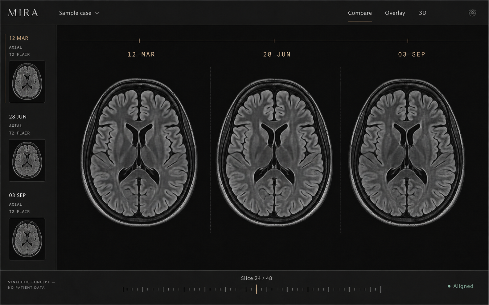
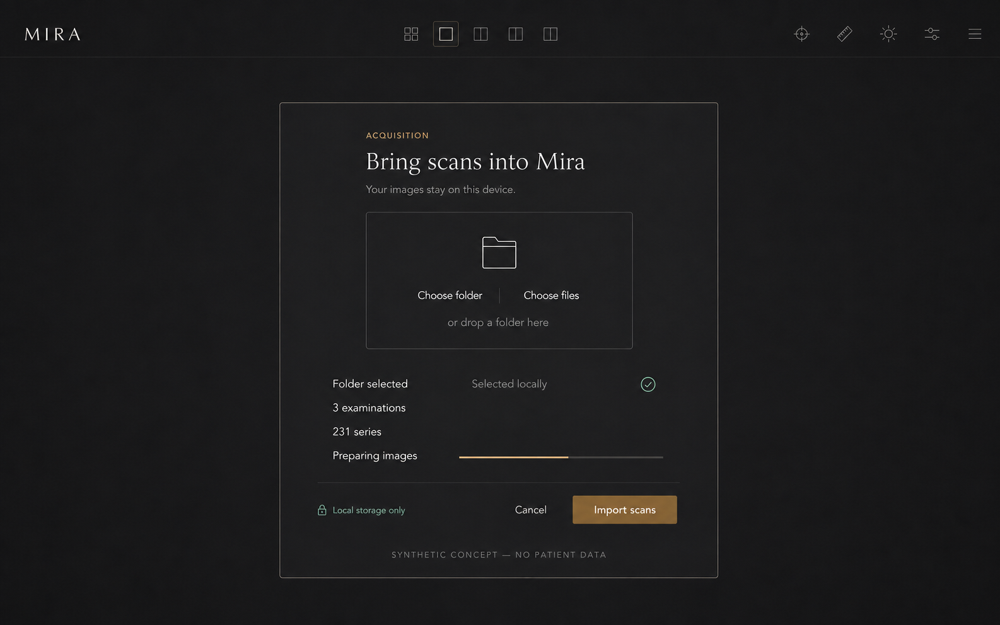
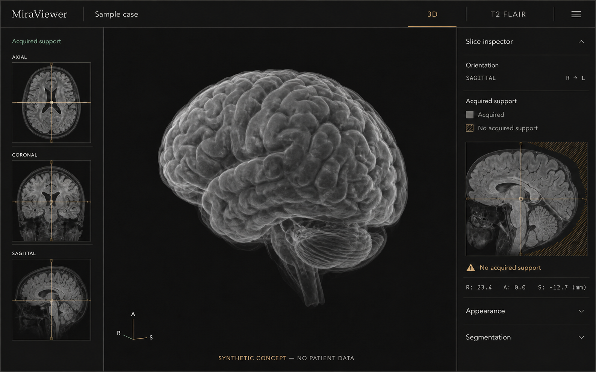
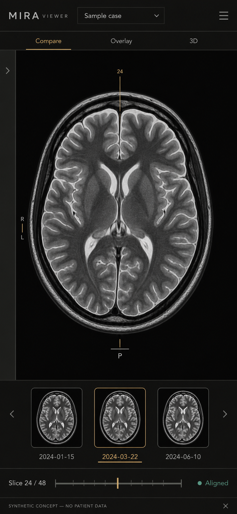

# MiraViewer visual redesign: The Quiet Instrument

- **Status:** Implemented and validated against the production application; concept artwork remains illustrative.
- **Prepared:** 2026-08-24.
- **Implementation baseline:** `5ab9f41db58ac47c7185b0ff143d71553bc769c2`.
- **Product:** Browser-local, offline-capable longitudinal MRI comparison, alignment, and reconstruction.
- **Visual direction:** A precise optical instrument, not a dashboard or an AI-generated marketing interface.
- **Concept-art safety:** Every illustrated scan is newly generated synthetic concept imagery. No user MRI, patient image, name, identifier, source path, or private screenshot was provided to the image generator.
- **Relationship to earlier work:** Supersedes only the appearance recommendations in the earlier SVR product specification and DICOM acquisition plan. Their patient-safety, algorithmic, privacy, accessibility, and operational contracts remain authoritative.

## Executive decision

MiraViewer should feel like a beautifully engineered **medical viewing instrument**: dark, quiet, exact, and exceptionally respectful of the images it presents. Anatomy is the visual protagonist. Everything else is a calibrated structural surface, an informative label, a real measurement, or an action with a clear consequence.

The redesign removes the current combination of cobalt gradients, glowing sliders, oversized icons, stacked cards, rounded selection pills, decorative shields, lock emoji, hover-lift buttons, and competing import-console colors. It replaces them with one neutral basalt-and-graphite material system, warm bone-white humanist typography, restrained bronze actions, and a fine champagne **registration datum** that appears only when it represents actual image position, acquisition progress, or verified physical alignment.

Minimalism does not mean hiding clinical information. Patient identity, examination dates, acquisition geometry, alignment uncertainty, unsupported anatomy, import outcomes, and destructive-operation consequences must become **more readable and more truthful**, not disappear behind a cleaner screenshot.

The application remains entirely local and offline. No hosted fonts, design dependencies, decorative rendering loops, patient-data uploads, new imaging algorithms, or changes to clinical ownership are required.

## Concept gallery

The following images are design illustrations, not screenshots of implemented software. All anatomical imagery, labels, dates, quantities, and statuses in the artwork are synthetic visual placeholders. The implemented product must show only values derived from actual verified application state and must never display invented anatomy as onboarding decoration.

### 1. Longitudinal comparison workspace



The reading-room concept makes three comparable examinations substantially more important than navigation chrome. Mode selection is text-led, selected context is persistent, study labels are quiet and chronological, and one physical slice navigator serves the entire comparison. Any visible registration mark must remain in image gutters or represent an explicitly enabled, real inspection crosshair; it must never permanently obscure diagnostic pixels.

### 2. Local-only acquisition folio



The intake surface communicates privacy and capability through typography, spacing, source choices, and operation facts instead of a giant upload illustration or generic dashed drop zone. A real operation owns the acquisition manifest, progress, cancellation, and terminal outcome. Backup replacement always keeps its separate explicit consent and safety limit.

### 3. Evidence-aware reconstruction lightbox



The reconstructed volume occupies the center. Acquired orientation evidence, physical inspection, and unsupported regions remain legible without surrounding the anatomy with three simultaneously expanded control panels. Unsupported material is not recolored into believable tissue; warning hatch and text describe real missing support.

### 4. Compact responsive reading room



The narrow layout keeps patient identity, image context, current study, and slice navigation available without horizontal overflow. Secondary rails become accessible drawers; touch targets remain physically usable without turning the interface into a consumer-social application.

## 1. User, job, and scope

### 1.1 Primary user and single job

The primary user is a person carefully reviewing one patient's MRI examinations across time and, when appropriate, examining a physically supported three-dimensional reconstruction.

The interface has one job: **make the actual acquired anatomy, its provenance, and the next safe action easier to understand without misrepresenting uncertainty**.

### 1.2 In scope

- Global theme tokens, typography, spacing, separators, focus treatment, and motion.
- The application shell, patient context, comparison modes, empty/loading states, and global actions.
- Examination chronology, sequence/plane filters, grid comparison, overlay comparison, and slice navigation.
- Alignment initiation, progress, successful outcomes, ambiguity, refusal, and recovery messaging.
- Local file, folder, ZIP, and complete-backup acquisition surfaces.
- SVR source evidence, reconstruction readiness, volume lightbox, orthogonal inspection, support disclosure, and segmentation controls.
- Shared dialogs, help, export, deletion, responsive layouts, keyboard behavior, accessibility, and measured visual-performance overhead.
- Synthetic-only concept art and eventual synthetic-only actual-application visual validation.

### 1.3 Explicitly out of scope

- New registration, reconstruction, segmentation, import, storage, archive, or backup algorithms.
- Any change to patient matching, durable ownership, support propagation, cancellation, dataset revision, writer batching, or source admission.
- Hosted services, telemetry, image uploads, remote fonts, remote assets, accounts, or new third-party UI frameworks.
- Decorative synthetic scan imagery inside the implemented empty state.
- Fake examination dates, invented patient identities, fabricated measurements, simulated progress, or unsupported claims of clinical confidence.
- Bundling the concept PNGs into the running application or offline ZIP.
- Publication, deployment, changes to the public pull request, or implementation merely because this specification exists.

## 2. Current-state diagnosis

| Finding                                 | Current evidence                                                                                                                                      | Consequence                                                                           | Required decision                                                                                           |
| --------------------------------------- | ----------------------------------------------------------------------------------------------------------------------------------------------------- | ------------------------------------------------------------------------------------- | ----------------------------------------------------------------------------------------------------------- |
| Two unrelated brands                    | `frontend/src/index.css:3-14` defines violet-charcoal/cobalt globals; `:245-252` defines a separate teal intake palette.                              | Import feels like another application.                                                | One root semantic token system; intake consumes the same tokens.                                            |
| Inconsistent typography                 | `frontend/src/index.css:24-30` uses an Inter/system stack; `:263-270` separately uses Avenir Next.                                                    | The visual tone changes at a clinically important handoff.                            | One local-only humanist interface stack plus one restrained display and data stack.                         |
| Generic onboarding                      | `frontend/src/components/ComparisonMatrix.tsx:817-842` includes an oversized blue brain, lock emoji, privacy pill, elevated CTA, and hover lift.      | The first impression resembles a generated template rather than a serious instrument. | Compose the empty state around type, negative space, a real next action, and a plain local-only disclosure. |
| Overloaded application bar              | `frontend/src/components/ComparisonMatrix.tsx:519-732` combines branding, modes, patient context, playback, dates, help, and menus in a wrapping row. | Patient and examination context compete with operational controls.                    | Use one stable identity bar and one contextual reading rail.                                                |
| Too much permanent chrome               | Filter and examination sidebars consume roughly 256 px and 224 px before image padding; SVR can add two more 280–380 px panels.                       | At a 1280 px viewport, imaging can be reduced to roughly 424 px.                      | At most one substantial auxiliary inspector below 1440 px; make chronology a compact rail or drawer.        |
| Decorative controls                     | `frontend/src/index.css:147-190` styles range thumbs with blue gradients, glow, and scaling.                                                          | Routine interaction draws more attention than anatomy and wastes visual contrast.     | Flat controls, subtle mechanical tracks, visible focus, no glow or hover enlargement.                       |
| Blur over diagnostic images             | `frontend/src/components/comparison/GridCell.tsx:86,156` and `OverlayView.tsx:154,225` use `backdrop-blur`.                                           | Image pixels become occluded and compositing becomes more expensive.                  | Opaque contextual gutters; no decorative filter over a diagnostic canvas.                                   |
| Stacked visual containers               | `frontend/src/components/Svr3DView.tsx:1092-1185` and `SvrVolume3DViewer.tsx:2450-2678` combine nested borders, cards, and concurrent side panels.    | The 3D surface feels like a machine-learning control panel.                           | A single lightbox, one evidence owner, and contextual inspection drawers.                                   |
| Medical language weakened by decoration | Sparkles, decorative status medallions, generic badges, and saturated fills appear across comparison, segmentation, and export surfaces.              | Decorative semantics compete with acquired evidence and uncertainty.                  | Use text, position, one measured datum, and deliberate warning semantics.                                   |

These are presentation and information-architecture findings. The current clinical algorithms, local-only guarantees, and extensive safety regressions are assets to preserve.

## 3. Creative direction

### 3.1 The Quiet Instrument

The visual references are a precision optical comparator, a photographic darkroom, a carefully maintained radiology lightbox, and a well-made mechanical measuring instrument. The result should be warm without being cozy, luxurious without being ornamental, and clinical without feeling institutional.

Four principles govern every decision:

1. **Anatomy receives the light.** Actual MRI pixels remain neutral grayscale and visually dominant.
2. **Chrome recedes.** Navigation, labels, dividers, and controls exist to orient the user, not to advertise a component library.
3. **Precision is earned.** Every date, coordinate, status, marker, quantity, and alignment line comes from verified application state.
4. **Trust is explicit.** Local-only processing, patient scope, source support, uncertainty, cancellation, and destructive consequences remain visible.

### 3.2 Signature: the registration datum

The only memorable ornamental gesture is a single fine champagne-colored datum. It is not ornament in the implemented product: its position always corresponds to a real domain value.

| Surface          | Real authority                                                          | Allowed datum expression                                                     | Forbidden expression                                                                                                                |
| ---------------- | ----------------------------------------------------------------------- | ---------------------------------------------------------------------------- | ----------------------------------------------------------------------------------------------------------------------------------- |
| Study chronology | Selected examination and actual chronology.                             | A small notch or underline aligned with the active examination.              | Equally spaced invented dates or fabricated timeline events.                                                                        |
| Comparison       | Verified physical alignment and current slice position.                 | Aligned gutter ticks or a user-enabled inspection crosshair.                 | A permanent line across anatomy, implied correspondence across patients, or an alignment mark without a successful verified result. |
| Slice navigation | Actual selected ordered image index and known slice count.              | A slender position indicator on the real accessible range control.           | Decorative scan lines or an invented position when no image exists.                                                                 |
| Acquisition      | Operation-owned current/total values or a truthful indeterminate state. | A thin determinate track or clearly labeled bounded indeterminate indicator. | Fabricated percentages, optimistic completion, or simulated scanner activity.                                                       |
| SVR inspection   | Real selected axial/coronal/sagittal voxel and physical output grid.    | An optional orthogonal crosshair that matches the accepted volume.           | Decorative reticles, unsupported coordinates, or a cursor from another patient/revision.                                            |

If the authority is unknown, missing, ambiguous, stale, or clinically unsupported, omit the mark or explicitly identify the unavailable state. The datum never supplies color as its only meaning.

### 3.3 Explicitly rejected directions

- A cream-and-serif editorial website: beautiful in isolation but wrong for preserving grayscale darkroom adaptation.
- A black-and-neon AI dashboard: reproduces the existing saturation problem and falsely suggests analytical certainty.
- Glassmorphism, frosted overlays, translucent cards, and floating windows: reduce MRI legibility and increase compositing expense.
- A generic radiology console crowded with status badges: retains too many simultaneous authorities.
- A decorative luxury treatment using gradients, gold fills, fake scan lines, or branded medical illustrations: creates atmosphere at the expense of evidence.

## 4. Semantic visual system

### 4.1 Canonical color tokens

Preserve the existing root token names where compatibility matters. Introduce additional tokens only when they express genuinely different evidence or warning semantics. The import surface must consume aliases of these same values rather than declare a second brand.

| Semantic role                   | Suggested existing/new token | Value     | Usage                                                                                        |
| ------------------------------- | ---------------------------- | --------- | -------------------------------------------------------------------------------------------- |
| Diagnostic void                 | `--bg-primary`               | `#111210` | MRI lightbox background and deepest application surface; no image tint.                      |
| Instrument shell                | `--bg-secondary`             | `#181A18` | Header, drawers, dialogs, and contextual rails.                                              |
| Raised graphite                 | `--bg-tertiary`              | `#20221F` | Hover/selected backgrounds, restrained input surfaces, and grouped control fields.           |
| Titanium divider                | `--border-color`             | `#353831` | Decorative 1 px section rules; never the sole indicator of control state.                    |
| Bone text                       | `--text-primary`             | `#EFEDE7` | Primary labels, selected patient, actions, and trusted values.                               |
| Warm smoke                      | `--text-secondary`           | `#A6A59B` | Explanatory copy, secondary labels, and inactive navigation.                                 |
| Quiet but legible metadata      | `--text-tertiary`            | `#92938A` | Nonessential labels; still meets normal-text contrast on raised graphite.                    |
| Accessible bronze action        | `--accent`                   | `#75633C` | Filled primary controls that retain white/bone text and the existing contrast-test contract. |
| Accessible action hover         | `--accent-hover`             | `#87744A` | Hover/focus background for white-text primary actions.                                       |
| Champagne datum                 | `--signal-metal`             | `#C7B58C` | Fine position indicators, active underlines, and occasional precise highlights.              |
| Verified acquired evidence      | `--evidence`                 | `#8FBAB2` | Explicitly verified source/support state; always paired with text.                           |
| Review / unsupported space      | `--warning`                  | `#D1A566` | Actual uncertainty, missing acquired support, partial import, or user review.                |
| Failure / destructive operation | `--danger`                   | `#D89B93` | Real failure, irreversible action, or blocked safety condition.                              |
| Visible keyboard focus          | `--focus-ring`               | `#C7B58C` | Existing 2 px focus outline with its existing visible offset.                                |

The light champagne datum is not the global filled-action color. White on champagne would fail the application's existing primary-action contrast contract. Preserve deep bronze as `--accent`; reserve champagne for readable marks, outlines, or dark-on-light pairings specifically verified for contrast.

### 4.2 Measured contrast

The following ratios were computed from the actual proposed sRGB values:

| Foreground               | Background                | Contrast | Meaning                                                 |
| ------------------------ | ------------------------- | -------: | ------------------------------------------------------- |
| Bone `#EFEDE7`           | Shell `#181A18`           |  14.95:1 | Primary application copy.                               |
| Bone `#EFEDE7`           | Raised graphite `#20221F` |  13.69:1 | Primary labels in raised controls.                      |
| Smoke `#A6A59B`          | Raised graphite `#20221F` |   6.47:1 | Secondary labels and explanatory text.                  |
| Quiet metadata `#92938A` | Raised graphite `#20221F` |   5.16:1 | Small metadata that still exceeds normal-text contrast. |
| Champagne `#C7B58C`      | Raised graphite `#20221F` |   7.95:1 | Physical indicators and visible focus.                  |
| Sage `#8FBAB2`           | Raised graphite `#20221F` |   7.51:1 | Verified-acquisition labeling.                          |
| Ochre `#D1A566`          | Raised graphite `#20221F` |   7.09:1 | Actual warnings and unsupported-space labeling.         |
| Oxidized rose `#D89B93`  | Raised graphite `#20221F` |   6.89:1 | Real failures and destructive context.                  |
| White `#FFFFFF`          | Bronze `#75633C`          |   5.82:1 | Existing white-on-accent regression contract.           |
| Bone `#EFEDE7`           | Bronze `#75633C`          |   4.97:1 | Filled primary actions using bone-white typography.     |

Titanium section rules have approximately 1.47:1 contrast against the shell and are therefore **decorative structure only**. Any boundary needed to identify a focus state, active control, or meaningful UI affordance must meet the applicable nontext contrast requirement through another independently visible indicator.

### 4.3 Typography

| Role                                  | Family order                                                                        | Size / line height  | Rules                                                                                          |
| ------------------------------------- | ----------------------------------------------------------------------------------- | ------------------- | ---------------------------------------------------------------------------------------------- |
| Wordmark and rare display heading     | `Optima`, `Candara`, `Avenir Next`, system sans-serif                               | 24–32 px / 1.15     | Only wordmark, empty-state title, or major section introduction; no serif-as-decoration trend. |
| Application body                      | `Avenir Next`, `-apple-system`, `BlinkMacSystemFont`, `Segoe UI`, system sans-serif | 15 px / 1.5         | Humanist, calm, sentence case, normal weight.                                                  |
| Navigation and controls               | Same interface stack.                                                               | 13–14 px / 1.45     | Medium weight only when meaningfully selected.                                                 |
| Dates, slices, coordinates, and units | `SFMono-Regular`, `ui-monospace`, `Consolas`, monospace                             | 12–13 px / 1.45     | Tabular numerals; no tracking on clinically meaningful values.                                 |
| Nonclinical micro-label               | Same interface or data stack.                                                       | Minimum 12 px / 1.4 | Never use 9–11 px for patient identity, image state, warnings, or physical quantities.         |

Use only fonts already available locally through the browser/operating system. Do not add a Google Fonts request, external stylesheet, tracking pixel, font loader, or unlicensed typeface. A self-hosted licensed face is a separate future decision and must preserve offline packaging and the bundle budgets below.

### 4.4 Geometry and materials

- Base spacing: 4, 8, 12, 16, 24, 32, and 48 px.
- Structural dividers: one physical CSS pixel, without inner outlines around every field.
- Corner radii: 2 px for fine indicators, 4 px for normal controls, 6 px for surfaces, and at most 8 px for a large dialog.
- Shadows: none on routine controls; a single bounded dialog scrim is sufficient for modal separation.
- MRI canvases: true neutral image pixels on the diagnostic void; never apply sepia, global opacity, CSS tint, blur, or contrast filters for branding.
- Icons: one restrained 16–18 px outline icon only when it explains an actual action; no oversized brain, sparkles, lock emoji, generic shield collection, or decorative upload cloud.
- Accent coverage: the champagne datum should occupy substantially less than 1% of an ordinary desktop frame.

### 4.5 Motion

- Use direct opacity/color transitions of approximately 100–140 ms when they improve state comprehension.
- Do not use `transition-all`, width animation, continuous pulses, glowing gradients, bounce, scroll-linked animation, or idle `requestAnimationFrame` loops.
- Preserve the existing global `prefers-reduced-motion: reduce` behavior.
- When a drawer changes imaging geometry, commit the layout once; do not produce a sequence of expensive viewer resize/reconstruction events.
- Progress motion must come from real operation updates. Indeterminate discovery requires explicit text and must not masquerade as measured percentage completion.

## 5. Information architecture

### 5.1 Desktop composition

Target a stable 56 px application identity rail, optional 32–36 px contextual rail, compact 184–208 px navigation where appropriate, and a 48 px physically meaningful slice-navigation footer.

```text
┌ MIRA  Compare  Overlay  3D                 Selected patient / examination        Import  Menu ┐
├ Plane · sequence · verified alignment state · actual examination context                     ┤
│ Sequence rail │                                                                              │
│ Axial         │   examination A          examination B          examination C                │
│ T2 FLAIR      │                                                                              │
│               │        acquired              acquired               acquired                 │
│               │        anatomy               anatomy                anatomy                  │
│               │                                                                              │
├───────────────┴──── verified gutter datum ─── actual slice position / available frames ───────┤
└ Study chronology, selected exam, operation state, and next available action                  ┘
```

Desktop rules:

- The patient identity remains readable before modes, dates, and secondary actions.
- Comparison, overlay, and 3D remain separate modes with accessible pressed/selected state.
- Modes are text-led. A bronze underline or notch indicates selection; a saturated filled pill is unnecessary.
- Examination chronology should usually live in a compact contextual rail or bottom filmstrip rather than a permanent 224 px right sidebar.
- One substantial inspector may be open at a time below 1440 px.
- At 1280 px, a single-panel comparison/reconstruction state should leave at least 70% of available width to imaging.
- At 1440 px and wider, a second contextual rail may appear only when it materially improves the current task.
- Controls that cannot act on the current state must explain their prerequisite or remain contextually unavailable; never leave a visually unexplained disabled reconstruction CTA.

### 5.2 Responsive behavior

| Viewport                     | Composition                                                                                              | Critical requirements                                                                              |
| ---------------------------- | -------------------------------------------------------------------------------------------------------- | -------------------------------------------------------------------------------------------------- |
| 1920 × 1080 and larger       | Identity rail, optional sequence rail, expansive imaging, contextual inspector when useful.              | Anatomy remains dominant; no decorative fullscreen dead zones or simultaneous competing 3D panels. |
| 1440 × 900                   | One compact navigation rail and one optional concise evidence/chronology context.                        | Patient, sequence, current study, and warnings remain readable.                                    |
| 1280 × 800                   | Only one 208–280 px substantial auxiliary surface.                                                       | Imaging keeps at least 70% of available width.                                                     |
| 1024 × 768                   | Contextual drawers replace persistent secondary navigation.                                              | Patient scope and image context remain directly available.                                         |
| 768 × 1024                   | One active image/volume, accessible study filmstrip, drawer-based tools.                                 | No hidden critical provenance; stable aspect ratio.                                                |
| 390 × 844                    | Compact identity bar, large diagnostic image, selected study, bottom navigation, and sheet/drawer tools. | No horizontal overflow; all coarse-pointer targets at least 44 × 44 px.                            |
| 320 px and 200% browser zoom | Essential controls stack and wrap into named drawers/sheets.                                             | Patient identity, operation result, cancel action, warnings, and focus order remain accessible.    |

Collapsed surfaces must not remain keyboard-focusable. Opening a drawer must preserve or deliberately move focus, expose its state with `aria-expanded`, and close with Escape where operationally safe.

## 6. Surface specifications

### 6.1 Application bar and patient context

Affected owner: `frontend/src/components/ComparisonMatrix.tsx`.

1. Replace the oversized Brain mark with a small `Mira`/`MIRA` optical-style wordmark. Retaining the current product name for accessibility and document title remains acceptable.
2. Present Grid/Compare, Overlay, and 3D as three restrained mode tabs, preserving existing state and keyboard/focus semantics. If `Grid` becomes `Compare`, deliberately update its accessible label, help copy, and behavior-focused tests.
3. Keep the selected patient permanently visible at every supported width.
4. Show a selector only when more than one patient is present; a single patient remains visibly identified without a meaningless dropdown.
5. Preserve the exact patient-switch order: abort active alignment, clear stale alignment/derived state, then select the new patient.
6. Move playback/date-specific tools into the contextual rail for the mode that owns them.
7. Keep import available as a real global action; place export, deletion, and secondary actions behind the named application menu without hiding active-operation cancellation.
8. Display persistence failures and clinically unsafe alignment results through accessible alerts/statuses, not transient decorative toasts.

### 6.2 Empty and loading states

Empty state:

- A short wordmark or restrained heading: `Bring your scans into Mira` or the current established `Import scans` language.
- One plain local-only sentence: `Your images stay on this device.`
- One clear primary `Import scans` action and optional restrained folder/file choices.
- A genuinely unexposed black image field; no generated brain image, patient card, invented timeline, false measurement, mock progress, or simulated diagnostic result.
- No oversized blue brain, lock emoji, outlined privacy pill, floating card, hover lift, animated pulse, or marketing claim.

Loading state:

- Explain the actual activity in simple language, such as `Loading saved scans`.
- Preserve patient context when a background refresh occurs; never unmount useful imported results solely to show a full-screen spinner.
- Avoid a decorative animated brain or invented progress percentage.

### 6.3 Plane, sequence, and examination chronology

Affected owners: `ComparisonFiltersSidebar.tsx`, `ComparisonDatesSidebar.tsx`, and contextual areas in `ComparisonMatrix.tsx`.

- Present planes and sequence families as concise typographic rows, not grids of bright pills.
- Use actual patient-scoped chronology and source thumbnails only when the database returns real acquired data.
- Move study dates to a horizontal timeline/filmstrip when it frees valuable image width.
- A selected study uses readable text and a champagne underline/notch; state cannot depend on color alone.
- If chronology is hidden inside a drawer, keep the selected examination visible in the persistent context rail.
- Preserve distinct same-day examinations and their exact identities; a display date alone is never a sufficient canonical key.
- Retain the physical-output mode and its disclosure that interpolated presentation pixels do not add acquired MRI detail.
- Filtering, date toggling, and panel collapse must not trigger new DICOM reads, duplicate manifest authorities, or loss of selected patient context.

### 6.4 Grid comparison

Affected owners: `GridView.tsx`, `comparison/GridCell.tsx`, `DicomViewer.tsx`, and the slice navigator.

- Allocate most of the viewport to equal, correctly scaled grayscale examinations.
- Put examination date, sequence, plane, and real alignment state into a stable caption gutter.
- Keep annotation and window/level controls in a purposeful opaque contextual area; remove `backdrop-blur` and unnecessary controls floating directly over anatomy.
- Keep hover-only controls accessible through keyboard focus and permanently available on non-hover/coarse-pointer devices.
- Preserve native image aspect ratio, view transforms, reverse slice order, per-date settings, undo/redo, and current no-black-flash loading behavior.
- Show a verified shared registration datum only when the reference and target are actually compatible and aligned.
- If alignment is ambiguous, insufficiently supported, failed, canceled, or physically incompatible, label the specific outcome. Do not draw misleading corresponding markers.
- Do not introduce independent visual patient/series caches or a second alignment-result authority.

### 6.5 Overlay comparison

Affected owner: `frontend/src/components/comparison/OverlayView.tsx`.

- Center the single true image lightbox and place active/reference examination information in its caption rail.
- Keep both actual comparison layers concurrently mounted so date toggling does not introduce a black flash.
- Retain hold-to-compare, keyboard/pointer navigation, playback, speed, exact image transforms, and accessibility.
- Show which examination is active through text and a discrete chronology datum, not a fullscreen tint or decorative transition.
- Suppress native-only annotations on derived presentation planes exactly as the existing safety contract requires.
- Do not add crossfades that blend mismatched patient images or suggest a false anatomical intermediate.

### 6.6 Alignment and uncertainty

Affected owners: `ComparisonMatrix.tsx`, `ComparisonFiltersSidebar.tsx`, and current alignment progress/result components.

- Alignment starts from the same selected patient, examination, sequence, output grid, and canonical worker path as today.
- Progress must disclose the actual operation phase. Cancellation remains immediate, reachable, and truthful.
- A successful mark is shown only after an operation-owned verified result is applied.
- `ambiguous`, `insufficient-overlap`, `incompatible-geometry`, `failed`, and `cancelled` outcomes remain separately understandable.
- The interface must not invent a clinical probability, simplify uncertainty into a universal green success check, or present unsupported coordinate agreement.
- Review and refusal warnings combine an explicit sentence with ochre and an accessible status/alert.
- Existing exclusion masks, source provenance, patient-space coordinates, output-grid identity, physical aspect, and previous settings remain unchanged.

### 6.7 Acquisition and importing

Affected owners: `UploadModal.tsx`, `AccessibleDialog.tsx`, and intake styles in `index.css`.

Preserve one operation-owned acquisition workflow; redesign presentation only.

| State               | Visual treatment                                                                                                      | Information that must remain visible                                                                                 |
| ------------------- | --------------------------------------------------------------------------------------------------------------------- | -------------------------------------------------------------------------------------------------------------------- |
| Idle                | Quiet folio, solid subtle receiving field, clear folder/files/source actions.                                         | Local-only processing, allowed source types, storage constraints, and truthful available actions.                    |
| Discovering         | Real phase label with a bounded indeterminate datum if total is unknown.                                              | Discovery is ongoing; operation can be canceled.                                                                     |
| Source review       | Typographic acquisition manifest with real source kind, discovered counts, bytes, and relevant privacy/storage facts. | Folder/file/ZIP distinction, patient-safe examination facts when established, explicit complete-backup consequences. |
| Importing           | Thin determinate progress rail when a true total exists; otherwise explicit indeterminate text.                       | Current count, true total if known, current phase, safe cancelability, duplicate/exclusion awareness.                |
| Committing          | Calm but explicit commit state; action reflects actual noninterruptible transaction semantics.                        | A transaction already committing cannot be misrepresented as stopped.                                                |
| Complete            | Concise verified summary without success confetti or decorative shields.                                              | Exact imported/duplicate/excluded/error counts and the next available action.                                        |
| Partial or canceled | Ochre plus a specific truthful sentence.                                                                              | Durable work already committed, canceled candidates, exclusions, errors, and recovery options.                       |
| Failed              | Textual failure, actionable remediation, and real operation state.                                                    | No invented success; no leak of patient text, file path, UID, or parser payload.                                     |
| Backup restore      | A clearly differentiated destructive/replace review surface.                                                          | Actual record categories, explicit informed consent, atomicity, and the existing 512 MiB complete-restore limit.     |

Required behavior:

- Retain individual files, extensionless DICOM, nested folders, native/fallback directory pickers, drag-and-drop, ordinary ZIPs, ZIP64, and complete-backup detection.
- Preserve archive CRC, path validation, compression limits, SOP deduplication, patient/frame safety, bounded batches, zero-write duplicate replay, exact dataset revision, and current cancellation behavior.
- Keep `role="progressbar"` numerically determinate only when its total is genuinely known.
- Keep polite live regions concise and sanitized; never announce PHI, paths, source filenames, or raw parser messages.
- Preserve sticky terminal actions, no horizontal overflow, and 44 px minimum touch targets.
- Never use a fake scan, fictional patient, guessed study thumbnail, simulated percentage, or static illustrated medical image to make the empty importer look busy.

### 6.8 3D reconstruction and source readiness

Affected owners: `Svr3DView.tsx` and `useSvrReconstruction.ts` presentation consumers.

- Keep the currently selected patient, canonical examination, sequence family, and accepted source context visible.
- A source rail should show real orientation count, admitted image count, source resolution, slice-profile provenance, compatibility, memory estimate, and the actual reason reconstruction is unavailable.
- Display single-orientation inspection as a legitimate limited state instead of suggesting that one stack already provides isotropic 3D evidence.
- Use one primary `Reconstruct volume` action. Advanced solver/appearance options are disclosed only when they can meaningfully affect the current operation.
- At a 1280 px viewport, do not simultaneously render the global date sidebar, an expanded 340 px generation panel, and an expanded 380 px 3D-control panel.
- Preserve run identity, stale-result cancellation, patient/examination/frame isolation, resident memory accounting, and phase-aware peak limits.
- Preserve all existing source-readiness explanations, physical voxel spacing, source counts, acquisition support, focus-box behavior, and failure messages.
- Do not treat decorative source thumbnails as evidence. Every preview must originate from actual acquired data in the selected safe identity.

### 6.9 Reconstructed-volume lightbox

Affected owner: `frontend/src/components/SvrVolume3DViewer.tsx`.

- The accepted monochrome volume owns the center of the composition.
- Grayscale remains neutral; no warm photographic grade, rainbow shader, novelty hologram, decorative bloom, or false opacity in unsupported space.
- The orthogonal inspector supports real axial, coronal, and sagittal slices using the existing canonical axis mapping.
- Keep true anisotropic physical aspect ratios and actual patient-millimeter coordinates.
- Represent unsupported anatomy through the current truthful amber hatch and an explicit `No acquired support` text label. Color alone is insufficient.
- Acquired orientation count, native directional resolution, slice-profile provenance, selected slice, and physical coordinates remain available.
- The orthogonal crosshair is allowed only when it reflects the actual current inspected slice and does not imply verified support where none exists.
- Contextual appearance, segmentation, and ONNX controls remain unavailable until their prerequisites exist.
- Preserve existing keyboard controls: arrow-key rotation; `+`, `=`, and `-` zoom; `0` reset; `1`, `2`, and `3` select planes; `[` and `]` select slices; Escape cancels supported interactions.
- Preserve WebGL context-loss messaging, context recovery, zero-idle rendering, and nearest-filtered acquired-support semantics.

### 6.10 Segmentation, measurement, and model management

- Replace decorative sparkles or generic AI badges with neutral, action-specific labels.
- Preserve existing patient/reconstruction-bound segmentation ownership and support-safe growth.
- Keep measurements in actual physical units such as `mm²`, `mm³`, and `mL`, with meaningful precision.
- Never present a boundary extending through unsupported anatomy as confidently measured.
- Keep verified model identity, unsupported output/class warnings, inference cancellation/serialization, and model-cache safety visible when relevant.
- Treat tumor/lesion labeling as a precise user tool, not an opportunity for animated AI branding.

### 6.11 Shared dialogs, export, deletion, and help

- Continue using `AccessibleDialog`; do not create a second modal/focus-management authority.
- Apply the same quiet graphite, minimal radius, measured layout, and accessible action hierarchy to import, export, deletion, and help.
- Keep `role="dialog"`, `aria-modal`, title/description associations, initial focus, trapped Tab/Shift+Tab, inert background, overflow restoration, focus restoration, and correct Escape behavior.
- Destructive deletion remains visually distinct, explicit, and deliberately confirmed. Styling cannot reduce comprehension or make a destructive action look primary by accident.
- Export preserves complete snapshot semantics, original bytes, selected-patient scope, annotations, derived frames, model sidecars, and truthful progress.
- Help presents exact actual shortcuts and concepts in readable grouped typography rather than decorative tiles.

## 7. Component state and interaction contract

| Component              | Default                                                    | Selected / active                                                  | Disabled / unavailable                                        | Failure or warning                                                    |
| ---------------------- | ---------------------------------------------------------- | ------------------------------------------------------------------ | ------------------------------------------------------------- | --------------------------------------------------------------------- |
| Mode tab               | Smoke text on shell.                                       | Bone text, visible textual state, fine bronze/champagne underline. | Muted but still readable; explain unavailable prerequisites.  | Never used as the sole operation-status surface.                      |
| Primary action         | Deep bronze background with white/bone label.              | Modest accessible hover/focus change; no scaling or shadow.        | Contrast-respecting disabled state plus relevant explanation. | Inline supporting error text; never fake a successful action.         |
| Secondary action       | Text-led or a minimal graphite control.                    | Background shift and visible focus.                                | State not conveyed solely by color.                           | Clear relevant remediation.                                           |
| Patient selector       | Always visible selected context.                           | Native/accessible interaction and exact existing scope handling.   | No selector for one patient; keep the identity visible.       | Cross-patient conflicts remain explicit and fail closed.              |
| Study row / filmstrip  | Actual date plus actual acquired thumbnail when available. | Fine verified datum plus label/accessible current state.           | Missing examination is identified honestly.                   | Unsafe source or stale revision is not silently selected.             |
| Range / slice control  | Flat 2–3 px track with precise 12–16 px visible thumb.     | Real current position and accessible numeric value.                | No slider values invented before an image exists.             | Preserve blocked navigation during active alignment when required.    |
| Progress track         | Hidden until an operation exists.                          | Real known-total fill or explicitly indeterminate phase.           | No simulated completion.                                      | Partial, canceled, failed, and committed states remain distinct.      |
| Verified support label | Hidden when no support authority exists.                   | Sage plus clear acquired-support text.                             | Unknown remains unknown.                                      | Ochre hatch and `No acquired support` for actual unsupported anatomy. |
| Drawer / dialog        | Closed controls are inert.                                 | Named, focus-managed, and `aria-expanded` where appropriate.       | Only meaningful accessible triggers are offered.              | Preserve operation-aware Escape/backdrop restrictions.                |

## 8. Accessibility requirements

1. Preserve normal-text contrast of at least 4.5:1 and meaningful focus/control-indicator contrast of at least 3:1.
2. Preserve the existing white-on-`--accent` regression in `frontend/tests/comparisonAccessibility.test.tsx:86-93`.
3. Keep primary body copy 14–16 px, routine controls 13–14 px, and all clinically meaningful labels at least 12 px.
4. Preserve visible keyboard focus: at least a 2 px outline and a clearly visible offset.
5. Keep desktop activation targets practically usable; retain at least 44 × 44 px on coarse-pointer and acquisition surfaces.
6. Preserve native semantics and accessible names for selected patient, mode buttons, import sources, progress, cancel, plane selection, slices, controls, and destructive actions.
7. Maintain correct `aria-pressed`, `aria-current`, `aria-expanded`, live-region, `role="status"`, `role="alert"`, and progressbar behavior.
8. Do not make clinically important information available only on hover, color, microtype, tooltip, or a collapsed inaccessible panel.
9. Retain existing reduced-motion and non-hover device behavior.
10. Preserve reading and focus order through overlay dates, drawers, dialogs, context menus, and reconstruction inspection.
11. Support at least 320 px width where practical, 390 × 844, 768 × 1024, 1024 × 768, 1280 × 800, 1440 × 900, 1920 × 1080, ultra-wide displays, and 200% zoom without horizontal overflow or lost safety information.
12. Ensure contrast and support-state distinctions remain understandable in forced-colors/high-contrast modes; do not assume that hue survives user accessibility settings.

## 9. Clinical truth and privacy guardrails

The redesign must not change what the product claims to know.

- The selected patient, selected study, selected sequence, relevant frame of reference, and accepted dataset revision remain the existing canonical authorities.
- A date, patient name, source thumbnail, acquisition count, coordinate, output-grid detail, support percentage, alignment state, or segmentation value appears only when verified by the current owner.
- A shared longitudinal datum never suggests that distinct patients, incompatible frames, unaligned studies, or ambiguous registrations occupy the same physical location.
- Derived presentation remains visibly distinguishable from acquired image data where that distinction matters.
- A higher-density output grid is clearly described as interpolation, not additional acquired detail.
- Unsupported regions stay unsupported through image display, 3D rendering, orthogonal inspection, segmentation, and measurement.
- Unknown geometry, missing patient identity, uncertain alignment, no acquired support, stale data, blocked persistence, and source incompatibility remain explicit.
- Local-only operation is stated in the product and remains true in the implementation: no new requests containing scans, identifiers, usage analytics, or diagnostic data.
- Concept PNGs contain only generated synthetic imagery. Never screenshot the user's populated origin, include a real source image, publish private patient data, or use invented concept anatomy as a production empty-state asset.
- Public or reviewer-facing visual evidence, if separately authorized later, must be generated from a dedicated synthetic-only browser origin with no real identifiers, paths, filenames, or timestamps.

## 10. Performance and offline budgets

### 10.1 Measured current production baseline

The existing locally built production assets at the reviewed revision are:

| Asset                       | Current gzip size | Meaning                                                                              |
| --------------------------- | ----------------: | ------------------------------------------------------------------------------------ |
| Main application CSS        |       9,684 bytes | Current complete visual stylesheet, including the existing separate intake language. |
| Main application JavaScript |     809,872 bytes | Existing initial application payload.                                                |
| Lazy SVR chunk              |      47,489 bytes | Existing separately loaded 3D reconstruction interface.                              |

These are build-artifact observations, not field percentiles. Measure before/after using the same dependencies, build mode, gzip settings, and source revision.

### 10.2 Redesign-only budgets

- Additional JavaScript dependencies: **zero**.
- Additional runtime network requests, telemetry calls, remote fonts, or externally hosted assets: **zero**.
- Main application JavaScript: target net-neutral gzip size; investigate any meaningful increase and reject an avoidable increase greater than approximately 1,024 gzip bytes.
- Main CSS: target at most approximately 2,048 additional gzip bytes; hard investigation threshold approximately 4,096 gzip bytes, with token consolidation expected to offset new styling.
- Lazy SVR chunk: target no increase; reject an unjustified increase greater than approximately 1,024 gzip bytes.
- Concept artwork: stored only under `agent_docs/design-docs/assets/`; never imported by production code, copied to `frontend/public`, or added to the runnable ZIP.
- Preserve the existing lazy loading of SVR, same-origin WASM and worker assets, offline launch, fixed-origin storage behavior, and COOP/COEP isolation/fallback.
- New continuously running decorative animation, GPU filter, canvas compositing pass, background polling task, or idle `requestAnimationFrame`: **zero**.
- No `backdrop-filter`/blur over diagnostic imagery, global image filters, shader tinting, width-transition resize cascades, or ornamental canvas layers.
- No redesign-owned main-thread task over roughly 50 ms on the declared reference workload; report browser-owned work separately.
- Aim for ordinary UI acknowledgement within approximately 100 ms and interaction rendering around 33 ms p95 / 50 ms p99 on measured declared hardware. These are engineering targets until measured, not clinical or cross-device promises.
- Avoid visible canvas resizes/layout shifts during ordinary panel hover, focus, timeline selection, or operation progress. Target CLS no greater than 0.05 on representative synthetic flows.

### 10.3 Preserve existing operation budgets

- Folder discovery becomes visibly active within approximately 200 ms when the browser event loop is available.
- Cancellation acknowledges within approximately 100 ms and reflects any already-committing database transaction honestly.
- Ordinary import progress updates remain bounded to approximately 5–10 Hz; phase and terminal transitions publish immediately.
- Prepared writer batches retain their approximate 8–32 MiB target; transient candidate/inflate/worker memory retains its existing approximately 64–128 MiB engineering envelope.
- Existing 512 MiB reconstruction/restore guardrails, source-support integrity, duplicate zero-write behavior, and batch transaction counts remain unchanged.
- Do not invalidate or regenerate reconstructed volumes, alignment frames, Cornerstone image caches, or patient-scoped settings merely because tokens or panel layout change.

## 11. Implementation ownership and change boundaries

| Concern                        | Existing owner to preserve                                                                   | Presentation work permitted                                                                      | Work explicitly forbidden                                                                        |
| ------------------------------ | -------------------------------------------------------------------------------------------- | ------------------------------------------------------------------------------------------------ | ------------------------------------------------------------------------------------------------ |
| Visual semantics               | `frontend/src/index.css` root custom properties and existing shared styles.                  | Consolidate palettes, aliases, spacing, focus, motion, and component appearance.                 | Introduce parallel brand dictionaries or a runtime theme coordinator.                            |
| Application/patient scope      | `frontend/src/components/ComparisonMatrix.tsx`.                                              | Recompose identity bar, context rail, modes, empty state, operation banners, and menu hierarchy. | Add a second patient authority or change switch/cancellation ordering.                           |
| Filters and chronology         | Existing comparison sidebars, filtering hooks, and persisted UI settings.                    | Restage rails, drawers, labels, and chronology presentation.                                     | Re-key examinations by formatted date or duplicate persisted filter state.                       |
| Image presentation             | Existing `GridView`, `OverlayView`, `GridCell`, `DicomViewer`, and `SliceLoopNavigator`.     | Move controls into contextual gutters and refine visual hierarchy.                               | Change pixel decoding, geometry, display transforms, annotation safety, or layer mounting.       |
| Import                         | `UploadModal`, existing operation state, clinical ingestion service, and `AccessibleDialog`. | Redesign folio layout, source action affordances, manifest, progress, and result hierarchy.      | Change admission, writer, ZIP, restore, revision, cancellation, or consent behavior.             |
| 3D source readiness            | `Svr3DView` and the existing reconstruction hook.                                            | Compose one source/evidence rail and a dominant lightbox.                                        | Add an independent source/revision cache or alter solver/registration settings silently.         |
| Accepted volume and inspection | `SvrVolume3DViewer` and its current canonical plane/axis/support logic.                      | Restage contextual controls, labels, inspection rail, and evidence disclosures.                  | Change support textures, physical axes, pixel values, cache behavior, or segmentation authority. |
| Dialog lifecycle               | `frontend/src/components/ui/AccessibleDialog.tsx`.                                           | Apply the unified visual system.                                                                 | Introduce a second focus trap, portal, global key handler, or destructive-action policy.         |

## 12. Ordered implementation program

### Phase 0: freeze evidence and safety baseline

1. Capture synthetic-only current states at 1920 × 1080, 1440 × 900, 1280 × 800, 768 × 1024, and 390 × 844.
2. Record baseline CSS/main/SVR gzip sizes, runtime network requests, canvas layout stability, and comparison/3D interaction timings.
3. Freeze patient-switch, unsupported-support, alignment outcome, import terminal-state, and dialog-accessibility regressions.
4. Approve the palette, typography, concept-art direction, and semantics of the verified registration datum.

**Exit gate:** Baseline contains no real patient imagery or identifiers and all current safety tests pass.

### Phase 1: establish one semantic visual system

1. Consolidate root and intake palette tokens without changing component behavior.
2. Unify local-only typography, data numerals, focus treatment, spacing, separators, and radii.
3. Replace gradient/glow range styling with accessible flat tracks and real visible focus.
4. Preserve all existing semantic CSS selectors, reduced-motion behavior, non-hover controls, and contrast tests.

**Exit gate:** No external font/assets, existing white-on-accent contrast remains at least 4.5:1, and CSS budget remains inside the measured threshold.

### Phase 2: redesign shell, context, and first impression

1. Recompose the identity bar, mode controls, patient selector, action menu, and contextual examination rail.
2. Replace the decorative empty/loading states with honest local-only typography and clear next actions.
3. Restage chronology into a compact rail or drawer without changing examination identity.
4. Verify patient switching aborts/clears stale work in the existing order.

**Exit gate:** Persistent patient identity is visible at every tested viewport; existing patient-switch and operation-alert tests pass.

### Phase 3: refine comparison and alignment

1. Simplify filter/date rails and increase grayscale image area.
2. Move image controls into purposeful contextual gutters and remove image-covering blur.
3. Introduce the datum only for real selected dates, real current slices, and truly verified physical correspondence.
4. Retain overlay concurrency, held comparison, playback, output-grid provenance, uncertain outcomes, and all keyboard controls.

**Exit gate:** Side-by-side and overlay screenshots show larger neutral images, no fake correspondence, no flicker, and unchanged alignment safety.

### Phase 4: redesign acquisition without changing ingestion

1. Restyle the shared dialog and source choices as the acquisition folio.
2. Recompose idle, discovery, review, importing, committing, complete, partial, canceled, failure, and backup-consent states.
3. Keep actual source manifests, real counters, sanitized announcements, truthful cancellation, and the restore-size warning.
4. Verify desktop, keyboard, coarse-pointer, narrow, and background-refresh scenarios.

**Exit gate:** Existing folder/ZIP/backup/cancellation/duplicate tests remain green; no user-facing state reports stronger completion than durable storage confirms.

### Phase 5: redesign reconstruction and inspection

1. Rebalance source readiness, accepted volume, orientation evidence, and orthogonal inspection around the single lightbox.
2. At 1280 px, expose no more than one substantial auxiliary inspector at a time.
3. Preserve acquisition source evidence, physically correct aspect, current plane, patient coordinates, support hatch, and segmentation boundaries.
4. Keep WebGL context recovery, zero-idle rendering, memory admission, stale cancellation, and lazy loading unchanged.

**Exit gate:** Synthetic axial/coronal/sagittal assertions remain exact, unsupported regions remain explicitly disclosed, and 3D image area exceeds the single-panel target.

### Phase 6: harden dialogs, responsiveness, accessibility, and offline performance

1. Apply the same restrained treatment to export, deletion, help, and operation feedback.
2. Exercise the full viewport/zoom, keyboard, touch, screen-reader, reduced-motion, and forced-colors matrix.
3. Rebuild the offline ZIP and confirm no concept assets, remote fonts, analytics calls, or external requests enter the product.
4. Repeat measured bundle, layout stability, idle rendering, import, alignment, and reconstruction checks.
5. Capture final real-application screenshots exclusively with synthetic data in an isolated non-user origin.

**Exit gate:** All behavior, privacy, performance, and visual acceptance criteria below pass.

## 13. Verification program

### 13.1 Existing focused regression suites

Run relevant existing tests before broader validation:

```bash
npm run test -- tests/comparisonAccessibility.test.tsx tests/ComparisonMatrix.test.tsx tests/patientSelector.test.tsx
npm run test -- tests/UploadModal.test.tsx tests/overlays.test.tsx tests/exportBackup.test.ts
npm run test -- tests/Svr3DView.test.tsx tests/SvrVolume3DViewer.test.tsx tests/useAutoAlignPhysical.test.tsx
```

Preserve existing assertions for:

- White-on-accent contrast, visible focus, reduced motion, non-hover controls, and responsive SVR layouts.
- Named patient selection, abort/clear/select ordering, same-day examinations, and alignment warning visibility.
- Individual/folder/extensionless/ZIP sources, CRC errors, source review, explicit backup consent, bounded restore, cancellation, duplicates, retained completion, and sanitized live regions.
- Incompatible 3D sources, stale patient/revision, acquisition orientation evidence, bounded memory, no unsupported invented anatomy, and actual source resolution.
- Exact axial/coronal/sagittal source pixels, physical aspect ratios, support hatch, patient coordinates, slice limits, keyboard navigation, and WebGL recovery.
- Existing overlay mounting, derived annotation safety, support-safe segmentation, and truthful operation outcomes.

### 13.2 New visual and behavioral checks

- Global and intake surfaces resolve to the same computed semantic token values.
- Existing meaningful text and all new color pairings meet their measured contrast thresholds.
- The empty application contains no fabricated scan, fake patient, lock emoji, decorative brain illustration, or pretend operation state.
- The selected patient remains visible at 390 px and can be changed safely when more than one patient exists.
- A real verified datum appears for aligned compatible data and does not appear for failed, ambiguous, incompatible, or cross-patient data.
- No comparison controls apply blur, opacity, tint, or CSS filters to diagnostic images.
- Overlay toggling retains both image layers and does not produce a black flash.
- Import displays a real progress maximum only when known and never erases terminal counts during background refresh.
- Backup consent cannot be bypassed by the new visual action hierarchy.
- At 1280 px, one-panel 3D and comparison states reserve at least 70% of available width for imaging.
- Orthogonal inspectors preserve source pixels, unsupported hatch, physical aspect ratio, and current patient-space position across all three planes.
- Collapsed drawers are inert, focus restoration works, and all 44 px touch targets are preserved.
- No remote font, new runtime network request, decorative animation loop, or concept PNG is loaded.

### 13.3 Final repository checks

```bash
npm run check
npm run build
npm run package:zip
```

Private real-MRI corpus validation, if needed for a later implementation, must remain separately enabled, read-only with respect to source images, and aggregate-only in its evidence. Real MRI imagery must never appear in concept art, public screenshots, commit artifacts, or reviewer-facing design examples.

### 13.4 Actual-application visual validation

Use the actual integrated application, not Storybook. Start from a dedicated synthetic-only origin/profile that cannot expose an existing patient-containing browser database.

Capture at minimum:

1. Empty first-run state.
2. Acquisition idle state and keyboard-focus treatment.
3. Folder/source review with clearly synthetic acquisition facts.
4. Indeterminate discovery and actual known-total import progress.
5. Complete, duplicate, partial, canceled, and failed terminal outcomes.
6. Explicit complete-backup replacement confirmation.
7. Three-examination comparison with a real verified alignment.
8. Ambiguous/insufficient-support alignment with no misleading datum.
9. Overlay comparison and preserved image-layer mounting.
10. One-stack 3D readiness with its honest prerequisite message.
11. Accepted three-plane reconstruction with actual axial/coronal/sagittal inspection.
12. Unsupported evidence with text and hatch.
13. Segmentation, physical measurement, and unavailable-model behavior.
14. Every required desktop/narrow viewport, 200% zoom, keyboard-only use, reduced motion, and coarse pointer.

Each synthetic capture must state the real application route/origin, viewport, device scale factor, relevant GPU/renderer limitations, and any evidence not actually established. Remove only agent-created synthetic records and close only owned tabs after verification.

## 14. Definition of done

The future implementation is complete only when all of the following are simultaneously true:

1. Comparison, acquisition, SVR, export, deletion, and help use one coherent visual identity.
2. The application unmistakably resembles a restrained clinical optical instrument rather than a cobalt/cyan SaaS dashboard.
3. Actual MRI images remain neutral, untinted, correctly scaled, physically supported, and visually dominant.
4. Patient scope, chronology, sequence, plane, and current image state remain understandable at every supported viewport.
5. The registration datum appears only for real operation-owned measurements and never obscures anatomy or implies unsupported physical correspondence.
6. Alignment ambiguity, failed registration, unsupported space, stale work, import partial success, persistence failure, and destructive consequences remain explicit and accessible.
7. Existing patient isolation, dataset revision, DICOM admission, archive integrity, backup atomicity, memory budgets, and offline operation remain unchanged.
8. Existing and new contrast, focus, touch-target, dialog, keyboard, reduced-motion, viewport, and screen-reader checks pass.
9. No external assets, remote fonts, tracking, new dependencies, image filters, continuous animation, or runtime concept-art files are introduced.
10. Production CSS/JavaScript growth and real interaction behavior stay inside the measured engineering budgets.
11. Focused regressions, the complete frontend check, production build, and runnable offline ZIP succeed.
12. Actual integrated-product evidence uses only synthetic data and accurately distinguishes what was verified from what was not.

## 15. Design and implementation risks

| Risk                                                                      | Why it matters                                                                            | Mitigation                                                                                                     |
| ------------------------------------------------------------------------- | ----------------------------------------------------------------------------------------- | -------------------------------------------------------------------------------------------------------------- |
| Champagne used as the universal button background.                        | White-on-champagne fails the existing accessibility contract.                             | Keep deep bronze as the filled-action token; champagne remains a fine indicator or a tested dark-text surface. |
| Removing sidebars also removes patient/source context.                    | A quieter image can silently become less safe.                                            | Make context persistent before collapsing anything; verify patient and source contracts at every width.        |
| A beautiful crosshair suggests false registration.                        | Physical correspondence is clinically meaningful and can be wrong across frames/patients. | Bind every mark to actual verified alignment or a real local inspection position.                              |
| Generated concept text is interpreted as a clinical claim.                | Image-generation text and invented numbers are visual placeholders, not product evidence. | Label every artwork synthetic; derive implemented labels solely from verified product state.                   |
| Luxury styling adds remote fonts or heavy motion.                         | The application must work entirely offline and preserve clinical rendering performance.   | Use OS-native stacks, static CSS, bounded transitions, and measured build/network gates.                       |
| Replacing shared dialogs breaks accessible cancellation.                  | Focus, Escape, and transaction state are already safety-sensitive.                        | Keep `AccessibleDialog` and existing operation owners; redesign visual composition only.                       |
| Large-screen three-panel concepts are copied literally to narrow screens. | Imaging becomes too small and controls overflow.                                          | One substantial panel below 1440 px, accessible drawers, and explicit viewport acceptance tests.               |
| A documentation asset is imported into production.                        | Synthetic anatomy would become fabricated product content and enlarge the offline ZIP.    | Keep generated PNGs exclusively in this design-document assets directory and check build output.               |
| Styling changes accidentally alter image presentation.                    | Aesthetic overlays can distort pixel interpretation or physical aspect.                   | Add targeted pixel/aspect/support regressions and disallow global filters or image-covering blur.              |

## 16. Image-generation method and exact prompts

The concepts were generated as new raster `ui-mockup` assets using the built-in image-generation workflow. No user image, user screenshot, real MRI scan, or patient data was supplied. The exact generation prompts are recorded below for repeatability.

### 16.1 Shared art-direction prompt

```text
Use case: ui-mockup. Asset type: high-fidelity concept art for an actual browser-local MRI comparison and reconstruction application called MiraViewer. Art direction: "The Quiet Instrument", a bespoke radiology lightbox designed like precision optical equipment and a photographic darkroom. Colors must be neutral basalt #111210, instrument graphite #181A18, raised graphite #20221F, titanium hairlines #353831, bone-white #EFEDE7, warm smoke #A6A59B, extremely restrained champagne datum #C7B58C, verified sage #8FBAB2 and warning ochre #D1A566. Display typography resembles Optima; interface typography resembles Avenir Next; numbers resemble SF Mono. Text is sparse, impeccably typeset and correctly spelled. Show only deliberately generated synthetic conceptual anatomy, never actual patient imagery, and include the legible small label "SYNTHETIC CONCEPT — NO PATIENT DATA". No actual patient names, IDs, diagnoses, real institutions, marketing copy, generated avatars or people. No purple, cobalt, neon, gradients, glow, glassmorphism, cards-within-cards, oversized icons, emoji, trendy SaaS dashboards, analytics charts, decorative numbered sections, heavy shadows, giant pills, fake depth, lorem ipsum or watermarks. A signature hairline champagne registration datum must always correspond to actual visible image position, acquisition progress or an orthogonal slice, never act as decoration. Flat front-on realistic production software screenshot, extremely polished, restrained, believable, and implementation-ready.
```

### 16.2 Initial scene prompts

#### Three-examination longitudinal comparison

```text
Scene: full-bleed desktop browser application interior, generous 16:10 landscape. A quiet 56-pixel top instrument bar with the restrained wordmark "MIRA", compact patient context "Sample case", and text mode controls "Compare", "Overlay", "3D"; Compare is subtly selected by a small bronze underline, not a pill. Beneath, one 220px left rail carries a vertically spaced acquisition/contact-sheet list with three sample dates, miniature grayscale thumbnails, "AXIAL", and "T2 FLAIR". The enormous central lightbox contains three anatomically plausible synthetic axial brain MRI slices arranged side-by-side, precisely centered with tremendous dark negative space. Above each image are refined labels "12 MAR", "28 JUN", "03 SEP"; a single continuous champagne hairline aligned through the same anatomical slice across all three panels makes longitudinal registration legible. Each image has tiny white L/R orientation markers and a near-invisible support boundary; no diagnostic annotations. A slender footer houses one true slice-position caliper with tiny ticks and the label "Slice 24 / 48", plus a muted status "Aligned". Make anatomy sharp and clinically plausible while clearly marked SYNTHETIC CONCEPT. This must feel like a very expensive precision instrument, not a design-system showcase.
```

#### Local-only folder and DICOM acquisition

```text
Scene: full-bleed 16:10 desktop browser application showing the first-run DICOM acquisition/import experience. Preserve the same restrained MIRA instrument shell and quiet graphite reading-room backdrop. Center an architectural floating folio, approximately 720px wide, with nearly square corners, a single titanium hairline edge, no drop shadows and no generic modal/card styling. Small eyebrow "ACQUISITION"; restrained elegant heading "Bring scans into Mira"; one calm sentence "Your images stay on this device." A broad borderless charcoal receiving field has a tiny precision-line folder symbol, useful labels "Choose folder" and "Choose files", plus understated text "or drop a folder here"; no oversized upload cloud and no dashed neon box. Beneath, render a real-looking but entirely synthetic acquisition manifest: "Folder selected", "3 examinations", "231 series", "Preparing images"; show a single genuine thin champagne datum as an indeterminate intake-progress rail, sage check for verified local storage, one clear "Import scans" button in deep bronze #75633C with bone-white type, and a subdued "Cancel" text action. Include explicit tiny disclosure "Local storage only" and the prominent small label "SYNTHETIC CONCEPT — NO PATIENT DATA". Extreme restraint, Swiss-level spacing, premium humanist typography, measurable hierarchy, no visual clutter.
```

#### Acquired-support-aware 3D reconstruction

```text
Scene: full-bleed 16:10 professional desktop MRI 3D reconstruction workstation, front-on. Top 56px MIRA instrument bar with exact labels "Sample case", "3D", and "T2 FLAIR". The main space is an enormous near-matte-black lightbox dominated by one sophisticated grayscale volumetric synthetic brain reconstruction; realistic semitransparent grayscale anatomy, no rainbow shading, no sci-fi hologram, no purple. Thin calibrated physical axes sit quietly at one lower corner with R / A / S markers. At left, a 260px evidence rail displays exactly three small orthogonal synthetic grayscale previews labeled "AXIAL", "CORONAL", "SAGITTAL", with hairline champagne crosshairs corresponding to the actual intersecting planes and a discrete verified-sage caption "Acquired support". At right, a collapsible 285px inspector uses typographic rows rather than boxes: labels "Slice inspector", "Orientation", "Acquired support", "Appearance", and "Segmentation"; one narrow grayscale reconstructed slice includes understated ochre cross-hatching exclusively in unsupported regions and one small warning label "No acquired support". Put a subtle compact physical-coordinate status line below the slice. Use large disciplined image-first negative space, 1px titanium rules, warm-white typography, restrained bronze active control, no fake measurements and no claims of clinical certainty. Clearly show "SYNTHETIC CONCEPT — NO PATIENT DATA".
```

#### Narrow-screen responsive comparison

```text
Scene: a full-bleed realistic narrow portrait browser viewport, approximately 390 by 844 CSS pixels and a 9:16 portrait composition, showing MiraViewer's responsive comparison reading room after synthetic-only import. No device frame or presentation backdrop. At top, a 52px graphite bar with legible MIRA wordmark, patient selector "Sample case", and a 44px accessible menu target. A second understated segmented text row presents "Compare", "Overlay", "3D". The central area is almost entirely devoted to one large sharp synthetic grayscale axial brain MRI slice on matte black, with two genuine orientation markers and one delicate champagne datum at the current slice position. Beneath, a horizontally scrollable low-profile acquisition filmstrip shows three miniature synthetic MRI thumbnails and three concise dates, with the active date denoted only by a bronze underline. Bottom has an ergonomic 44px-high slice navigator with exact compact label "Slice 24 / 48", an easily grabbable minimal track and a visible verified sage "Aligned" status; no horizontal overflow. A thin dismissible left drawer edge implies sequences; no enormous cards, no bottom-tab social-app tropes, no fake patient details. Include a tiny but legible line "SYNTHETIC CONCEPT — NO PATIENT DATA". Preserve the same calm, expensive, instrument-grade identity as the desktop scenes.
```

### 16.3 Safety and fidelity refinement prompts

Initial generated images were checked for clinical fidelity. Final desktop concepts were refined to keep alignment marks out of diagnostic anatomy, remove invented source paths and first-run scan imagery, and replace a misleading flat 2D cutaway with an unmistakably volumetric 3D reconstruction.

#### Unobscured longitudinal anatomy

```text
Use case: precise-object-edit of a previously generated synthetic-only high-fidelity MiraViewer luxury medical application concept. Preserve the complete existing composition, all three identical synthetic grayscale axial MRI images, their proportions, dates, exquisite dark precision-instrument palette, left source rail, header, bottom physical slice navigator, readable typography and SYNTHETIC CONCEPT — NO PATIENT DATA footer. Make exactly one clinically important change: REMOVE the long horizontal champagne line and its endpoints everywhere it crosses or touches any of the three MRI images. Never draw, tint, cover, or obscure diagnostic anatomy. Indicate verified alignment instead using three tiny elegant champagne ticks restricted exclusively to the dark metadata gutters immediately above each image, with a subtle connecting hairline only in the top caption rail where no anatomy exists. The images themselves must be entirely unobstructed. No new crosshair, no new card, no new text, no new patient data.
```

#### Source-free local acquisition concept

```text
Use case: precise-object-edit of a previously generated synthetic-only polished MiraViewer local MRI import UI concept. Preserve the central luxury graphite acquisition folio, its exact restrained typography, heading Bring scans into Mira, privacy sentence, fine folder icon, Choose folder / Choose files actions, real-looking synthetic acquisition manifest, thin progress bar, local storage only label, bronze Import scans button, Cancel action, and SYNTHETIC CONCEPT — NO PATIENT DATA footer. Carefully make these required safety corrections: completely REMOVE the web browser address bar, tabs, and localhost URL; entirely REMOVE all background brain/head MRI images, orientation rulers, decorative crosshairs, scan lines, measurements, and anatomy because no real scans exist before import; replace the entire backdrop with an immaculate empty matte graphite reading-room shell and a small quiet MIRA application bar only. Completely REMOVE the visible fabricated source path [generated fictional source path] and any filename, path, URL, patient name, or identifier; in its place show only the concise generic privacy-safe words Selected locally. No decorative medical imagery or invented data beyond the already explicitly synthetic conceptual count labels. Preserve the widescreen composition and luxurious exact styling.
```

#### Unmistakable acquired-support-aware volumetric 3D

```text
Use case: precise-object-edit of a previously generated synthetic-only luxury MiraViewer 3D reconstruction UI concept. Preserve the existing entire premium dark graphite MiraViewer application composition, refined header and 3D mode, Sample case label, the left AXIAL / CORONAL / SAGITTAL source-inspection rail with its three small synthetic grayscale MRI slices, the right evidence inspector, actual-looking source orientation, explicit No acquired support text, subtle ochre hatch limited to unsupported inspector pixels, sage acquired-support color, and the SYNTHETIC CONCEPT — NO PATIENT DATA marker. Change the CENTRAL hero only: completely replace the enormous flat 2D side-profile sagittal head MRI with an UNMISTAKABLY THREE-DIMENSIONAL, three-quarter-perspective, realistically ray-marched grayscale volumetric reconstruction of an isolated synthetic human brain, with visible dimensional cortical folds, depth, volumetric contour, softly semi-transparent physically plausible acquired grayscale density, and no face or skull profile. It must visibly read as a rotating professional 3D reconstructed MRI volume, not a 2D sagittal slice, not a side-on head cutaway, not a flat scan, not a photograph, not a science-fiction hologram. Remove the full-screen decorative gold crosshair over the main hero; keep any real selected crosshair only inside the small source/inspector slices. Retain neutral grayscale only, no glow, rainbow, fake anatomy in unsupported regions, floating cards, additional text, or patient data.
```
