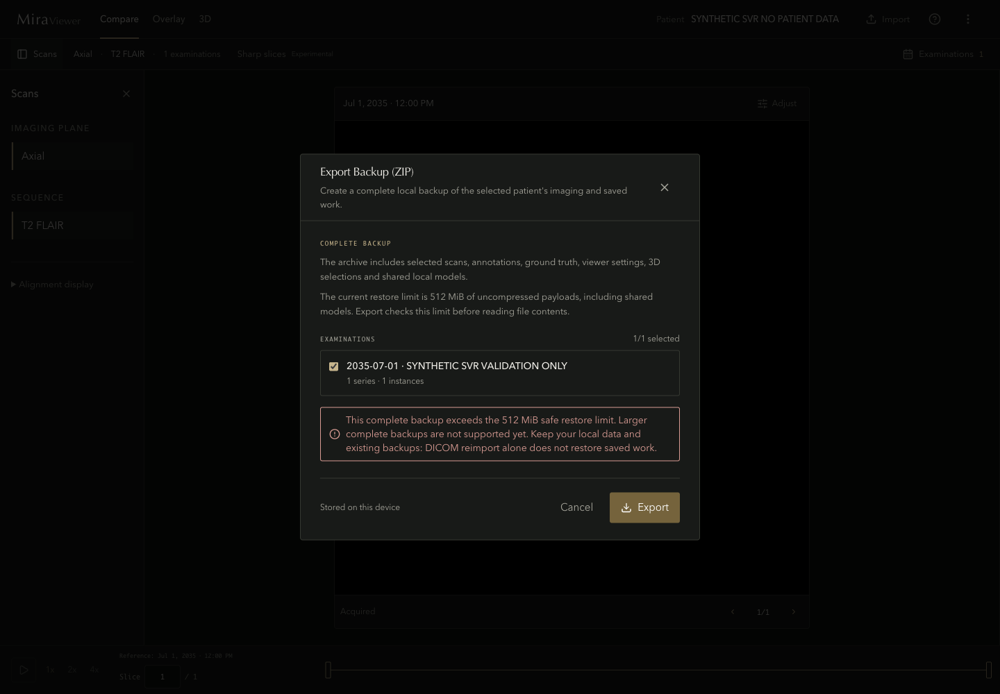
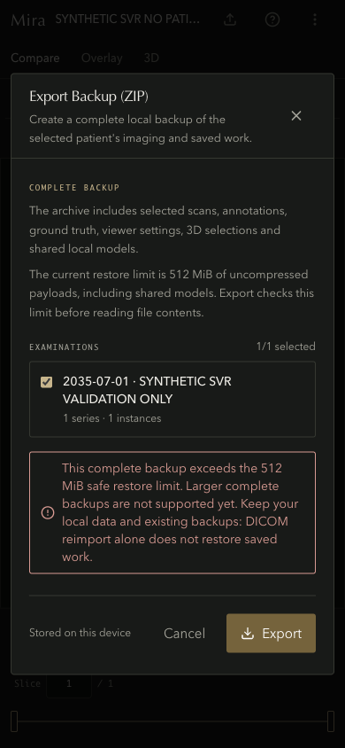

# Complete-backup capacity and cancellation

This implements the **immediate safety change** in [audit finding F5](../../exec-plans/active/2026-09-01-full-codebase-audit.md#f5-backup-export-and-restore-have-incompatible-capacity-contracts). It does not implement the later streaming/staged design or permit large restores.

## Contract and implementation

Both export and restore now use the same **512 MiB uncompressed-payload ceiling**. Export first registers the descriptors that will appear in the final manifest. It totals scans, masks, derived pixels/support and cached models before reading Blob contents, assembling chunked labels, hashing or packaging. An over-limit selection fails without creating a download. Legacy dense label rows and derived typed arrays still require database value reads; this is not a claim of allocation-free catalog inspection.

The version-2 manifest, ownership checks, integrity checks and medical-data commit behavior remain in place. Complete backups now use **uncompressed ZIP members** for every payload and the manifest. This can make the archive larger, but avoids legitimate sparse models or metadata exceeding the existing expansion-ratio guard. A one-MiB zero-filled model reproduced that separate failure before the fix. The final ZIP also passes the existing reader's container preflight before a download is offered; import protections were not relaxed. Source Blob values are retained as immutable references during preflight. A changed revision of a chunked selection cannot be mixed with earlier metadata. File sizes are checked again when bytes are read. JSZip receives a local `Uint8Array` view, avoiding its cross-realm `instanceof ArrayBuffer` limitation without another full copy.

Export accepts an AbortSignal and checks cancellation during collection and before publication. During packaging, cancellation pauses its owned JSZip stream and rejects the operation. Cancel, Escape, backdrop close and unmount retire the dialog's controller; late progress/results cannot start a download or close a later dialog. Examination choices are disabled while an export is active. Failed capacity checks retain the choices for retry.

The dialog discloses the limit and shared models. An over-limit warning tells users to keep local data and existing archives; reimporting DICOM alone does not restore saved work. The first visual pass caught misleading advice to “select fewer” when only one examination was selected. That advice was removed, the explanatory copy shortened, and the corrected state inspected again.

## Production-browser evidence

[capacity.json](capacity.json) records a normal production build at source fingerprint `be7fb717605cd21e811f819a56b21dae7a8739ac1e74d2b3bf8024a781c0c109`, application fingerprint `c6fedef483d2105b00409f63a8839abbd28514d0d7bdfe41237536875b1f2f7b`, based on commit `8e69da81219a447a93751ea342e629561086aa41`. The tracked changes were not yet committed at capture; the fingerprint identifies them. Model-manifest fingerprint: `5662be7768cef65140ce885dde9099fb16c0e64f0b90927d79ef8a9461aa725c`.

The test ran the actual app at `http://127.0.0.1:43134/` in an isolated headed Chrome profile. It imported one synthetic DICOM through the normal UI, then seeded two opaque synthetic cache records of 256 MiB each. These are native Blobs composed from shared synthetic blocks, not patched size getters, private data, real ONNX weights, or a claim that 512 MiB was simultaneously resident. Cache seeding exercises the export boundary; it is not an inference or large-DICOM-ingestion test.

The aggregate exceeded 512 MiB once the scan was included. The real export dialog rejected it with:

- **Zero** large-Blob `arrayBuffer` calls, stream calls or requested bytes.
- **Zero** downloads and page errors.
- The warning visible and controls available afterward, including at a 390 × 844 viewport.

The same workflow then replaced only its synthetic cache inputs with one 1 MiB repeated-byte model. It exported through the normal dialog and restored into a fresh browser context. The complete model payload and the imported DICOM's SHA-256 matched exactly. This verifies the sparse, below-cap case against the actual reader, not only an archive-size calculation.

The run passed in 11.5 seconds with unchanged source fingerprints. Its browser, server and disposable profile closed; port 43134 was released. A separate exact-marker sweep found no remaining resources from the current or earlier owned batches. User and other-worktree browser state was preserved.

### Inspected UI

The centered desktop panel retains the existing olive/gold palette, title hierarchy and restrained warning treatment. The shortened copy separates explanation, selection and recovery without clipping or covering controls. **PASS for this current static state.**

At 390 × 844, the examination label and warning wrap cleanly, gutters remain consistent and both footer actions stay visible. The message accurately describes the unsupported case instead of prescribing an impossible smaller selection. **PASS for this current static state.**

Both canonical PNGs were inspected individually at original detail, with an immediate path-specific assessment. Published copies are byte-identical; hashes are in the receipt. These judgments do not retroactively validate earlier imaging screenshots or establish motion/anatomical quality. Storybook was not used.

## Regression coverage and retained failures

All [six existing normal-production workflows](workflow.json) passed in **45.1 seconds** at the same source fingerprint, covering real synthetic custom-model execution, cancellation, saved drafts, import/navigation/annotations, reload/restore, acquisition identity and alignment replay.

The focused export, storage-integrity, export-dialog and import-dialog files passed **141 tests**. They cover exact DICOM bytes, saved masks/marks, compatible restoration, aggregate preflight before byte reads, the inclusive capacity boundary, early/collection/packaging cancellation, late-result rejection and smaller-selection retry. Existing corruption, identity, model-cache failure and noninterruptible medical-commit checks remain.

The stricter preflight exposed an old test-fixture gap: Node's structured clone, used by fake IndexedDB, turns jsdom Blobs into plain objects. The old tests could consequently export a string representation instead of their three intended DICOM bytes. This suite now uses cloneable native Blobs throughout, with an exact byte assertion. Native Blob buffers also exposed JSZip's realm-sensitive type check; passing a local byte view resolved it. The alternative of loosening size validation or adding fallback synthetic bytes was rejected. The smallest exact-byte reproduction passed before the focused suite was rerun. The next full run passed 3,185 tests but found five instances of the same old Blob/File fixture problem in the separate storage-integrity file. That suite now uses cloneable native File/Blob values too, and its five cases pass in the 141-test focused run. After that correction and reduction, the complete suite passed as recorded below. The earlier failing attempt is retained, not relabeled as a pass.

Failed attempts and the first, rejected visual state remain in ignored `frontend/tmp/backup-capacity-*.log` and `artifacts/performance/audit-backup-capacity-2026-09-03/attempt-01/`. Current raw runs, authored harness copies and original screenshots remain under `attempt-03/`; earlier attempts remain intact. Public evidence omits machine-local paths and private inputs.

## Final validation after reduction

The [complete default suite](unit-suite.json) passed **3,191 tests, zero failures, 54 existing skips** at code commit `a83816c6169b3f69e91bebf11b28c095c1a1293e`, source fingerprint `3d347c9baea2f29cc1d4054239d6d073cc948e41682a516da2ba8b5cd8632c66`. Source identity was unchanged across the run; no private fixture opt-ins were enabled. The focused reduction checks also passed 262 storage, backup and viewer tests, app/config/browser TypeScript references, and targeted ESLint. Final full ESLint passed at the same source fingerprint.

The two-pass reduction removed only a redundant saved-selection error factory and combined duplicate archive imports. Comments, guards, exception messages, transaction order, serialization and UI behavior are unchanged. Across the whole PR, non-comment insertions fell from 2,900 to 2,899, while non-comment churn stayed 3,345; this was a small cleanup, not a large reduction. Full-file AST/line scans covered all 40 changed files and all 246 diff hunks on both passes, alongside direct review of changed ownership and control paths. Detailed scan and reduction receipts remain in ignored `artifacts/turbovac/2026-09-03-sparse-editing-backup/reduction/`.

The normal-production browser workflows, capacity round trip and static captures above remain evidence for their recorded `be7fb717…` fingerprint. They were not rerun or relabeled after the constructor/import cleanup. The final unit checks cover that cleanup; no rendering, archive-policy or cancellation logic changed after those browser runs. Documentation-only publication changes do not change these source fingerprints.

## Still open

JSZip still buffers admitted exports, and restore still materializes verified payloads before its medical-data transaction. The model cache is a separate database; this change does not claim cross-database atomic publication. Streaming export, durable verified staging, quota/corruption/cancellation preservation at large scale, and synthetic round trips above 512 MiB remain required for full F5 completion. The [implementation ledger](../../exec-plans/active/2026-09-02-full-codebase-audit-implementation.md) is the status authority for that remaining work.
