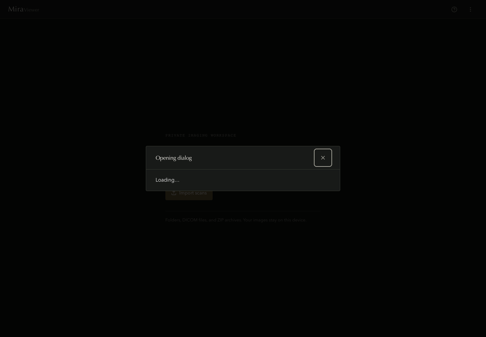
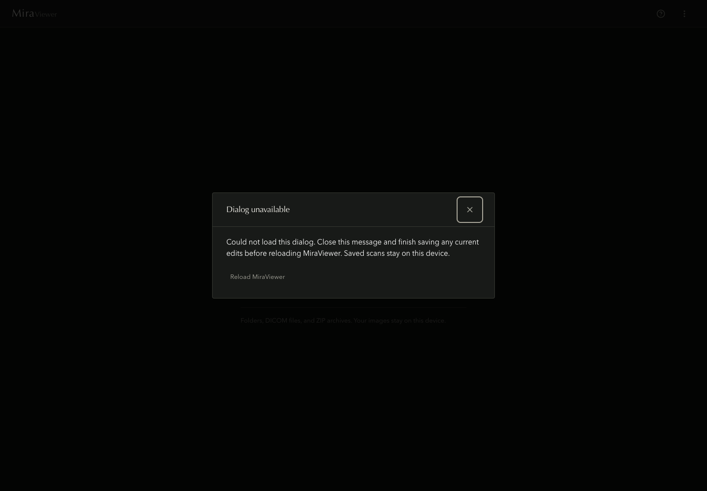
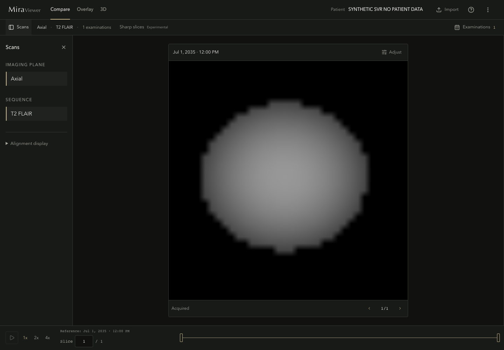
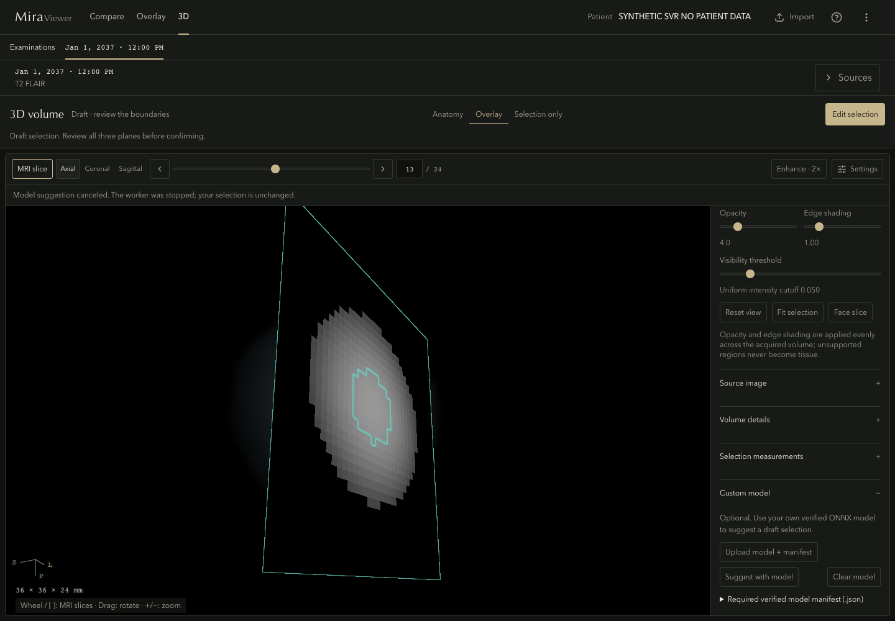

# Native playback and startup delivery

This implements F7 and F9 of the [full-codebase audit](../../exec-plans/active/2026-09-01-full-codebase-audit.md), following the completed source-identity and CI work in [PR #15](https://github.com/blader/MiraViewer/pull/15). The [implementation ledger](../../exec-plans/active/2026-09-02-full-codebase-audit-implementation.md) owns current completion status. The measurements below are real, local Chromium runs with synthetic inputs, not private MRI or an anatomical validation.

## What needed to improve

1. **Automatic slice playback could prevent any new plane from finishing.** Import two 512 × 512, 256-slice synthetic examinations, allow their physical registration to complete, and press 4× slice playback. The player asks for a position every 31.25 ms. Each uncached reslice took about 42 ms and was canceled by the next request. Cached planes still appeared, so merely counting render events missed the failure.
2. **The empty shell delivered an unused interaction library and every dialog.** Application-owned pan, zoom, wheel and annotation handlers did not use Cornerstone tools, math or Hammer. Nevertheless, those packages were initialized at startup. Import/export/help/clear code also arrived before it was needed.
3. **The public deployment silently lost WASM threading.** Local hosts sent isolation headers, but the tracked Vercel configuration did not. The actual baseline at `https://miraviewer.org` reported `crossOriginIsolated: false` and the loaded ORT runtime used one thread.

## F7: retain the runtime and regulate automatic demand

The numerical reslicer, native pixel resolution, support masks and source/request fences are unchanged. The alignment owner now retains at most one successful idle reslicing worker for 30 seconds. Cancellation, errors and timeouts still terminate the active worker. Registration-cache invalidation and unmount dispose the idle runtime; every job receives freshly prepared, transferred inputs. This is not a second source-pixel cache.

The slice navigator accumulates elapsed clock steps while a required visible alignment is running. Once the existing current-request result is terminal, it coalesces those steps into one new position. It never starts a queue of obsolete planes. Manual navigation and Pause remain available. Offscreen registration does not hold up a completed visible pair, and a failed visible result cannot deadlock playback.

### Why no rolling source-slab cache

A separately instrumented production-shaped build measured median slab preparation at **0.77 ms** and worker computation at **12.8 ms** for 256² planes. The proposed slab cache was conditional on preparation dominating; that condition did not hold. Retaining the runtime reduced startup cost, but on its own still canceled every uncached 512² plane at 4×. The remaining failure was demand arriving faster than completion, not missing source caching.

### Paired real-browser results

`warm-baseline-04` uses retained `candidate-02` (F9 only). `warm-candidate-04` uses retained `candidate-04` (F7 + F9). Both use Chromium **151.0.7922.34**, the same normal production route and the same independently hashed physical DICOM inputs. No numerical-worker code or graph weights changed. Each speed runs for two seconds, followed by an explicit manual return to the reference slice.

| Workload                                                 |     Baseline |    Candidate |
| -------------------------------------------------------- | -----------: | -----------: |
| 256² warm manual worker median                           |     19.12 ms |      9.29 ms |
| 256², 4× uncached completions                            |           56 |           65 |
| 512² warm manual worker median                           |     41.64 ms |     35.28 ms |
| 512², 4× uncached completions                            |        **0** |       **22** |
| 512², 4× canceled jobs                                   |           33 |            1 |
| 512², 4× canceled transferred input                      |   123.75 MiB |     3.75 MiB |
| Sampled whole-browser RSS high-water, combined workloads | 1,456.75 MiB | 1,562.89 MiB |

The remaining candidate cancellation occurs around the final manual jump. The stronger regression explicitly requires uncached completion; it fails against the old bundle at 512²/4× and passes for both candidate sizes. **All 97 shared native reference planes match bit-for-bit in pixels and support.** All final display identities name the requested reference index and native output grid.

Last-manual-request-to-matching-render-event delay was 12–42 ms for candidate 256² phases and 12–76 ms for candidate 512² phases. The 512²/4× final return is slower than the baseline's cached return (76 versus 16 ms); the candidate had actually advanced and filled its bounded output cache. Full per-phase timings are in [measurements.json](measurements.json). These are observed browser draw events, not physical screen latency.

Memory did **not** improve in this sample. The additional completed work and retained runtime trade about 106 MiB of sampled whole-browser high-water for useful output; this measurement cannot attribute all of that difference to the worker. RSS samples cover only the owned Chromium process tree at 250-ms intervals, including renderer and GPU processes. They are not an isolated allocation measurement or guaranteed instantaneous peak. The runtime retains one idle worker, not a growing slab cache.

The player may skip positions to follow elapsed time on a slow device. This fixes starvation without lowering fidelity; it does not promise 32 distinct displayed planes per second. No smoothness, physical monitor, anatomical or hardware-wide performance verdict is inferred from these metrics.

## F9: smaller startup, explicit dialog recovery, consistent assets

The tools/math/Hammer initialization and dependencies are removed. Core Cornerstone, WADO, the actual compressed decoder, and application interaction handlers remain. Imaging initialization stays at its existing startup owner: the measured, smaller change does not require moving first-image work to a new lifecycle.

One conditional dialog host loads the selected dialog through the existing active-dialog state. The shared accessible shell owns focus and background isolation while loading or failing. Closing before delivery prevents a late module from reopening the dialog. A failed fetch is dismissible and offers an explicit reload after warning users to finish saving; it never reloads automatically.

An attempted in-place dynamic-import retry was rejected after a real browser trace showed Chromium cached the failed import and made no second network request. There is no retained retry counter, cache-busting module identity, or second error-boundary owner.

| Production entry          | Raw bytes | Gzip bytes |
| ------------------------- | --------: | ---------: |
| Merged baseline `7da6db8` | 2,664,701 |    814,004 |
| F9-only candidate         | 2,046,336 |    658,045 |
| F7 + F9 candidate         | 2,047,293 |    658,515 |

The combined entry is **23.2% smaller raw / 19.1% smaller gzip**. The initial paired F9 startup run used ten fresh contexts per build: five explicit-VR little-endian DICOM imports and five RLE imports of the same synthetic slice. Median usable-shell frame time was **319 → 263 ms**, first actual image draw after the import click **78 → 74 ms**, and total main-thread long-task duration per context **90 → 57.5 ms**. All 20 output canvases had SHA-256 `24cd3f9d325f9dcb17240d0489b08124791520b914f5746e1b28303287f37e5e`.

Those initial latency figures belong to the F9-only candidate, not a claim about every future revision. The later combined F7/F9 check used ten more fresh contexts and measured 274 ms to the shell, 74 ms from import click to image draw, and 57.5 ms of long tasks; its output hashes were identical. Resource Timing confirms that Vite preview served the entry with gzip, matching the artifact sizes above. Small sample medians do not establish fleet percentiles. Model, codec and pipeline assets were not removed to shrink the bundle.

### Actual host qualification

A fresh owned browser runs the **real emitted custom-model worker**, using an explicit WASM-only session and a 24³ pointwise synthetic oracle. After completion, the harness reads the same already-loaded ORT module inside that worker, then terminates it. This is an actual execution/provider check, not a guessed thread count based on headers. All **13,824** labels match. Seven auxiliary runtime workers were observed on each eight-thread local host and closed with the parent.

| Host                                          | Actual isolation | Loaded ORT 1.23.2 thread setting | Asset result                                  |
| --------------------------------------------- | ---------------- | -------------------------------: | --------------------------------------------- |
| Vite preview, `127.0.0.1:43134`               | true             |                                8 | 38 byte/hash/MIME checks pass                 |
| Canonical offline launcher, `127.0.0.1:43125` | true             |                                8 | 38 checks pass; all other origins blocked     |
| Canonical dev command, `localhost:43124`      | true             |                                8 | 37 checks pass; actual source worker executes |
| Public baseline, `https://miraviewer.org`     | false            |                                1 | 38 checks pass                                |

The assets include the complete vendored ORT/WASM closure, ITK pipelines and all pinned model graphs/constants/notices. The production worker hash is checked against the retained bundle. The offline test uses the unchanged canonical Python launcher and its durable origin; only automatic opening of the operator's browser is suppressed. Its assets point to the retained physical bundle, which must remain preserved while that comparison is needed.

The first dev test completed the oracle but exposed a harness-cleanup mismatch: Playwright's default forceful process-group shutdown killed the npm wrapper before it could retire detached Vite. Only that verified owned Vite PID was signaled. Configuring graceful SIGTERM in the temporary qualification harness then passed and closed normally in 7.5 seconds. No production launcher behavior or user process changed.

The new Vercel header configuration still needs qualification on its actual deployment. The baseline result above is deliberately not reported as a candidate-host pass. Custom hosts without isolation continue to use the safe single-thread path. [ORT's environment documentation](https://onnxruntime.ai/docs/tutorials/web/env-flags-and-session-options.html) explains the requirement; [Vercel's configuration documentation](https://vercel.com/docs/project-configuration/vercel-json) defines the response-header rules.

## Visual and interaction evidence

These are real-app, 1440 × 1000 static captures from the F9-only production candidate at `/`, not Storybook. Each original was individually inspected at original resolution. The centered modal, typography, close/focus treatment and readable status passed the stated desktop static review. They do not establish motion, mobile behavior, anatomy or GPU performance. F7 changes computation and automatic demand, not these dialog layouts.

| Loading, dismissible                           | Delivery failed, dismissible                                 |
| ---------------------------------------------- | ------------------------------------------------------------ |
|  |  |

The normal browser suite exercises actual import, pan/zoom/wheel, overlays, outlines, clear/export, saved selection, source replacement and custom-model cancellation. The added dialog case covers network failure, dismissal, explicit reload recovery, closing a delayed import and reopening normally. The RLE fixture extends the existing synthetic generator; default uncompressed bytes are unchanged.

The existing import/navigation/annotation/reopen/backup workflow now uses RLE-compressed stacks, so normal CI also exercises the shipped decoder rather than leaving it exclusively in the timing suite. Its focused production replay passed in 7.0 seconds; the other workflows continue to cover uncompressed input.

## Provenance and preserved failures

[measurements.json](measurements.json) contains the build/application/model identities, per-phase output hashes and timings, source-manifest hashes, actual host runtime settings, checked assets and image hashes. Application and test-harness fingerprints are separate: a test-only change does not relabel the compiled app. The numerical longitudinal worker remained byte-identical across this comparison.

Complete raw runs, physical synthetic inputs and failed attempts remain under local `artifacts/performance/audit-startup-delivery-2026-09-04/`. The failed import retry, initial incorrect import-button selector, Playwright inline-file limit, diagnostic build anchor error, old-bundle starvation and initial lint failures are retained. The large browser fixture uses real file-picker paths because its bytes exceed Playwright's 50 MiB inline payload limit; it was not downsampled to evade the limit.

No original MRI, private weights, marks, source, screenshots, prior receipts or comparison bundle was deleted. Diagnostic `[TRACE:...]` instrumentation was confined to a separate ignored build transform; it is absent from the production sources and committed performance test. All eleven normal-production workflows passed on the combined candidate in 43.8 seconds; the startup/codec check passed in 7.8 seconds. Full lint and both TypeScript checks passed. The first complete unit run passed 3,258 tests and failed one obsolete synchronous-dialog expectation; its repair preserves the retained-import assertion. Subsequent hosted CI passed all 3,259 default unit tests, but exposed the separate rendering problem below. Hosted current-head CI, final review clearance and merge remain distinct from local runtime acceptance.

## CI follow-up: status updates must not redraw unchanged 3D pixels

Two hosted runs failed the normal custom-model workflow: [33887132867](https://github.com/blader/MiraViewer/actions/runs/33887132867) reached its 180-second deadline during reopen; [33889164663](https://github.com/blader/MiraViewer/actions/runs/33889164663) timed out taking the cancellation screenshot after a trivial page evaluation had already taken 12.8 seconds. The latter passed lint, production build, all 3,259 default unit tests and the other ten browser workflows. Those failures are preserved, not classified as random flakes.

The enhancement hook returns a new wrapper object on every React render. The viewer watched that wrapper and requested a full raymarch even when only a custom-model status message changed. A production-component regression failed before the fix: one status update increased the draw count from one to two with unchanged display inputs. The repair removes the redundant enhancement ref, reads current committed state through React's effect-event primitive, and invalidates only changes to the enhancement result, source, enabled state or strength. Actual display changes still request a frame. The shader, image quality, physical fixtures, viewport and timeouts are unchanged.

An observation-only copy of the original custom-model workflow ran against retained `candidate-04` and the corrected `candidate-06`. No test body, input, assertion or deadline changed. Full GL draw submissions fell from **32 to 18**. The cancellation PNGs are byte-identical, SHA-256 `b33b2499c36fcaedfd42972a1cd4b81bc5a0087432fec5c479f19b247cb5fca1`; saved and reopened draft labels are also identical. All three custom workers close in each run. These are one-sample local submission counts, not completed-GPU timings or a hardware-wide speed claim.

The corrected build then passed **all eleven uninstrumented normal workflows in 41.6 seconds**, plus 149 focused viewer/enhancement tests, full lint and TypeScript project checks. Its application fingerprint is `2c21538f1a3b340ba0d94f68784bf41af1754498cc46860fc24e64f18d7024db`. The entry remains 2,047,293 raw bytes (658,513 gzip); the earlier startup and playback timings retain their original build identities. [Follow-up receipts](followup-acceptance.json) include the old failures, exact builds, raw receipt hashes, label readbacks and limitations. The full hosted suite must still pass on the pushed fix.

During inspection, two image-tool previews omitted content that was present in their canonical PNGs. No product change was made from that appearance. Pixel checks established the discrepancy; exact-byte copies under distinct paths displayed the complete images. Earlier visual judgments were reopened. Fresh individual inspections covered the three F9 captures, the cancellation state and the independent-2D editing/reopened states. The follow-up record preserves those checks and the independent evidence used to reconsider each architectural choice. This validates those exact static states, not previous motion claims or an entire family of rendering choices. All owned replay browsers and servers closed; unrelated sessions were untouched.

## Independent-2D editing acceptance

The original audit also required proof that independent-2D sources remain brush-editable. A normal-production replay imported **72 physical synthetic DICOM files** with genuine independent 2D acquisition tags, reconstructed the volume, used native pointer Add/Remove gestures, confirmed the selection, reloaded and reconstructed again. Admission metadata was not injected into IndexedDB and no application module was mocked.

The saved source mode is `independent-2d`. Auto-fill remains explicitly unavailable with the brush-only explanation; no inference worker is created. All **13 selected voxels, 13 Add marks and 13 Remove marks**, the complete source identity and reviewed state survive reopening exactly. Label SHA-256 is `3381b61f105fc6228ffa1225927b50f6b7fb1bc69ce306eac77302ba13a29051`. This 7.6-second replay belongs to retained `candidate-04`; it is not relabeled as a run of the later rendering fix. Its complete saved/reopened records are in [followup-acceptance.json](followup-acceptance.json). The static captures cover the visible desktop workspace only; lower panes extend beyond the viewport.

## Release checkpoint

This report records pre-merge experiments, including deliberately preserved failures. Preview protection is unchanged; the public candidate-host execution is scheduled after the authorized merge, not substituted with a protected-preview header check. The [local merge closeout](../../../artifacts/turbovac/startup-delivery-2026-09-04/merge-closeout.md) records final-head CI, fully paginated review clearance, the actual merge and deployed-runtime qualification as they occur. A pending entry there is not a completed gate.
