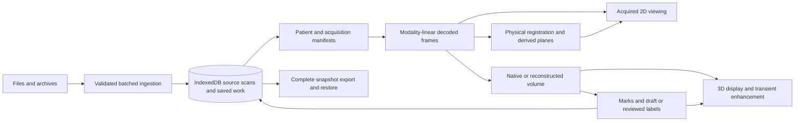

# MiraViewer full-codebase improvement audit

**Reviewed:** September 1–2, 2026; filename uses the audit’s start date.\
**Scope:** the current working tree, including unfinished segmentation/native-plane changes—not just the committed branch.\
**Emphasis:** architecture, performance, duplication/obsolescence, and UX. Correctness is addressed where it exposes an architectural weakness or materially affects saved work.

## Verdict

**Keep the local-first architecture. Make repeated interactions cheaper, give expensive state the right lifetime, and delete obsolete execution paths before adding more mechanisms.**

The application has sound foundations: browser-local storage, explicit acquired-image provenance, bounded imaging memory, cancellable worker jobs, and separation between original MRI data and derived display content. Much of the earlier architectural debt has already been addressed. A framework rewrite, a new global state library, or another alignment/segmentation algorithm would not be my first investment.

The remaining problems cluster around a specific mismatch: users make small, repeated changes, but several paths perform acquisition-sized scans, recreate model sessions, reconstruct whole rasters, copy whole label volumes, or read every cached image record. Other boundaries confuse display identity with durable identity, or advertise capabilities that the current acquisition cannot support.

There are also concrete simplifications available: **seven source modules totaling 3,108 physical source lines are unreachable from the application entrypoint**, and a separate bundle-only experiment removing the apparently unused Cornerstone tools initialization reduced the entry bundle by **500,326 bytes raw / 119,279 bytes gzip**. These are different findings; the unreachable modules are generally already excluded from the runtime bundle.

### Recommended priorities

“Small” means a focused change at an existing boundary; “medium” crosses several existing owners; “large” changes persistence or execution architecture. These are scope estimates, not delivery commitments. Numbering is for reference, not a numerical quality score.

| Finding                                                                                                                      | Priority                     | Main benefit                                         | Scope                                   | Evidence                                         |
| ---------------------------------------------------------------------------------------------------------------------------- | ---------------------------- | ---------------------------------------------------- | --------------------------------------- | ------------------------------------------------ |
| [F1. Final alignment scoring blocks the UI thread](#f1-final-alignment-scoring-still-blocks-the-ui-thread)                   | High                         | Responsiveness during alignment                      | Small–medium                            | Reachable path + synthetic CPU measurement       |
| [F2. Every correction behaves like a cold batch](#f2-interactive-corrections-rebuild-acquisition-and-model-state)            | High                         | Faster repeated segmentation corrections             | Small first step; medium thereafter     | Repeated work demonstrated in source             |
| [F3. Sparse editing becomes dense work](#f3-sparse-editing-is-not-sparse-through-painting-and-persistence)                   | High                         | Brush responsiveness and lower write volume          | Medium                                  | Reachable raster/copy/write paths                |
| [F4. Cache bookkeeping reads image payloads](#f4-derived-frame-bookkeeping-loads-pixels-it-does-not-need)                    | High; quick win              | Lower allocation and database traffic                | Small                                   | Actual data API probe                            |
| [F5. Export can exceed restore capacity](#f5-backup-export-and-restore-have-incompatible-capacity-contracts)                 | High                         | Trustworthy backup UX and bounded resource use       | Small guard; large scalable format path | Direct contract contradiction                    |
| [F6. Presentation keys own durable settings](#f6-study-and-acquisition-identity-should-not-be-decided-by-presentation)       | High                         | Stable selections and discoverable acquisitions      | Medium                                  | Actual data API counterexamples                  |
| [F7. Warm browsing still rebuilds content](#f7-separate-plane-content-from-request-identity-and-retain-warm-rendering-state) | Medium–high                  | Less conversion, synthesis, and cancellation churn   | Medium                                  | Cross-boundary invalidation and repeated work    |
| [F8. Retire obsolete production paths](#f8-delete-obsolete-features-and-their-private-protocols)                             | High architectural return    | Less code and fewer competing contracts              | Small–medium                            | Import graph + caller inspection                 |
| [F9. Reduce startup cost and host differences](#f9-reduce-startup-work-and-make-runtime-delivery-consistent)                 | Medium–high; quick win       | Smaller startup payload, predictable inference setup | Small–medium                            | Two diagnostic builds + host configuration       |
| [F10. Make capabilities and recovery explicit](#f10-make-capabilities-and-recovery-visible-before-users-hit-a-dead-end)      | Medium–high                  | Fewer misleading controls and dead ends              | Small–medium                            | Reachable UX paths; limited live visual evidence |
| [F11. Test the shipped browser workflow](#f11-close-the-gap-between-unit-coverage-and-the-shipped-browser)                   | High enabling work           | Reliable improvement/regression evidence             | Medium                                  | Current checks and test configuration            |
| [F12. Upgrade legacy geometry metadata](#f12-secondary-correctness-legacy-scans-need-a-metadata-upgrade-path)                | Secondary correctness        | Preserve existing users’ alignment/3D access         | Medium                                  | Production-module counterexample                 |
| [F13. Make custom-model cancellation real](#f13-secondary-correctness-custom-model-inference-needs-a-bounded-lifecycle)      | Secondary; advanced workflow | Recoverable cancellation and resource admission      | Medium                                  | Reachable lifecycle/accounting gap               |

## Scope and confidence

| Item                                        | Reviewed state                                                                                                                                                                                 |
| ------------------------------------------- | ---------------------------------------------------------------------------------------------------------------------------------------------------------------------------------------------- |
| Repository                                  | MiraViewer; Vite + React + TypeScript in frontend; local Python offline launcher                                                                                                               |
| Branch                                      | blader/siqi-chen/segmentation-sampled-plane-pruning                                                                                                                                            |
| HEAD / merge base against local origin/main | 5f0efa433b6c8b6672add9a30184ec1140b2b5a3                                                                                                                                                       |
| Working tree                                | 46 tracked changed/deleted files at kickoff, plus untracked work including v2 model assets and production helpers                                                                              |
| Source inventory                            | 188 TS/TSX/CSS/JSON source files; 57,810 physical lines, including comments and declarations                                                                                                   |
| Test/support inventory                      | 196 code files; Vitest discovered 179 test files in the full run                                                                                                                               |
| Production module graph                     | 183 non-declaration TS/TSX/JS modules; 176 reachable when conservatively including type imports, re-exports, dynamic literals, and worker URL edges                                            |
| Review method                               | Repository-wide inventory and reachability; deep end-to-end review of import/storage, comparison/alignment, rendering, reconstruction, selection/inference, backup, and release configuration  |
| Privacy                                     | No private MRI files, patient database, or MRI pixels were read. Runtime probes used synthetic records/arrays. Only the empty local application was visually inspected.                        |
| Changes made by this audit                  | This report and an empty-state screenshot. Builds and synthetic preparation used temporary output directories. No production code, tests, dependencies, commits, or remote state were changed. |

The source/test/script/distribution content fingerprint remained unchanged across the review and builds:

```text
8fdce15db0758928d705aa38d441c1a23a56caabd9abc821579025c6bb681e5a
```

The fingerprint hashes sorted relative paths and file SHA-256 values for the inspected code extensions under frontend/src, frontend/tests, frontend/scripts, and frontend/distribution. Model binaries were separately checked against their manifest. It is a working-tree fingerprint, not a Git revision.

This is a thorough architectural audit, **not a mathematical proof of every numerical kernel, a clinical accuracy assessment, or an exhaustive browser acceptance run**. Unchanged numerical routines were reviewed through their production integration, representations, resource boundaries, and relevant tests. All changed production files in the imaging/segmentation scope were inspected. Historical reports were used as leads and checked against current code; historical benchmark numbers are not treated as current evidence.

## The architecture worth keeping



The main production flows are understandable. The best improvements preserve these boundaries:

- **Durable source:** IndexedDB owns imported scans. Patient/study/frame checks, physical ordering for new imports, and source provenance are real and should remain authoritative.
- **Accepted imaging content:** acquired pixels, accepted registration, and label/mark content should outlive individual navigation or progress updates when their source has not changed.
- **Transient presentation:** windowing, pan, zoom, sharp-slice synthesis, GPU reductions, and enhancement must not become new measurement or annotation authorities.
- **Execution:** workers own expensive scratch and cancellation. Retaining reusable state is useful only with explicit source identity, a byte budget, and disposal.

The current implementation already fixes several historical concerns: actual Cornerstone cache reuse, raw modality-linear decoding, live validation before applying alignment, patient isolation, complete v2 backup content, accessible shared dialogs, on-demand GPU rendering, bounded undo/cache behavior, and source-preserving enhancement. The current dirty native-plane changes also improve demand-versus-prefetch priority, byte-bounded caching, texture allocation reuse, and preservation of the last complete plane with its matching geometry. Do not undo those improvements while simplifying.

## Findings and recommendations

### F1. Final alignment scoring still blocks the UI thread

**High priority. Confirmed reachable cost; measured only as a synthetic Node function call.**

The normal comparison path requests physical registration reuse. On a cold multi-frame alignment, the code performs worker-backed registration and optional Elastix refinement, then calls final affine selection synchronously from the React hook. See [useAutoAlign.ts:1070–1110](../../../frontend/src/hooks/useAutoAlign.ts#L1070).

The selector constructs descriptor pyramids and scores the seed plus optimizer proposal in both directions: [structuralAffineSelection.ts:254–336](../../../frontend/src/utils/structuralAffineSelection.ts#L254). The fallback 2D route already has a worker operation for final scoring: [alignmentScoringRunner.ts:168–181](../../../frontend/src/utils/alignmentScoringRunner.ts#L168). The physical route does not use it.

A 256 × 256 synthetic Float32 probe, with scales 256/128/64 and one optimizer proposal, took **1,637.81, 1,412.56, 1,306.52, and 1,460.40 ms** across four consecutive calls on Node 22.22.0/arm64. This establishes substantial synchronous CPU work, not a browser latency percentile or a clinical-performance result.

There is work to remove before moving it: the reverse score at lines 306–312 consumes only coverage, but computes descriptors, gradients, and local similarity statistics to obtain it. Coverage is a weighted support calculation; the discarded appearance scores do not influence selection. See [perceptualSliceSimilarity.ts:508–685](../../../frontend/src/utils/perceptualSliceSimilarity.ts#L508).

**Recommendation:** implement coverage-only reverse evaluation with exactly the current support, resampling, exclusion, and weighting semantics. Move remaining final selection to a final-only operation at an existing worker boundary. Do not initialize unused legacy coarse/fine state just to run final selection.

**Preserve:** final refinement is optional. If it fails, retain the accepted physical pose and valid presentation. The existing [physical-route tests](../../../frontend/tests/useAutoAlignPhysical.test.tsx#L1467) deliberately protect this independence.

**Acceptance:** exact transform/coverage parity; cancellation while ranking; no stale result publication; browser traces showing the final-scoring CPU work off the UI thread. Measure total completion time as well as input/paint responsiveness—worker placement alone need not make total alignment faster.

### F2. Interactive corrections rebuild acquisition and model state

**High priority. Repeated work is demonstrated; its share of real correction latency is not yet measured.**

The editor defaults to Auto-fill. A substantive stroke schedules a proposal after 350 ms; another stroke cancels the current proposal. See [useSvrSelection.ts:334–375](../../../frontend/src/hooks/useSvrSelection.ts#L334).

Each proposal currently crosses several cold boundaries:

1. It constructs a new native-source context, then asks for the full acquisition’s intensity range: [Svr3DView.tsx:1426–1475](../../../frontend/src/components/Svr3DView.tsx#L1426).
2. The range cache exists only inside that short-lived context. Its first call visits every acquisition frame and every valid pixel. Processing decodes use a non-inserting cache policy, so uncached frames can be decoded again on the next correction: [nativeSourceContext.ts:127–193](../../../frontend/src/utils/svr/nativeSourceContext.ts#L127).
3. The current-source guard serializes the whole source/provenance structure repeatedly inside that frame loop. With N-frame metadata serialized through an N-frame pass, this metadata-check component grows quadratically: [nativeSourceContext.ts:85–89](../../../frontend/src/utils/svr/nativeSourceContext.ts#L85).
4. Regional assembly is followed by another exact crop copy. Then a new tracking worker initializes four ONNX sessions from six model assets, executes the proposal, releases the sessions, and terminates. See [interactiveTrackingWorker.ts:155–204](../../../frontend/src/utils/segmentation/interactiveTrackingWorker.ts#L155), [efficientTam/model.ts:84–108](../../../frontend/src/utils/segmentation/efficientTam/model.ts#L84), and [interactiveTracking.worker.ts:145–149](../../../frontend/src/utils/segmentation/interactiveTracking.worker.ts#L145).

The verified manifest contains **75,065,470 model bytes**. Browser HTTP caching may avoid transferring those bytes from disk/network every time; it does not preserve worker-local graph initialization and model sessions. The dirty query-blocking/pruning work reduces important memory or propagation costs, but does not eliminate this cold-start structure.

**Recommendation, in order:**

1. Keep the validated full-acquisition intensity range and immutable metadata with the accepted source, not an individual proposal. Use the existing dataset/source generation to invalidate them. Retain source validation at acceptance; do not replace safety checks with an unverified mutable pointer. Recompute memory admission from current owners per job; do not accidentally cache old residency/budget measurements with the source scalar.
2. Measure source preparation, asset loading, graph initialization, encoding, propagation, and publication separately.
3. Retain a bounded source-owned model worker across successfully completed corrections. Keep each run’s history separate. Cancellation or failure may still destroy the worker when that is necessary to terminate an uninterruptible inference call. Explicitly budget and expire idle sessions.
4. Cache image features or remove redundant crop copies only after measuring their benefit and defining the complete preprocessing/source key.

**UX consequence:** show meaningful phases and let an expensive case use an explicit “Update boundary” action if repeated auto-start/cancel cycles do not produce useful results. Any progressive preview must remain provisional and separate from saved label authority.

**Acceptance:** two successive corrections measure the unchanged acquisition once; normal completion reuses sessions; source/revision changes invalidate them; cancellation releases active work before replacement. Compare identical final masks, all hard marks, peak memory, and time to the completed correction. Do not achieve a speedup by dropping conditioning context or lowering source fidelity.

### F3. Sparse editing is not sparse through painting and persistence

**High priority. The algorithmic costs are clear; representative pointer latency remains unmeasured.**

The code already has sparse edit patches, bounded undo, and sparse GPU uploads. But a small edit becomes dense work at three other boundaries:

- A changing stroke clones the entire byte-label volume; undo likewise materializes a replacement: [useSvrSelection.ts:334–404](../../../frontend/src/hooks/useSvrSelection.ts#L334). A 256³ byte mask means **16 MiB per replacement**, before other copies.
- Each pointer move copies the accumulated stroke Set. Its React update rebuilds the entire visible slice into a newly allocated canvas/ImageData, including a point object per pixel: [SvrSegmentationEditor.tsx:119–217](../../../frontend/src/components/SvrSegmentationEditor.tsx#L119) and [244–254](../../../frontend/src/components/SvrSegmentationEditor.tsx#L244).
- Each completed edit submits the whole label array to IndexedDB: [SvrVolume3DViewer.tsx:578–626](../../../frontend/src/components/SvrVolume3DViewer.tsx#L578), [localApi.ts:666–686](../../../frontend/src/utils/localApi.ts#L666).

The current change to mount only visible editing panes is beneficial. It does not remove dense repainting inside a visible pane.

**Recommendation:** separate the immutable grayscale slice from transient brush, marks, mask contour, and crosshair layers. Rebuild grayscale only when source, slice, or window changes; coalesce brush-overlay updates to animation frames. Carry the existing patch representation farther through editing and persistence, using a durable patch/checkpoint or chunk-update design if representative data justifies it.

Do not replace immediate durable submission with a component-local debounce that loses a final edit on remount. Do not mutate a shared label buffer unless every renderer, undo owner, and persistence reader has a clear versioned view. The grayscale/overlay separation is a useful first change even before persistence format work.

**Acceptance:** for a long brush gesture, record grayscale rebuild count, full-volume copies, persisted bytes, and pointer-to-paint time. Preserve exact undo/redo, hard marks, save/reopen behavior, label ownership, and existing sparse GPU updates. Compare work against changed pixels/voxels, not only total frame rate.

### F4. Derived-frame bookkeeping loads pixels it does not need

**High priority and a small, well-bounded first fix. Actual query behavior was reproduced.**

Every saved derived frame is followed by an unrestricted getAll on the creation-time index, solely to decide which old IDs to delete: [localApi.ts:908–927](../../../frontend/src/utils/localApi.ts#L908).

The normal save path caps retention at 32 records. Each admitted 1024² frame can contain Float32 pixels plus byte support. Inserting a 33rd maximum-size record can therefore retrieve **165 MiB of pixel/support payload to choose one eviction**. This is an illustrative calculated payload volume, not measured peak browser RAM or a universal upper bound: restore can merge incoming frames with existing records before normal save-path pruning. The browser materializes all returned values at once; see [MDN’s index getAll behavior](https://developer.mozilla.org/en-US/docs/Web/API/IDBIndex/getAll).

Hydration has a related over-read: [localApi.ts:930–953](../../../frontend/src/utils/localApi.ts#L930) fetches every frame for the patient; [derivedAlignmentFrame.ts:189–192](../../../frontend/src/utils/derivedAlignmentFrame.ts#L189) filters for the selected sequence/series only afterward. The sequence-availability hook triggers this path when its context changes.

An in-memory probe through the actual production data API confirmed unrestricted getAll when inserting the 33rd synthetic record and retention of 32 records afterward.

**Recommendation:** prune using the existing index’s key-only API/key cursor. This does not require a new store or cache. For hydration, select current patient/revision/sequence candidates before loading their pixels; add a targeted compound index when a schema change is justified. Keep full validation for frames actually admitted to presentation.

**Acceptance:** eviction reads no retained pixel payloads and preserves exactly the same retained IDs. Hydration reads only relevant candidates. Use 32 synthetic 1024² frames to measure clone/allocation volume and sequence-switch time; keep malformed/stale-source rejection unchanged.

### F5. Backup export and restore have incompatible capacity contracts

**High priority because this undermines both scale and the promise made before users erase local data.**

The export dialog promises a “complete, restorable backup”: [ExportModal.tsx:124–126](../../../frontend/src/components/ExportModal.tsx#L124). Export accumulates every DICOM/model/segmentation/derived-frame payload as an ArrayBuffer in JSZip, then produces a whole output Blob: [exportBackup.ts:191–310](../../../frontend/src/services/exportBackup.ts#L191). It has no aggregate-size admission or abort signal, and the dialog cannot be dismissed during export.

Restore explicitly rejects a manifest whose referenced payload exceeds **512 MiB**: [exportBackup.ts:388–392](../../../frontend/src/services/exportBackup.ts#L388). The limit is over restored payload, not just compressed ZIP size. A patient with 513 MiB of referenced scans and saved work can receive an export that this application refuses to restore. Reimporting original DICOM files does not restore saved annotations or segmentation.

This matters beyond error wording: [ClearDataModal.tsx:95–96](../../../frontend/src/components/ClearDataModal.tsx#L95) recommends making a backup before deletion. The exporter and importer need the same definition of a usable backup.

**Recommendation:** immediately share export/restore capacity preflight and disclose incompatibility before expensive collection. Do not label an over-limit export restorable. For the intended large-data workflow, stream export and stage verified restoration in durable local storage before atomic publication. Keep ownership/integrity validation, quota checks, and the existing noninterruptible commit boundary. Support cancellation before publication.

Simply raising the in-memory restore cap moves the failure to a larger allocation. A streaming/staging design is larger work, but removes the cause rather than adding another threshold.

**Acceptance for the immediate change:** successful below-cap restoration and explicit over-cap warning/rejection before expensive export, using aggregate payload rather than compressed ZIP size. **Acceptance for the later scalable design:** successful synthetic round trips above 512 MiB, including saved labels, marks, settings, models, and derived frames. Record peak browser memory and cancellation behavior. Corruption, quota failure, and pre-commit cancellation must preserve the previously visible dataset. The small shared-admission change should ship before the larger format/resource redesign.

### F6. Study and acquisition identity should not be decided by presentation

**High architectural leverage. Two concrete counterexamples were reproduced through the production data API.**

Patient/study ownership is much stronger than it was. But the comparison representation still makes presentation choices into durable identity:

1. An examination key is a formatted study timestamp. The Study UID is appended only if another currently imported study shares that timestamp: [localApi.ts:207–224](../../../frontend/src/utils/localApi.ts#L207). Importing a colliding study changes the original study’s key.
2. Settings are saved and hydrated under those examination keys: [localApi.ts:305–352](../../../frontend/src/utils/localApi.ts#L305), [usePanelSettings.ts:295–323](../../../frontend/src/hooks/usePanelSettings.ts#L295).
3. A comparison cell exposes only the largest-instance series for its plane/sequence/examination. Other candidates disappear from ComparisonData: [localApi.ts:251–289](../../../frontend/src/utils/localApi.ts#L251). Adding a larger series silently changes the chosen acquisition while the cell keeps its settings key.

The synthetic production-module probe saved a zoom adjustment, added a larger same-combination series as synthetic persisted records, and observed the acquisition switch with the prior cell settings. Adding a synthetic same-timestamp study record then changed the examination key, leaving the original settings stored but unreachable under the new key. This exercised the production comparison/settings APIs, not the ingestion UI.

**Recommendation:** use Study UID as stable examination identity and timestamp only for labeling/sorting. Preserve candidate series in the local API and offer one recommended default plus an explicit source selector when there are alternatives. Persist user selection and source-sensitive adjustments against the actual acquisition. Keep the current “largest useful stack” heuristic as a default, not an irreversible filter.

Migrate old settings where ownership is unambiguous; keep ambiguous settings recoverable instead of guessing. This is an evolution of the current matrix, not a replacement UI.

**Acceptance:** save adjustments, import a colliding study and a larger alternative acquisition, reload, switch sources, and export/restore. The original examination/source choice and its settings remain attached to their intended identities; every legitimate imported alternative remains discoverable.

### F7. Separate plane content from request identity and retain warm rendering state

**Medium–high priority. Static invalidation and work amplification are established; real browsing latency needs measurement.**

There are two opportunities in the existing accepted-registration browsing path.

**Exact replay should not look like new image content.** An exact cached replay preserves the original derivedFrame/pixel buffers and updates request/settings metadata: [alignmentBrowsing.ts:193–213](../../../frontend/src/utils/alignmentBrowsing.ts#L193). Applying the result creates a new wrapper: [derivedAlignmentFrame.ts:106–122](../../../frontend/src/utils/derivedAlignmentFrame.ts#L106). The viewer treats wrapper inequality as new raster content, while sharp-slice display resets on source-object inequality: [DicomViewer.tsx:1039–1049](../../../frontend/src/components/DicomViewer.tsx#L1039), [useSharpSliceDisplay.ts:27–34](../../../frontend/src/hooks/useSharpSliceDisplay.ts#L27). Display-only reference changes can therefore recreate unchanged pixels and restart optional synthesis.

Use the retained immutable plane content/calibration as the raster identity, separately from run/request/settings identity. The original derivedFrame object is already retained during exact replay; a new hash registry may be unnecessary. Preserve invalidation when genuinely changed content arrives under the same image ID.

**An uncached plane should not rebuild the whole rendering session.** Warm browsing correctly reuses the physical pose, but densifies each uncached plane, re-prepares the intersecting native slab, and starts a fresh reslicing worker: [alignmentBrowsing.ts:225–242](../../../frontend/src/utils/alignmentBrowsing.ts#L225), [longitudinalFrames.ts:340–383](../../../frontend/src/utils/svr/longitudinalFrames.ts#L340), [runLongitudinalRegistration.ts:49–125](../../../frontend/src/utils/svr/runLongitudinalRegistration.ts#L49).

Raw Cornerstone images may be cached. The proven repeated work is fresh modality/support conversion, slab allocation and transfer, and worker startup/disposal—not an assertion that every Blob is always decoded again. The output cache is sensibly bounded, but does not retain overlapping native slabs. Warm requests start immediately and abort on request-key changes; slice playback independently requests 8/16/32 positions per second. Under a slower renderer this can discard work while the viewer correctly holds its previous accepted image.

**Recommendation:** first fix immutable-content invalidation. Then profile the existing warm path and, if preparation dominates, retain a byte-bounded rolling native slab in its current rendering worker. Send missing source frames and the newest requested plane; coalesce superseded navigation. Keep registration/source/revision invalidation and explicit disposal. Transferred buffers change ownership; reuse must be designed at the receiving worker, not assumed on the sender. See [transferable-buffer semantics](https://developer.mozilla.org/en-US/docs/Web/API/Web_Workers_API/Transferable_objects).

**Acceptance:** harmless exact replay does not regenerate raster/synthesis; real content changes do. For cold/warm scrolling and fast playback, measure completed correct planes, last-request-to-display delay, canceled work/bytes, main-thread long tasks, and peak retained memory. Preserve native resolution, support masks, and exact pixel parity. Do not promise a frame-rate gain before this measurement.

### F8. Delete obsolete features and their private protocols

**High architectural return. Separate proven unreachable modules from removal candidates requiring a behavior check.**

The conservative application import graph starts at main.tsx and includes re-exports, type imports, literal dynamic imports, and worker URL references. Seven modules are unreachable even with that over-approximation. Source-wide reference searches found tests or references inside this orphan subtree, not an application entrypoint. The only unresolved dynamic module expression is the external ORT runtime bundle, not a hidden loader for these modules.

| Unreachable source module                                                                                     | Physical source lines |
| ------------------------------------------------------------------------------------------------------------- | --------------------: |
| [TumorSegmentationOverlaySeedGrow.tsx](https://github.com/blader/MiraViewer/blob/5f0efa433b6c8b6672add9a30184ec1140b2b5a3/frontend/src/components/TumorSegmentationOverlaySeedGrow.tsx) |                 1,591 |
| [costDistanceGrow2d.ts](https://github.com/blader/MiraViewer/blob/5f0efa433b6c8b6672add9a30184ec1140b2b5a3/frontend/src/utils/segmentation/costDistanceGrow2d.ts)                       |                 1,164 |
| [marchingSquares.ts](https://github.com/blader/MiraViewer/blob/5f0efa433b6c8b6672add9a30184ec1140b2b5a3/frontend/src/utils/segmentation/marchingSquares.ts)                             |                   199 |
| [segmentTumor.ts](https://github.com/blader/MiraViewer/blob/5f0efa433b6c8b6672add9a30184ec1140b2b5a3/frontend/src/utils/segmentation/segmentTumor.ts)                                   |                    56 |
| [useWheelNavigation.ts](https://github.com/blader/MiraViewer/blob/5f0efa433b6c8b6672add9a30184ec1140b2b5a3/frontend/src/hooks/useWheelNavigation.ts)                                    |                    41 |
| [stats.ts](https://github.com/blader/MiraViewer/blob/5f0efa433b6c8b6672add9a30184ec1140b2b5a3/frontend/src/utils/stats.ts)                                                              |                    29 |
| [base64.ts](https://github.com/blader/MiraViewer/blob/5f0efa433b6c8b6672add9a30184ec1140b2b5a3/frontend/src/utils/base64.ts)                                                            |                    28 |
| **Total**                                                                                                     |             **3,108** |

This count includes comments and blank lines. It excludes tests, documentation, generated assets, and any speculative further deletion. It is maintenance surface, not an estimated startup-byte reduction.

There are two additional seams:

- **Old imperative viewer capture.** The abandoned SeedGrow overlay is the only source caller of the viewer’s decoded-frame/display-wait methods; screenshot capture has no source caller. Current Grid/Overlay viewers do not pass the old imperative ref. Review [DicomViewer.tsx:276–510](../../../frontend/src/components/DicomViewer.tsx#L276) and its wiring with the orphan removal, along with the obsolete threshold-slider CSS at [index.css:1848](../../../frontend/src/index.css#L1848).
- **A second selection engine that normal callers cannot choose.** The only application path always supplies the learned proposer, but [useSvrSelection.ts:226–254](../../../frontend/src/hooks/useSvrSelection.ts#L226) retains a legacy SeededVolumeWorker alternative, runner disposal, memory bookkeeping, and result-shape branches. A 6.15 kB seeded-worker asset is still emitted by the baseline build. Make the normal proposer contract explicit and remove that unreachable application branch. Keep shared voxel/geometry helpers; do not delete the entire seededVolume module blindly. If the old solver is valuable for research comparisons, move its entrypoint to explicit diagnostics.

The unused unsafe-full-resolution override and initSession return surface in [useOnnxTumorSession.ts:536–549](../../../frontend/src/hooks/useOnnxTumorSession.ts#L536) are smaller cleanup candidates. The uploaded-ONNX feature itself remains reachable and is not dead.

**Recommendation:** remove each obsolete vertical slice with its private helper/protocol surface, then retire tests that exist solely to exercise that removed feature. Preserve or move tests for genuinely shared invariants. Do not maintain both old and new implementations just because old tests still import the old one.

**Do not over-delete:** the fallback 2D alignment algorithm is still reachable for single-frame pairs. Normal multi-frame comparisons use physical registration, but [useAutoAlign.ts:673–675](../../../frontend/src/hooks/useAutoAlign.ts#L673) permits the single-frame fallback. Decide that product contract explicitly before removing it.

**Acceptance:** inspect the production module/worker graph after deletion; verify no old solver asset or dead UI entry remains; run actual current selection, undo, annotation, navigation, and save/reopen regressions. No behavior change is claimed by this audit’s graph analysis alone.

### F9. Reduce startup work and make runtime delivery consistent

**Medium–high priority. Bundle size was measured; a safe deletion still needs runtime verification.**

The fresh production build emits an entry JavaScript chunk of **2,736,954 bytes raw / 836,405 bytes gzip**. The 3D workspace and some overlays are already lazy-loaded, which is good. However, main.tsx initializes the imaging engine before mounting the application, and the comparison shell statically imports all four dialogs. See [main.tsx](../../../frontend/src/main.tsx), [ComparisonMatrix.tsx:1–25](../../../frontend/src/components/ComparisonMatrix.tsx#L1).

The application imports and initializes cornerstone-tools, cornerstone-math, and Hammer in [cornerstoneInit.ts:1–16](../../../frontend/src/utils/cornerstoneInit.ts#L1) and [124](../../../frontend/src/utils/cornerstoneInit.ts#L124), but has no other production references to the tools library or its event namespace. Current interactions are implemented directly in the app.

**Diagnostic build:** a Vite transform removed only those three imports, three external assignments, and the tools initialization in memory. No source file or dependency was edited. Both builds used the same source snapshot and gzip settings.

| Entry chunk                    |           Raw bytes |          Gzip bytes |
| ------------------------------ | ------------------: | ------------------: |
| Current application            |           2,736,954 |             836,405 |
| Diagnostic without tools stack |           2,236,628 |             717,126 |
| Reduction                      | **500,326 (18.3%)** | **119,279 (14.3%)** |

This proves a payload opportunity, not an approved behavior-preserving change or a measured startup-latency improvement. Library initialization has side effects; verify real pan, zoom, wheel, outline, overlays, and compressed DICOM decoding before removing it. Keep Cornerstone core, the WADO loader, and required offline codecs. A major Cornerstone migration is not necessary to test this smaller improvement.

Next, lazy-load import/export/help/clear dialogs and consider making imaging initialization belong to the first imaging workspace rather than the empty shell. Measure the cold empty state and first actual image separately so code splitting does not merely move an unexplained delay onto the first useful action. Do not address Vite’s chunk warning by increasing the warning threshold.

**Runtime host parity:** dev/preview and the offline launcher send COOP/COEP isolation headers; the tracked [vercel.json](../../../vercel.json) does not configure them. [ortLoader.ts:29–35](../../../frontend/src/utils/segmentation/onnx/ortLoader.ts#L29) selects one WASM thread when not isolated. ONNX Runtime documents isolation as a multithreading requirement: [official environment-flag documentation](https://onnxruntime.ai/docs/tutorials/web/env-flags-and-session-options.html#envwasmnumthreads).

This is a repository configuration gap, **not a verified claim about live deployment headers**; project-level settings could supply them. Make supported host requirements explicit, verify the deployed origin, and add compatible headers or clearly communicate the single-thread fallback. Verify every runtime asset remains loadable under COEP.

**Acceptance:** compare cold entry bytes and time to usable shell/first image on the same browser; exercise the full interaction/codec smoke; load worker/WASM/model assets offline; record isolation and actual provider/thread configuration on each supported host. Do not remove required offline model assets merely to reduce the ZIP size.

### F10. Make capabilities and recovery visible before users hit a dead end

**Medium–high UX priority. These findings are source-traced; populated browser validation was blocked.**

#### Unsupported Auto-fill is offered on a valid reconstruction

An independent-2D reconstruction deliberately has no single nativeSource: [Svr3DView.tsx:1161–1165](../../../frontend/src/components/Svr3DView.tsx#L1161). The workspace still provides a proposer, and the editor defaults Auto-fill to true: [SvrSegmentationEditor.tsx:745–756](../../../frontend/src/components/SvrSegmentationEditor.tsx#L745). Its first supported mark can reach an error telling the user to reopen the examination because original MRI source data is unavailable: [Svr3DView.tsx:1403–1406](../../../frontend/src/components/Svr3DView.tsx#L1403).

Reopening does not change the acquisition mode. The actual limitation is that this proposal path needs a compatible native source grid.

**Recommendation:** derive capabilities from the already accepted acquisition/readiness object. Offer brush-only editing up front for independent-2D reconstruction, with a specific explanation. If learned selection is intended for that mode, separately implement and validate the mapping between original sources and the reconstruction. Do not silently substitute a different classifier.

**Acceptance:** independent-2D → reconstruct → mark → save/reopen works without invoking an unsupported proposer; native-source Auto-fill remains available. Recovery instructions must actually change the blocking condition.

#### Image-load failures have no complete recovery state

A failed image-ID lookup sets imageSource to null, whose UI says “Loading...” indefinitely: [DicomViewer.tsx:706–724](../../../frontend/src/components/DicomViewer.tsx#L706), [823–825](../../../frontend/src/components/DicomViewer.tsx#L823). Decoder rejection has a generic failure label but no local retry. A never-settling viewer load lacks the bounded wait that the alignment capture helper already uses.

**Recommendation:** give one image-request owner explicit lookup/decode/pending/error/retry states and a bounded wait. Keep the previously accepted pixels and their settings distinct from the pending request. Show an actionable error without raw identifiers; retry should not require a slice change or full app reload.

**Acceptance:** rejected lookup, rejected decode, and a hung decode all produce recoverable states. Retry succeeds for the same source identity. Old pixels must never acquire the new slice’s labels/settings before that slice has actually displayed.

#### Global overlay shortcuts intercept native control input

The overlay key handler excludes inputs/selects/textareas and dialogs, but not buttons or links. Space prevents default and blurs the focused target: [useOverlayNavigation.ts:207–247](../../../frontend/src/hooks/useOverlayNavigation.ts#L207). This can consume normal Space activation on a header/inspector button while overlay mode is active. The current test setup also stubs blur, so that behavior is not faithfully covered by jsdom alone.

**Recommendation:** scope comparison shortcuts to the viewer interaction surface, or exclude native interactive controls and already-handled events. Preserve hold-to-compare when the viewer owns keyboard focus. Reuse the existing centralized navigation owner rather than adding competing per-panel listeners.

**Acceptance:** keyboard-only help/import/adjustment buttons still activate normally; viewer Space-hold comparison works; opening a dialog blocks background shortcuts; focus remains predictable when comparison ends.

#### Visual direction

The current empty state is coherent: a restrained wordmark, readable serif heading, one dominant import action, and privacy guidance in a quiet dark workspace. It does not need another visual redesign before the interaction issues above. A saved, individually inspected [desktop empty-state capture](../../../artifacts/visual-validation/codebase-audit-2026-09-01/empty-desktop.png) passed for that state only.

Populated compare, import/restore, responsive drawers, and the 3D editor still need a current real-browser sweep. Their absence from this audit is a validation limit, not a visual PASS. Use representative numbers of examinations and source alternatives; do not judge usability from only the empty screen or isolated components.

### F11. Close the gap between unit coverage and the shipped browser

**High-value enabling work. The repository has substantial tests, but their evidence boundary must be explicit.**

The default suite uses jsdom and fake-indexeddb with ResizeObserver, matchMedia, and other shims: [vite.config.ts:92–100](../../../frontend/vite.config.ts#L92), [tests/setup.ts](../../../frontend/tests/setup.ts). Worker-runtime tests exercise valuable protocol behavior, but can mock the actual model/runtime. The shader probe is a separate browser-only file, not a normal Vitest test: [svrNativeCompositing.gpu.ts:1–4](../../../frontend/tests/svrNativeCompositing.gpu.ts#L1). Private corpus tests are deliberately opt-in; this is appropriate for privacy but must not be confused with default admission evidence.

The current checks also expose a real validation weakness:

- Full suite: **3,121 passed, 54 skipped, 1 failed**.
- The exact failing test alone: **passed**.
- Its complete 105-test file: **104 passed, the same test failed again**, with asynchronous React act warnings elsewhere in the file.

The failure is [SvrVolume3DViewer.test.tsx:1804](../../../frontend/tests/SvrVolume3DViewer.test.tsx#L1804), “blocks enhancement while a boundary suggestion runs and resumes after finish.” It observes an expected connected voxel as zero in the latest mocked save. The fixture’s two voxels are adjacent, so changing the expectation to zero would weaken the intended contract. The test waits for UI readiness before inspecting a save performed by another effect. Ordering/asynchronous persistence synchronization is the first investigation point, **not an established root cause or a proven production segmentation regression**. Increasing timeouts or accepting a single filtered pass would not resolve this evidence gap.

No repository-owned CI workflow was found. The tracked Vercel build runs installation/build, not the test suite. External repository or hosting gates may exist; this audit did not query them. The TypeScript application project also excludes tests, so passing production tsc is not a test-typecheck result.

**Recommendation:**

1. Make the failing workflow test await the actual intended saved-state outcome after determining the cause; retain cancellation/error assertions. Check that it passes both alone and in its full file/suite.
2. Add a small repository-owned browser acceptance command using the existing synthetic DICOM generator. Exercise import → compare → source/plane navigation → outline or selection → save/reopen → backup/restore. Use the actual built application, IndexedDB, workers, and emitted runtime assets.
3. Connect the production shader probe and at least one real inference smoke to explicit commands/receipts. Separate software-renderer pixel evidence from hardware performance evidence.
4. Establish or verify one CI/release gate covering lint, production type/build checks, unit tests, and the small synthetic browser workflow. Private anatomical evaluation remains separate and local; do not put patient fixtures or screenshots in CI artifacts.

Each receipt should identify the exact source/model revision, browser/provider, fixture type, skipped gates, and completed durable result. A test called “runtime” or a green build is not proof that the browser successfully initialized its real model.

**Documentation cleanup:** [AGENTS.md](../../../AGENTS.md) still describes older alignment behavior; [agent_docs/INTENT.md](../../INTENT.md) records a completed rectangle/Align All task and a 153-test snapshot, not the current project’s overall intent. README/distribution references to a “Download button” are also behind the current export menu. Maintain one current architecture/workflow guide and mark prior plans superseded or historical. Preserve useful evidence rather than deleting old documents as if they were runtime code.

### F12. Secondary correctness: legacy scans need a metadata upgrade path

**Important for existing users, but separate from the main interaction-performance work.**

The database upgrade creates the physical-position index without backfilling existing records: [db.ts:56–100](../../../frontend/src/db/db.ts#L56). New ingestion computes physicalSlicePosition, while duplicate imports return before canonical enrichment: [dicomIngestion.ts:428–449](../../../frontend/src/services/dicomIngestion.ts#L428), [689–711](../../../frontend/src/services/dicomIngestion.ts#L689).

The manifest treats missing stored physicalSlicePosition as unreliable geometry before evaluating the raw geometry fields: [localApi.ts:485–488](../../../frontend/src/utils/localApi.ts#L485). Alignment and reconstruction then reject that manifest. A synthetic production-module probe with valid legacy position/orientation/spacing/frame fields but no cached physical position produced geometryReliable=false and instance-number ordering.

**Recommendation:** establish one versioned metadata-upgrade path at the ingestion/manifest boundary. Derive missing ordering from validated stored geometry where possible; use bounded header reads for genuinely missing source information. Reimporting existing SOPs should be able to complete canonical metadata without duplicating the image or overwriting saved work. Do not infer unknown geometry or tell users to delete their scans to recover.

**Acceptance:** upgrade an earlier-schema synthetic database, interrupt/retry enrichment, reimport the same files, and verify stable source identity, physical ordering, preserved settings/annotations, and successful admission. Truly missing or malformed geometry must still fail safely. No live user database was inspected in this audit.

### F13. Secondary correctness: custom-model inference needs a bounded lifecycle

**Medium priority for the optional uploaded-model workflow. No out-of-memory failure was reproduced.**

The custom ONNX path uses a main-realm session owned by a React hook. Cancel increments result identity and waits for the underlying operation to settle; it does not stop that operation: [useOnnxTumorSession.ts:470–534](../../../frontend/src/hooks/useOnnxTumorSession.ts#L470). The UI correctly acknowledges that it is waiting, but editing remains blocked and there is no runtime deadline. This is weaker recovery than the explicitly owned workers used by learned selection and enhancement.

Its preflight counts volume, preprocessing, input and logits, but not the uploaded model’s bytes or a graph/runtime workspace reserve: [useOnnxTumorSession.ts:220–261](../../../frontend/src/hooks/useOnnxTumorSession.ts#L220). Input dimensions do not bound an arbitrary uploaded model’s memory needs. The default learned-model path already uses a more conservative model/runtime allowance.

**Recommendation:** apply the existing worker-ownership principles to custom inference: one active operation, bounded initialization/execution, true termination on cancel/timeout, and cleanup before admitting replacement work. Declare a conservative model/session memory policy and measure it. Preserve manifest verification, source-grid compatibility, and stale-output rejection. A generic new task framework is unnecessary unless it replaces the current duplicate lifecycle code.

**Acceptance:** a deterministic long-running synthetic model proves cancellation-to-release and restored editing; test initialization failure, hung execution, repeated runs, and invalid outputs. Compare measured browser memory with admission estimates before treating them as protective.

## Target ownership model

These are responsibilities to strengthen inside existing modules, not a proposal for six new global managers.

| Fact or resource                                   | Canonical owner                                                | Lifetime / change rule                                                             |
| -------------------------------------------------- | -------------------------------------------------------------- | ---------------------------------------------------------------------------------- |
| Patient, study, series, physical frame metadata    | IndexedDB plus validated acquisition manifest                  | Stable DICOM identity; versioned enrichment; no timestamp-derived ownership        |
| Source geometry and full-acquisition normalization | Accepted reconstruction/source context                         | Reused across corrections; invalidated by source or dataset revision               |
| Accepted registration and plane content            | Existing alignment owner and bounded frame cache               | Content changes when source/pose/grid/calibration changes, not merely a request ID |
| Saved marks, label edits, review state             | Annotation domain plus durable storage writer                  | Explicit completed edits; derived GPU/display copies do not own labels             |
| Scratch buffers and model execution                | Existing dedicated worker/session boundary                     | One active job; explicit retained-byte budget and cancellation/disposal            |
| Operation availability and recovery advice         | Derived from accepted acquisition/capability and request state | No separate flags that advertise work the source mode cannot perform               |

The large components are symptoms, not the primary defect. SvrVolume3DViewer has 3,283 lines, useAutoAlign 2,385, and Svr3DView 2,259 in this snapshot. Splitting them into arbitrarily smaller files would not fix the findings. Extract only when a real owner becomes clearer—for example, retaining accepted-source state outside a proposal, separating grayscale rendering from brush drafts, or making save completion observable independently of UI readiness. Delete superseded mechanisms in the same change.

## Ordered improvement plan

The small, directly evidenced changes can proceed independently. The larger changes need the browser measurement path first.

| Order | Work item                                                                                             | Dependency / tradeoff                                                       | Completion evidence                                                                                     |
| ----- | ----------------------------------------------------------------------------------------------------- | --------------------------------------------------------------------------- | ------------------------------------------------------------------------------------------------------- |
| 1     | Align backup export admission with the current restore cap; clarify unsupported Auto-fill             | Small protective UX work; do not promise large-backup support yet           | Over-limit export is disclosed before work; independent-2D editing never launches unsupported inference |
| 2     | Resolve the file-order/save-synchronization test failure and establish the small real-browser command | Required before calling subsequent changes release-ready                    | Full file and suite pass; a durable synthetic browser workflow receipt exists                           |
| 3     | Key-only derived-frame eviction; filter hydration before loading pixels                               | Existing storage primitive first; compound index only where justified       | Same retained results with no image-payload read for pruning                                            |
| 4     | Remove proven orphan modules and legacy selection branch; test tools-stack removal                    | Keep single-frame alignment, shared helpers, and required codecs            | Smaller production graph; current interaction smoke passes; measured entry-byte reduction               |
| 5     | Remove discarded reverse similarity work; move physical final scoring to a worker                     | Preserve optional-refinement fallback                                       | Exact result parity, bounded cancel, UI no longer executes the expensive ranking                        |
| 6     | Retain acquisition normalization and use immutable source-generation checks                           | Does not require persistent model sessions yet                              | Two corrections share the source pass; source changes invalidate it                                     |
| 7     | Separate grayscale and brush layers; design durable sparse updates                                    | Painting can land first; storage format changes need remount/rollback proof | Changed-area-scaled paint/write costs with unchanged undo/save behavior                                 |
| 8     | Stabilize study/series identity and migrate legacy metadata/settings                                  | Coordinate schema work; never guess ambiguous ownership                     | Import/collision/source-switch/upgrade tests preserve saved intent                                      |
| 9     | Retain bounded inference and native-reslice state where profiling justifies it                        | F2/F7 measurements; higher steady-state memory is the tradeoff              | Faster completed warm operations without higher unbounded residency or stale reuse                      |
| 10    | Scale backup/restore with streaming and durable staging; harden custom-model cancellation             | Larger persistence/execution changes; preserve all existing safety checks   | Multi-GiB synthetic round trip and bounded cancellation/resource receipts                               |

Host-header parity and lazy dialog delivery can accompany the startup cleanup after validating supported deployment assets. Do not bundle all ten work items into one refactor or require every optimization before shipping an independent, verified improvement.

## Performance and verification plan

Use the existing tests and synthetic fixtures first. Add tests only for the missing production boundary; do not expand configuration-only assertions or create parallel evidence systems.

| User-visible operation                  | Measure                                                                             | Hold constant / verify                                                               |
| --------------------------------------- | ----------------------------------------------------------------------------------- | ------------------------------------------------------------------------------------ |
| Empty shell → first acquired image      | Entry bytes, parse/evaluation, shell-ready and image-ready time                     | Same build, browser, compression, cache warmth, and DICOM codec                      |
| Cold alignment of multiple examinations | Source preparation, registration, final ranking, UI long tasks                      | Same source/frame/grid/pose contract; no lost coverage                               |
| Warm scrolling / slice playback         | Correct completed planes, final-request-to-display, canceled bytes/work             | Same resolution, selected examinations, cache capacity, and accepted registration    |
| First and second boundary corrections   | Acquisition scan count, session creations, encodes, completed-boundary time, memory | Same source/model hashes, all conditioning context and literal marks                 |
| Brush editing / undo                    | Pointer-to-paint, grayscale rebuilds, dense copies, durable bytes written           | Same stroke sequence, support mask, undo result, and reopened saved result           |
| Sequence switch / frame-cache eviction  | Records and payload bytes cloned, validation work, completion time                  | Same retained IDs, corruption checks, and active-reference behavior                  |
| Backup / restore                        | Peak RAM, staged bytes, time, cancellation and atomic publication                   | Same complete saved state; integrity/ownership/quota failures leave old state intact |
| Custom-model cancel                     | Cancel-to-resource-release and editing recovery                                     | Same real execution provider; discarded output never publishes                       |

Use a tiny synthetic browser corpus for repeatable integration, then representative authorized private cases locally for scale/fidelity. Report hardware/provider and source/model revision. Cold and warm results answer different questions. The single Node scorer probe is not a browser baseline, and one screenshot cannot prove smoothness. Do not report latency percentiles until the sample count and workload support them.

## Checks actually performed

| Check                                                                | Result                                                                                                                     |
| -------------------------------------------------------------------- | -------------------------------------------------------------------------------------------------------------------------- |
| npm run lint                                                         | Passed                                                                                                                     |
| tsc -b                                                               | Passed for the configured production/Vite projects                                                                         |
| verify-efficient-tam-assets on public model files                    | Passed; v2 manifest hash 5662be7768cef65140ce885dde9099fb16c0e64f0b90927d79ef8a9461aa725c                                  |
| Vite production build into an isolated temporary output              | Passed; 2,015 transformed modules; 16.16 s reported by Vite; large-entry-chunk warning retained                            |
| Model verification against that built output                         | Passed; 75,065,470 model bytes, 75,078,803 bytes including ancillary files                                                 |
| Full Vitest suite with two workers                                   | Failed: 3,121 passed / 54 skipped / 1 failed; 172 passed / 6 skipped / 1 failed test files; 99.29 s Vitest duration        |
| Exact failing test alone                                             | Passed: 1 passed / 104 filtered-out tests; 2.54 s total                                                                    |
| Entire SvrVolume3DViewer test file with one worker                   | Failed: 104 passed / same 1 failed; 20.08 s total                                                                          |
| In-memory production data API probes                                 | Confirmed mutable examination/source selection, missing legacy physical-position admission, and full-record eviction query |
| Synthetic final-affine function probe                                | Four current-code calls: 1.31–1.64 s; Node CPU proxy only                                                                  |
| In-memory no-tools diagnostic build                                  | Passed; entry payload reduced 18.3% raw / 14.3% gzip; behavior not validated                                               |
| Browser empty state on current production build                      | Captured and inspected at 2184 × 1329; bounded static PASS                                                                 |
| Populated browser / GPU / real-model acceptance                      | Not completed; browser connection lost before import workflow could be exercised                                           |
| Private MRI corpus, anatomical assessment, Python model-export suite | Not run; no claims of admission or clinical accuracy                                                                       |
| Source/test/script fingerprint after builds                          | Unchanged from kickoff                                                                                                     |

The full-suite output was saved to an ephemeral local test log; its original path is retained in the ignored authoring snapshot. The counts and failure are preserved here so the report does not depend on that temporary file surviving.

### Reproduction notes

Commands below run from frontend. The production output path is deliberately outside the worktree’s normal dist directory so existing previews/artifacts are not overwritten. The full test invocation excluded inherited MIRAVIEWER\_\* private-corpus opt-ins; no private dataset was needed.

```sh
MIRAVIEWER_AUDIT_DIST="$(mktemp -d)"
npm run lint
./node_modules/.bin/tsc -b
node scripts/verify-efficient-tam-assets.mjs
./node_modules/.bin/vite build --outDir "${MIRAVIEWER_AUDIT_DIST:?}"
node scripts/verify-efficient-tam-assets.mjs "${MIRAVIEWER_AUDIT_DIST:?}"/models/efficienttam-tiny512-v2
npm run test -- --maxWorkers=2 --reporter=dot
npm run test -- tests/SvrVolume3DViewer.test.tsx --maxWorkers=1 -t 'blocks enhancement while a boundary suggestion runs and resumes after finish'
npm run test -- tests/SvrVolume3DViewer.test.tsx --maxWorkers=1 --reporter=dot
```

The scorer probe bundled the actual pure selector into memory, using a 256² reference with intensity 0.5 + 0.14 sin(x/8) + 0.12 cos(y/6) + 0.1 sin((x+y)/4) + 0.06 cos((x−3y)/11). The moving texture used (x−2, y−1); final selection compared the identity seed against one affine proposal translated (−2, −1), at scales 256/128/64. This is a small synthetic CPU probe on a shared machine, not a controlled end-to-end benchmark.

The data-API probes used the actual bundled localApi with fake-indexeddb and tiny synthetic records/arrays. They did not exercise DICOM ingestion, a real browser database’s performance, or a large-archive round trip. The no-tools build was an in-memory seven-line transformation of cornerstoneInit; its raw/gzip results can be reproduced independently, but its behavioral safety remains unverified.

### Distribution size

The isolated production output totals **128,929,455 bytes (122.96 MiB)**. These are on-disk output bytes, not a claim that the whole distribution is fetched at startup.

| Output group                     |      Bytes |
| -------------------------------- | ---------: |
| Models and ancillary files       | 75,078,803 |
| Elastix/ITK pipelines            | 25,568,149 |
| ONNX Runtime assets              | 24,714,842 |
| Application CSS/JS/worker assets |  3,566,491 |
| HTML and icon                    |      1,170 |

The distribution already restricts copied ORT assets to the chosen runtime’s closure. Do not repeat the older recommendation to remove all unused ORT variants as if that work were still undone. Initial download cost, lazy model loading, offline ZIP size, and runtime memory are separate budgets.

### Visual evidence and cleanup

- Source: [empty-desktop.png](../../../artifacts/visual-validation/codebase-audit-2026-09-01/empty-desktop.png), from the current production build at http://127.0.0.1:43134/.
- Assessment: coherent dark imaging-workspace composition, legible hierarchy, clear import action, no visible clipping. PASS applies only to this empty desktop state; it is not a populated-view, mobile, motion, or reference-design fidelity verdict.
- A synthetic 96-file DICOM set was prepared from the existing test generator, but it was **not imported** after the browser connection failed. It supplies no completed-workflow evidence.
- **Cleanup: BLOCKED for browser-tab confirmation.** Repeated browser connection/session timeouts prevented confirming closure of the audit-owned tab at that exact local origin. The temporary preview server was stopped. No user-owned or other-worktree tab was targeted, and no browser process/profile was killed.

## Coverage map and exclusions

| Area                       | What was inspected                                                                                                                                                                                    |
| -------------------------- | ----------------------------------------------------------------------------------------------------------------------------------------------------------------------------------------------------- |
| Import/archive/persistence | All service and database modules; archive validation/batching; local API; source manifests; model cache; upload/export/clear dialogs; settings and comparison-data hooks                              |
| Comparison and 2D imaging  | Shell, filters, dates, grid/overlay/navigation/playback, dialogs, global shortcuts, DicomViewer and overlays, decoded-frame and derived-presentation ownership                                        |
| Alignment                  | Production hook/callers, physical admission/reuse, scoring/final selection, worker transport, Elastix lifecycle, result application, confidence and derived-frame persistence                         |
| SVR and segmentation       | Reconstruction/source admission, native-source planning/loading, worker lifecycle, 3D renderer, native planes, sparse labels, editing, learned/custom inference, enhancement and memory accounting    |
| Changed production work    | Current dirty native-plane/selection/UI changes, v2 manifest and model derivation/export/verification scripts, new memory-details component                                                           |
| Delivery and maintenance   | Package/TypeScript/Vite/lint configuration, installed dependency entries, offline packaging/launcher, Vercel configuration, source reachability, test entrypoints, current-versus-historical guidance |

Private fixtures/media, generated or vendored runtime internals, clinical ground truth, every unchanged numerical routine’s mathematical derivation, live hosting configuration, external CI/PR state, and a complete real-device browser matrix are outside the evidence established here. No recommendation depends on reading or publishing private MRI data.

## What not to do next

- Do not start with a framework migration or a global state-management rewrite.
- Do not split large files solely to meet line-count targets; change ownership and remove obsolete paths.
- Do not add more alignment or segmentation heuristics before eliminating repeated source/model work and measuring the current pipeline.
- Do not replace full acquired context with a smaller approximation and call it the same performance contract.
- Do not weaken patient/frame checks, cancellation ownership, support handling, or saved-state guarantees to make tests faster.
- Do not treat a build, filtered test pass, mocked worker run, or historical screenshot as current end-to-end acceptance.

**The most useful first engineering batch is small and concrete:** fix key-only eviction, retire the proven legacy subtree, validate tools-stack removal, reuse acquisition-level normalization, move final ranking off the UI thread, and expose honest capability/backup limits. Those changes remove work and concepts. The browser evidence path then determines which larger lifetime and persistence redesigns deserve investment.
