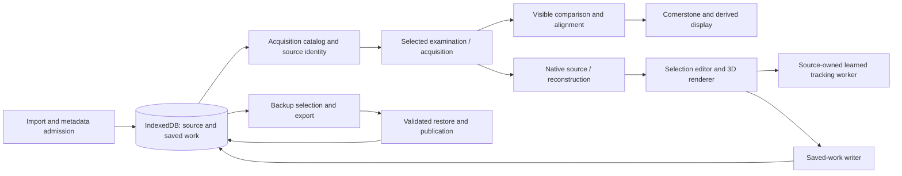

# MiraViewer — full-codebase audit: next priorities

> Historical plan/evidence. This preserves its original task and may include unfinished proposals. Current status belongs to the [implementation ledger](../active/2026-09-02-full-codebase-audit-implementation.md).

**Reviewed:** September 2, 2026. **Scope:** the complete current application source, including dirty and untracked implementation work, not just the committed branch diff. This is an audit and recommendation document; it does not declare the existing implementation plan complete.

## Executive assessment

MiraViewer has a sound local-first foundation and considerably better physical-image, cancellation, and validation boundaries than its size might suggest. The next improvements should concentrate on **stable source identity, the lifetime of saved-work writers, and work that scales with what the user is actually viewing or changing**.

The main architectural problem is not simply large React components. Several important decisions still have different owners depending on the entry point: which acquisition a date means, whether settings are safe to save, which buffers count toward an operation's budget, and which images deserve computation first. These differences cause confusing UX and unnecessary work even when the numerical helpers are correct.

The most valuable performance changes are also fairly concrete: stop rendering discarded coarse-alignment pixels; process the visible comparison pair before offscreen examinations; stop rebuilding unchanged grayscale slices during brush movement; and move enhancement upload preparation out of the rendering callback. Adding another general cache or rewriting the state-management stack should not be the starting point.

### Recommended priorities

| Priority      | Area                                                                                                                                       | Why it matters                                                                                                                             | Evidence                                                     |
| ------------- | ------------------------------------------------------------------------------------------------------------------------------------------ | ------------------------------------------------------------------------------------------------------------------------------------------ | ------------------------------------------------------------ |
| P1            | [N01 — Stable source identity and acquisition choice](#n01--make-source-identity-stable-and-acquisition-choice-explicit)                   | Existing saved work can become unreachable when the surrounding dataset changes; acquisition choice can change silently.                   | Actual import/export/restore probes.                         |
| P1            | [N02 — Saved-work readiness and replacement](#n02--give-hydration-restore-and-clear-authority-over-writers)                                | Failed reads become writable defaults; live settings can overwrite a successful restore.                                                   | Actual-hook and storage probes.                              |
| P1            | [N03 — One backup capacity contract](#n03--make-complete-backup-an-end-to-end-capability)                                                  | Export materializes large payloads and can produce an archive the application's own complete-restore path refuses.                         | Reachable code and existing documented limit.                |
| P1            | [N04 — Sparse editing through the whole pipeline](#n04--keep-small-edits-small-through-rendering-history-and-storage)                      | Small pointer edits still trigger dense image, mask, and statistics work.                                                                  | Full production-path inspection.                             |
| P1            | [N05 — Visibility-driven alignment and pose-only coarse output](#n05--compute-visible-alignment-first-and-stop-producing-discarded-pixels) | Offscreen targets delay the visible pair, and a coarse image is generated before being superseded.                                         | Actual-hook probe plus reachable worker/caller flow.         |
| P1            | [N06 — Complete heavy-operation admission](#n06--admit-heavy-work-against-the-same-live-resource-owners)                                   | Different entry points account for different retained resources, including completed enhancement and custom-model state.                   | Production ownership/lifetime inspection.                    |
| P2            | [N07 — Proportional rendering and asynchronous preparation](#n07--make-rendering-cost-proportional-and-prepare-uploads-off-the-draw-path)  | A fixed settled sampling floor and synchronous enhancement preparation consume work unrelated to the useful output.                        | Shader inspection and isolated CPU measurements.             |
| P2            | [N08 — Prepared native-source reuse](#n08--reuse-prepared-native-source-work-at-its-existing-owner)                                        | Accepted poses and retained model sessions do not eliminate repeated native conversion, worker setup, or oversized region preparation.     | Actual conversion/reslice and geometry-planner probes.       |
| P2            | [N09 — Explicit navigation identity and units](#n09--give-navigation-one-reference-and-store-examinations-by-identity)                     | Filtering can change the selected examination; global controls can disagree about what a slice number means.                               | Actual-hook probe and source-level mapping.                  |
| P2            | [N10 — Metadata-first discovery and enrichment](#n10--choose-metadata-before-reading-binary-payloads)                                      | Candidate discovery and backup preparation hydrate binary records before knowing which are needed; legacy metadata recovery remains split. | IndexedDB and ingestion paths.                               |
| P2            | [N11 — Remove obsolete paths and unnecessary startup work](#n11--retire-unreachable-paths-and-narrow-the-startup-dependency-graph)         | Parallel algorithms and unactivated tool infrastructure add maintenance and loading cost without a live product contract.                  | Caller inspection and measured build-file size.              |
| Cross-cutting | [N12 — Qualification at the real user boundary](#n12--qualify-the-whole-workflow-on-the-right-browser-backend)                             | Strong unit/helper evidence does not cover large backups, ordinary auto-fill, source replacement, or representative browser memory.        | Current receipts and the investigated headless-only timeout. |

P1 means the next substantive engineering tranche, not an asserted production incident or security severity. P2 items should follow the owning contracts or a small profile that establishes their value. Recommendations below distinguish measured effects from structural costs and unverified possibilities.

## 1. Scope, provenance, and method

The source pass covered **180 production files and 54,322 physical lines**, including components, hooks, ingestion, persistence, geometry, alignment, reconstruction, segmentation, shaders, types, and CSS. Comments and blank lines are included in that count; it is a coverage measure, not a debt estimate. Independent subsystem passes read their assigned files in full, followed relevant callers, and recorded line ranges and hashes. Root review covered application integration, delivery/build configuration, model-export tooling, browser acceptance code, and the runtime investigation. The [combined coverage manifest](../../../artifacts/performance/next-priorities-audit-2026-09-02/coverage.json) records full production coverage and the precise extent of additional reads.

| Snapshot                                | Value                                                                                                            |
| --------------------------------------- | ---------------------------------------------------------------------------------------------------------------- |
| Branch                                  | `blader/siqi-chen/segmentation-sampled-plane-pruning`                                                            |
| HEAD and local `origin/main` merge base | `5f0efa433b6c8b6672add9a30184ec1140b2b5a3`                                                                       |
| Source/test/tooling fingerprint         | `ec49ee531807dd0e2df4d7c0bd8bf9d472a52de52c68ac83a72274f285bb6321`                                               |
| Model-manifest fingerprint              | `5662be7768cef65140ce885dde9099fb16c0e64f0b90927d79ef8a9461aa725c`                                               |
| Audit evidence                          | [Source snapshot and assignments](../../../artifacts/performance/next-priorities-audit-2026-09-02/snapshot.json) |

`origin/latest` is not present in this repository; `origin/main` is the relevant local base. The working tree contains substantial pre-existing changes. Findings apply to the fingerprinted working tree, not to an imagined clean checkout, and should not be attributed to a particular author or commit without further history review.

**Boundaries:** third-party dependency implementations, generated bundles as source, binary model internals, and private MRI fixtures were not line-by-line audited. Test and documentation review was targeted, not a claim to have manually read every historical test or execution plan. Build outputs and model pins were checked separately. All new runtime and data probes used synthetic inputs; no private MRI pixels or identifiers were accessed. No production code, production data, commits, pushes, or PRs were changed for this audit.

Source claims below refer to current production code. Node/JSDOM/fake-IndexedDB probes establish the specific control/data behavior they exercise, not native-browser latency. Isolated GPU stubs establish CPU work, not GPU performance. Browser receipts identify the actual build and backend. Historical findings were reconciled only after current source review; resolved issues are credited in section 6 rather than repeated as open work.

## 2. Architecture to preserve—and clarify

The application is a client-side imaging workspace. IndexedDB owns imported DICOM and durable saved work; Cornerstone loads/display-decodes acquired images; workers handle expensive alignment, reconstruction, and learned tracking. React coordinates selection, navigation, presentation, and lifecycle. The offline and hosted applications serve assets rather than send scans to a processing backend.

The diagram is a code map, not a proposal for new services. The changes should clarify these existing owners:

| Fact or resource                          | Desired authority                                                         | Current friction                                                            |
| ----------------------------------------- | ------------------------------------------------------------------------- | --------------------------------------------------------------------------- |
| Examination/acquisition identity          | Stable study/series/SOP and geometry identity                             | Presentation grouping and the surrounding dataset alter keys.               |
| Permission to persist live settings       | Successfully hydrated current owner/generation                            | A failed read, restore, or clear can leave an old writer active.            |
| Current navigation reference              | One explicit examination/acquisition descriptor                           | Wheel, playback, physical alignment, and overlay indices choose separately. |
| Work needed immediately                   | Currently presented targets and their order                               | Enabled-but-unmounted examinations are treated as equally urgent.           |
| Heavy-operation admission                 | Actual retained owners plus phase-specific working memory                 | Wrappers pass different subsets of enhancement/model/display memory.        |
| A learned proposal versus saved user work | Proposal is disposable; hard marks and committed labels are authoritative | Preserve this existing separation while optimizing.                         |

Do not replace the local-first design or introduce a generic orchestration framework merely to shorten files. Extract boundaries when doing so removes a competing lifetime, decision, or representation.

## 3. Findings and recommendations

### N01 — Make source identity stable and acquisition choice explicit

**Architecture / UX; P1.** The catalog uses presentation-dependent keys for durable ownership. Patient grouping is intentionally conservative, but its key changes when another study with the same base identifier and a conflicting name is imported. Examination keys begin as formatted dates and gain a study suffix only after a timestamp collision. Those keys flow into settings and selection lookup. Separately, each examination/sequence combination exposes only the series with the largest instance count.

Relevant owners: [patientIdentity.ts:19](../../../frontend/src/db/patientIdentity.ts#L19), [localApi.ts:206](../../../frontend/src/utils/localApi.ts#L206), [localApi.ts:265](../../../frontend/src/utils/localApi.ts#L265), [localApi.ts:305](../../../frontend/src/utils/localApi.ts#L305), and [localApi.ts:691](../../../frontend/src/utils/localApi.ts#L691).

The [actual import/export/restore probe](../../../artifacts/performance/next-priorities-audit-2026-09-02/fresh_storage_ux-probe-results.json) demonstrated three distinct manifestations of the same ownership problem:

- Adding a same-timestamp study changes the old examination key; its existing settings row remains stored but the current lookup misses it.
- Adding a conflicting-name study changes the patient-group key; an existing volume-label row becomes inaccessible through the current scope guard.
- A roughly 3.9 KB, single-patient selective backup restores successfully, yet recomputing identity from only its included studies drops the ambiguity suffix. Settings and labels remain present under their old keys but are not found through normal lookup. This is not a mixed-patient archive rejection or a large-file edge case.

The same probe imported two genuine same-combination series and confirmed that the catalog offers one. Choosing the largest series is a useful default against tiny localizers; hiding all alternatives is the problem. A later import can silently change the selected acquisition and the image to which settings appear to apply.

**Recommendation.** Key durable examination work by stable source identity; keep date labels and conservative patient grouping as presentation/scope information. Retain acquisition candidates in the catalog, expose an explicit choice, and persist that choice by series UID. Bind source-sensitive settings, alignment, and selection state to the chosen acquisition. Migrate legacy keys only when the source association is unambiguous; otherwise preserve the row and surface a recovery choice. Do not fix this by removing patient-scope guards or merging reused patient IDs.

**Acceptance.** Import a later date collision, import a conflicting-name study, change the preferred series, and round-trip an isolated patient's backup. Existing annotations/settings must remain associated with the same source; unrelated imports must not change the acquisition silently. Test missing identifiers and deliberately ambiguous legacy rows as well as normal cases. Preserve the current conservative separation of different patients.

### N02 — Give hydration, restore, and clear authority over writers

**Architecture / UX; P1.** `usePanelSettings` distinguishes patient/sequence ownership but not successful hydration from a failed read. Its catch path installs defaults and then unconditionally marks the scope owned. That enables the ordinary 200 ms progress autosave and the unload writer. A successful restore can also leave the prior in-memory settings and undo history mounted because the parent performs a background catalog reload without replacing their authority.

See [usePanelSettings.ts:325](../../../frontend/src/hooks/usePanelSettings.ts#L325), [usePanelSettings.ts:469](../../../frontend/src/hooks/usePanelSettings.ts#L469), [usePanelSettings.ts:478](../../../frontend/src/hooks/usePanelSettings.ts#L478), and the persistent parent integration at [ComparisonMatrix.tsx:139](../../../frontend/src/components/ComparisonMatrix.tsx#L139) and [ComparisonMatrix.tsx:233](../../../frontend/src/components/ComparisonMatrix.tsx#L233).

The [actual-hook probe](../../../artifacts/performance/next-priorities-audit-2026-09-02/fresh_storage_ux-autosave-results.json) reproduced:

- One settings-read failure changed saved zoom `2` / pan `0.2` to defaults `1` / `0` after the normal timer, with **zero user edits**. An error notice did not prevent the write.
- A real restore wrote backup zoom `5`; the mounted hook retained zoom `2`. The next slice-progress change saved zoom `2` over the restored value.
- After deleting the isolated fake database, dispatching the mounted unload handler recreated a settings row. This last case demonstrates an authorized stale writer, **not** reliable browser unload timing or recreation of scans.

**Recommendation.** Treat hydration and database replacement as lifecycle boundaries of the existing writer. Failed hydration must not authorize default persistence. Restore/clear must retire pending timers, unload flushes, and stale histories before replacement; successful publication must hydrate a new current owner before writes resume. Reuse the existing source/dataset generation where its semantics fit, rather than adding unrelated “restoring,” “loaded,” and “safe to save” flags that can disagree. Provide a local Retry action for a failed read.

**Acceptance.** A recoverable read error performs no unsolicited writes. Restoring while the comparison remains mounted updates live settings and history before any subsequent save. Clear cannot be followed by an old authorized writer. Exercise pending timers and real browser reload separately from the deterministic hook tests. Patient switching must still never inherit the previous patient's settings.

### N03 — Make complete backup an end-to-end capability

**Architecture / performance / UX; P1.** Export and restore have different capability contracts. Export eagerly reads payload buffers into JSZip and returns a complete Blob; it has no shared restore-size preflight or cancellation signal. Restore rejects manifest payloads above **512 MiB**, in addition to archive safety and storage-headroom checks. Model-cache entries, masks, and derived frames contribute to the archive. A completed download is therefore not sufficient evidence of a restorable backup.

See [exportBackup.ts:191](../../../frontend/src/services/exportBackup.ts#L191), [exportBackup.ts:388](../../../frontend/src/services/exportBackup.ts#L388), [archiveSafety.ts](../../../frontend/src/services/archiveSafety.ts), [ExportModal.tsx:125](../../../frontend/src/components/ExportModal.tsx#L125), and [ClearDataModal.tsx:95](../../../frontend/src/components/ClearDataModal.tsx#L95). The offline [README.txt:18](../../../frontend/distribution/README.txt#L18) already acknowledges the size mismatch; this is an existing, documented limitation, not a newly introduced regression. The in-app complete/restorable language and export-before-clear guidance still overstate the supported path.

**Recommendation, in order:**

1. Build one metadata/key-based backup plan used by export and restore admission. Account for all selected payloads, archive constraints, optional models, identity, and available storage before expensive reads.
2. Surface whether the selected backup is completely restorable by this application. Explain which caches are optional; imported scans and saved user work are not interchangeable with reproducible runtime assets.
3. Give export genuine cancellation and bounded progress, with no download-success message before the artifact exists.
4. Replace whole-archive materialization with incremental export to a supported writable destination, retaining an explicitly bounded fallback where required.
5. Restore through bounded, durably validated staging and an atomic publication boundary. A late validation/quota/cancellation failure must leave the old published dataset usable. Do not perform an unbounded parse while assuming one IndexedDB transaction will remain alive.

Raising the 512 MiB constant alone makes the existing memory shape riskier. Importing original DICOM is not an equivalent recovery path for lost outlines, labels, or viewer settings.

**Acceptance.** Round-trip a small archive, an archive just below the current limit, one above it, and a multi-GiB synthetic dataset once streaming is implemented. Compare source bytes, source identity, annotations, settings, and selected acquisitions. Inject corruption, late malformed records, cancellation, insufficient staging space, and publication failure. Test a used browser profile, not only an empty destination. Measure peak retained bytes and time to usable restored state.

### N04 — Keep small edits small through rendering, history, and storage

**Performance / architecture; P1.** Partial GPU label updates and patch-based undo history are useful, but they do not make the full editing path sparse. The slice editor rebuilds scratch canvases and grayscale ImageData when cursor, brush, marks, or draft state changes. All three planes consume the shared cursor. Changed-mask publication, statistics, and persistence still touch dense volume representations in important paths.

The clearest rendering boundary is [SvrSegmentationEditor.tsx:119](../../../frontend/src/components/SvrSegmentationEditor.tsx#L119), with shared-plane consumers near [SvrSegmentationEditor.tsx:988](../../../frontend/src/components/SvrSegmentationEditor.tsx#L988). Changed-mask publication is at [useSvrSelection.ts:308](../../../frontend/src/hooks/useSvrSelection.ts#L308); the full-volume metrics scan is at [SvrVolume3DViewer.tsx:942](../../../frontend/src/components/SvrVolume3DViewer.tsx#L942), separately from its already-incremental GPU update near line 636. File length is not the finding; repeated dense work after a small edit is.

For scale, a binary `512³` label buffer alone occupies 128 MiB. That is an arithmetic example, not a measured production workload or a claim that history is unbounded. The current history and memory guards should be preserved.

**Recommendation.** Separate immutable grayscale content from mask, mark, cursor, and brush overlays. Cache a background by the actual plane content/VOI identity, and coalesce pointer painting to an animation-frame update. Carry the existing patch and prior-buffer identity through label counts and dirty-region publication instead of immediately rescanning unchanged data. Recompute bounds when an erased extremum requires it, and retain a full rebuild for whole-model replacements or missed revisions. Undo history is already bounded and patch-based; preserve it. Profile immutable publication and durable writes after removing unnecessary derived work, and change the durable representation only if that cost warrants bounded checkpoints or chunked persistence. Do not create an independent parallel selection model merely to optimize the canvas.

**Acceptance.** Moving a brush without changing the plane must not rebuild unchanged MRI backgrounds. A completed stroke, undo, redo, cancellation, remount, and backup/restore must preserve identical masks and literal Add/Remove marks. Measure the complete gesture through visible update and durable save, including bytes copied, full-volume passes, main-thread tasks, and retained history—not only texture-upload duration. Keep cross-plane cursor behavior and native-grid measurements unchanged.

### N05 — Compute visible alignment first and stop producing discarded pixels

**Performance / duplication; P1.** Two relatively direct reductions should precede a larger alignment-cache redesign.

**First, distinguish visible from merely enabled targets.** `ComparisonMatrix` passes all enabled columns into automatic alignment even in Overlay mode, where only the selected and comparison examinations are mounted. Columns are newest-first, while the initial overlay selection is oldest-first; uncached targets are processed serially. An actual-hook probe with five dates scheduled April and March before the visible February/January pair. This proves dispatch order, not measured starvation or a hardware latency percentile.

See [ComparisonMatrix.tsx:187](../../../frontend/src/components/ComparisonMatrix.tsx#L187), [useVisibleAlignment.ts:63](../../../frontend/src/hooks/useVisibleAlignment.ts#L63), [useAutoAlign.ts:310](../../../frontend/src/hooks/useAutoAlign.ts#L310), [OverlayView.tsx:440](../../../frontend/src/components/comparison/OverlayView.tsx#L440), and the [probe receipt](../../../artifacts/performance/next-priorities-audit-2026-09-02/fresh_alignment_performance-probe-results.json).

**Second, return only the coarse result the caller consumes.** The production coarse-registration caller requests deferred presentation validation, but the worker still reslices and transfers a full output image. The caller immediately performs the native refinement/presentation path; the coarse pixel output has no application consumer on this route. The code already has a pose-estimate result shape that can express the useful result.

See [useAutoAlign.ts:854](../../../frontend/src/hooks/useAutoAlign.ts#L854), [useAutoAlign.ts:902](../../../frontend/src/hooks/useAutoAlign.ts#L902), [longitudinalRegistration.ts:2030](../../../frontend/src/utils/svr/longitudinalRegistration.ts#L2030), and [longitudinalRegistration.worker.ts:44](../../../frontend/src/utils/svr/longitudinalRegistration.worker.ts#L44). Avoiding that image removes an output sampling pass and `5 × rows × columns` bytes of Float32-pixel plus validity output per applicable coarse result. That is an exact representation cost, not an end-to-end speedup estimate.

**Recommendation.** Preserve the stable alignment reference, but supply a separate ordered set of currently presented targets. Complete visible work first; prefetch other enabled dates only after the visible state is accepted. Keep exact-cache replay fast. Add a pose-only coarse worker result for the application route and retain image-producing behavior only where a real consumer needs it. Preserve physical fitting, confidence/coverage gates, explicit Realign, cancellation, and final publication.

**Acceptance.** On cold and warm cache misses, the selected/compare pair becomes ready before offscreen work. Switching dates or filtering must reprioritize without publishing stale results. Coarse pose, final pixels/support, confidence decisions, and cancellation behavior remain equivalent, while the discarded coarse frame is no longer allocated or transferred. Measure complete visible settling in addition to the removed stage.

### N06 — Admit heavy work against the same live resource owners

**Architecture / performance; P1.** The recent interactive-runtime retention work correctly accounts for its worker and releases it before competing heavy operations. The broader operation boundary is still uneven. Ordinary reconstruction does not receive the same retained-enhancement accounting that refinement and selection proposals receive. Completed enhancement results intentionally remain retained while the parent is busy. The optional custom ONNX session has another lifetime and admission path.

See [Svr3DView.tsx:1268](../../../frontend/src/components/Svr3DView.tsx#L1268), [useSvrReconstruction.ts:107](../../../frontend/src/hooks/useSvrReconstruction.ts#L107), [useSvrEnhancement.ts:54](../../../frontend/src/hooks/useSvrEnhancement.ts#L54), [SvrVolume3DViewer.tsx:708](../../../frontend/src/components/SvrVolume3DViewer.tsx#L708), and [useOnnxTumorSession.ts:220](../../../frontend/src/hooks/useOnnxTumorSession.ts#L220).

This is an incomplete set of retained owners, not a claim that every memory guard is missing. Active enhancement is already canceled when blocked; completed enhancement is the important distinction. Custom-model input admission counts grid/tensor-related work but not the full compiled-model/session/arena lifetime. That hook already serializes its own tasks and waits for release; enhancement also respects its running flag. The remaining gap is the reverse transition into parent-owned reconstruction and the idle resident session. No simultaneous-runtime out-of-memory failure was reproduced.

**Recommendation.** Make each heavy entry point consume the same current retained-resource snapshot and source-generation boundary. Account for the previous image/enhancement if it remains visible, plus labels/history, derived display state, and resident runtimes. Reclaim only resources that are actually disposable, then recalculate from the real owner; do not subtract an allowance before termination/disposal has occurred. Put optional custom-model execution behind a bounded worker/cancellation owner and a source-replacement barrier, reusing the established worker-lifecycle pattern where appropriate.

Keep phase-specific budgets: reconstruction and learned tracking do not have identical memory shapes. A uniform new constant is not a solution. A short-term targeted correction to the missing entry-point accounting is preferable to introducing a second application-wide resource manager.

**Acceptance.** Complete an enhancement, then start ordinary reconstruction; run/reload a custom model, then change source or start another heavy operation. Admission must count or actually release every retained owner and must preserve the previous accepted result on failure. Verify cancellation, bounded session initialization, provider replacement, late results, worker/session cleanup, CPU/GPU retained bytes, and visible UI responsiveness with a real model—not only a mocked `session.run`.

### N07 — Make rendering cost proportional and prepare uploads off the draw path

**Performance; P2.** The settled raymarch budget has a fixed floor: the viewer supplies `1024` steps, and the shader takes the maximum of that and a physical traversal estimate, up to its cap. Even a small volume therefore cannot use its short traversal to reduce the sample count. With a label overlay enabled, occupancy skipping and early termination are disabled in relevant branches. Interaction LOD helps while the user drags, but does not remove this settled-frame cost.

See [SvrVolume3DViewer.tsx:746](../../../frontend/src/components/SvrVolume3DViewer.tsx#L746), [glRaymarch.ts:878](../../../frontend/src/utils/svr/glRaymarch.ts#L878), [glRaymarch.ts:927](../../../frontend/src/utils/svr/glRaymarch.ts#L927), and [glRaymarch.ts:1053](../../../frontend/src/utils/svr/glRaymarch.ts#L1053).

There is also a separate first-display cost: `EnhancedVolumeBinding.upload` validates, normalizes, and converts enhanced-volume data synchronously from the render callback. In an [actual-source Node probe](../../../artifacts/performance/next-priorities-audit-2026-09-02/fresh_svr_runtime-probes.json), with GPU calls replaced by no-op counters, first preparation took 60.835 ms for `128³` output and 112.082 ms for `192³` output; neither yielded. Reusing the same result identity avoided that preparation. These are single CPU observations, not browser frame times, GPU measurements, or a statistical benchmark.

See [enhancedVolumeBinding.ts:144](../../../frontend/src/utils/svr/enhancedVolumeBinding.ts#L144) and [SvrVolume3DViewer.tsx:1903](../../../frontend/src/components/SvrVolume3DViewer.tsx#L1903). Synchronous shader compile/link readiness checks and resource creation also deserve profiling at source replacement; do not assume initialization and per-frame work have the same remedy.

**Recommendation.** Derive a conservative sample requirement from physical traversal and the chosen quality contract, rather than making the physical calculation only increase a fixed floor. Preserve label visibility with an occupancy rule that includes the overlay, or a separately bounded label pass; do not simply enable the current anatomy-only skip over labels. Prepare/validate/convert enhanced upload buffers cooperatively or in the existing computation worker before publication, with byte accounting and cancellation; leave the draw callback to bind ready resources and draw. Retain reusable programs at their actual canvas/context lifetime when profiling shows rebuilds.

**Acceptance.** Use independent pixel/geometry oracles for thin structures, labels over transparent anatomy, boundaries, oblique views, and native versus enhanced data. Record first-visible preparation and settled/interactive frames on the actual hardware backend. Compare complete output and resource lifetime, not FPS obtained by silently lowering detail or removing labels. Retain correct context-loss and cancellation recovery.

### N08 — Reuse prepared native-source work at its existing owner

**Performance / architecture; P2, profile before retaining more memory.** Reusing a fitted pose or learned model is not the same as reusing prepared source pixels.

For aligned browsing, each uncached neighboring output plane reconstructs its intersecting native slab: cached raw image pixels are converted and copied, then sent to a newly created worker which is terminated afterward. The [actual-source probe](../../../artifacts/performance/next-priorities-audit-2026-09-02/fresh_alignment_performance-probe-results.json) used two planes with the same source-frame envelope `[3,4]`; it observed four distinct converted pixel buffers, two worker starts/terminations, and 10,240 transfer bytes each. Its cached-image provider and Worker transport were substitutes, so this establishes preparation/control flow, not actual browser worker startup latency. Cornerstone raw-image reuse remains valuable; this is not evidence of repeated file decoding.

See [longitudinalFrames.ts:340](../../../frontend/src/utils/svr/longitudinalFrames.ts#L340), [longitudinalFrames.ts:829](../../../frontend/src/utils/svr/longitudinalFrames.ts#L829), and [runLongitudinalRegistration.ts:51](../../../frontend/src/utils/svr/runLongitudinalRegistration.ts#L51).

For selection, the accepted-source owner now retains useful metadata/range and the tracking runtime. Region loading still re-enters broader reconstruction/cropping machinery before producing the exact model context. An [actual geometry-planner probe](../../../artifacts/performance/next-priorities-audit-2026-09-02/fresh_svr_runtime-probes.json) planned an `80×80×128` exact context inside a synthetic `192×192×128` source. The intermediate loader requested `84×84×128` when axis-aligned and `162×162×128` at 40° obliquity—4.101 times the exact context's cells in the latter case. Exact-context data then coexist with that loader output. No inference or MRI decoding was timed in this probe.

The exact-grid → patient-axis bounding box → native enclosing grid → exact-grid copy is visible at [interactiveSelectionContext.ts:110](../../../frontend/src/utils/svr/interactiveSelectionContext.ts#L110), [nativeSourceContext.ts:206](../../../frontend/src/utils/svr/nativeSourceContext.ts#L206), [nativeVolume.ts:212](../../../frontend/src/utils/svr/nativeVolume.ts#L212), and [interactiveSelectionContext.ts:138](../../../frontend/src/utils/svr/interactiveSelectionContext.ts#L138). The full tracking-axis context is intentional and must not be truncated to remove this intermediate representation.

**Recommendation.** First remove N05's unnecessary requests and coarse output. Then profile warm navigation and second corrections by phase. Where preparation dominates, keep a bounded converted slab or exact native-region loader with the existing accepted-source owner, geometry, and cancellation generation. Separate an accepted physical pose from presentation-lattice/tone identity; changing output resolution should not automatically require refitting anatomy, but cached display transforms cannot simply be reused after deleting a key field. Coalesce obsolete requests rather than completing work the user has already left.

**Acceptance.** Adjacent requests with unchanged acquired content avoid redundant conversion without weakening validity or changing pixels. Native→different display resolution→native preserves physical registration while rebuilding only resolution-dependent presentation. Oblique region preparation retains all requested context and literal marks, without a broad intermediate reconstruction. Bound and measure retained memory, cancellation, source/provider invalidation, and complete visible settling before keeping a new cache.

### N09 — Give navigation one reference and store examinations by identity

**UX / architecture; P2.** The application has multiple implicit navigation coordinate systems. Global wheel navigation uses the primary Grid acquisition in Grid mode, but `playbackInstanceCount` prefers the overlay selection even when Overlay is not the active mode. The footer uses that count for stepping and Go to slice. With a 100-slice primary Grid acquisition and a 20-slice overlay acquisition, “slice 2” from the footer can land on primary slice 6, while one primary wheel step reaches slice 2.

See [useComparisonWorkspaceNavigation.ts:137](../../../frontend/src/hooks/useComparisonWorkspaceNavigation.ts#L137), [useComparisonWorkspaceNavigation.ts:174](../../../frontend/src/hooks/useComparisonWorkspaceNavigation.ts#L174), and [SliceLoopNavigator.tsx:264](../../../frontend/src/components/comparison/SliceLoopNavigator.tsx#L264). Different per-panel ordinals under normalized/physical mapping are not themselves wrong; an unnamed and inconsistent global reference is the problem.

Overlay selection and comparison history also use positional indices. The [actual-hook probe](../../../artifacts/performance/next-priorities-audit-2026-09-02/fresh_alignment_performance-probe-results.json) removed January while February was selected: the selected date became March and the comparison target changed from January to February. Filtering a different examination should not silently substitute the source the user is examining. See [useOverlayNavigation.ts:100](../../../frontend/src/hooks/useOverlayNavigation.ts#L100).

**Recommendation.** Introduce one explicit navigation-reference descriptor derived from the active view/source choice, and feed global wheel, footer, playback, and labels from it. Store selected/previous/compare examinations by stable identity; derive indices for presentation. Define a visible fallback only when the selected examination itself disappears. Preserve intentional local panel navigation and physical multi-date mapping.

**Acceptance.** Test unequal counts, offsets, reverse order, view-mode transitions, filtering an earlier date, import/reordering, and removal of the selected date. Wheel, keyboard stepping, playback, and Go to slice must agree about their declared reference. Add a real pointer/touch check for scrolling a stacked grid: canvas wheel/pan interception may make reaching later examinations awkward, but that remains an unverified UX hypothesis, not a reproduced finding here.

### N10 — Choose metadata before reading binary payloads

**Performance / architecture; P2.** The improved derived-frame eviction path already proves the value of key/index-first access. Other paths still discover candidates by materializing records that contain large arrays. Backup reads volume-segmentation and derived-frame records before filtering them; saved-selection discovery traverses full label rows before it knows which candidate is suitable. Limiting later validation or retained candidates does not undo an IndexedDB structured clone already requested.

See [exportBackup.ts:241](../../../frontend/src/services/exportBackup.ts#L241), [exportBackup.ts:262](../../../frontend/src/services/exportBackup.ts#L262), and [selectionMigration.ts:271](../../../frontend/src/utils/svr/selectionMigration.ts#L271). This distinction matters for typed arrays; the report does not assume that merely reading a Blob reference eagerly duplicates all of its payload bytes.

Ingestion also has separate metadata-admission/enrichment paths. Normal import reads the full file before several rejectable displayability checks, while later acquisition metadata hydration does not repair every legacy physical-order tag required by native/alignment workflows. Conservatively refusing incomplete geometry is correct; leaving old imports permanently unable to participate is a product/recovery gap.

See the full read and later multi-frame rejection at [dicomIngestion.ts:287](../../../frontend/src/services/dicomIngestion.ts#L287), the existing bounded duplicate probe at [dicomIngestion.ts:512](../../../frontend/src/services/dicomIngestion.ts#L512), and the separate bounded acquisition reader at [dicomAcquisitionMetadata.ts:86](../../../frontend/src/services/dicomAcquisitionMetadata.ts#L86). Reuse those existing primitives rather than adding a third header-reading policy.

**Recommendation.** Discover eligible source/selection/backup candidates from indexed metadata or keys, then hydrate only the chosen binary rows. Use a bounded header reader for admission and explicit metadata enrichment, with full-file fallback only when required by the encoding/parser. Reuse the existing ingestion/provenance validators and generation guards. Upgrade old metadata in bounded batches and allow duplicate re-import to enrich metadata without duplicating source bytes or discarding saved work.

**Acceptance.** Instrument actual value reads and bytes materialized while the database contains many unrelated large masks/frames. Candidate discovery must not load their arrays. Validate fresh import, older database upgrade, duplicate re-import, unsupported multi-frame input, incomplete headers, and geometry that genuinely cannot be recovered. Never invent slice positions or direction to make a source pass admission. Reuse the current derived-storage tests rather than adding a second storage abstraction for the same task.

### N11 — Retire unreachable paths and narrow the startup dependency graph

**Duplication / obsoletion / loading UX; P2.** There are useful deletion-first opportunities, but they require caller-level distinctions:

- The standalone `synthesizeSharpSlice` driver is exercised by tests/corpus paths, while normal sharp display uses the physical-world presentation/reslice path. Keep the shared bounded cubic interpolation primitives used by runtime. The narrow obsolete driver/private helpers amount to 133 physical lines (128 non-trivia lines), not the whole module. The real presentation path already has tests; the issue is a redundant alternative target, not absence of sharp-display coverage. See [sharpSliceSynthesis.ts:95](../../../frontend/src/utils/sharpSliceSynthesis.ts#L95) and [sharpSlicePresentation.ts](../../../frontend/src/utils/sharpSlicePresentation.ts).
- Focus/exclusion-gated alignment experiments have no provider in the sole current UI caller. Review these branches, including the tumor-focused alignment module, against an explicit product owner before carrying them indefinitely. Preserve live unmasked slab refinement, shared math, and single-frame/fallback alignment. See [useVisibleAlignment.ts:69](../../../frontend/src/hooks/useVisibleAlignment.ts#L69) and [tumorFocusedAlignment.ts](../../../frontend/src/utils/svr/tumorFocusedAlignment.ts).
- Cornerstone Tools, Hammer, and Cornerstone Math are initialized without a corresponding application tool-activation path; ordinary UI interactions use custom handlers. Remove them only after a full real-image interaction/codec smoke. Do not confuse unused tool infrastructure with the required DICOM loader. See [cornerstoneInit.ts](../../../frontend/src/utils/cornerstoneInit.ts).
- The legacy Saved tumor affordance and old segmentation APIs should be audited against actual writers. A read-only switch with no normal producing workflow is confusing UX, not a useful compatibility feature merely because tests import it. Preserve the currently reachable optional custom-model workflow unless it is explicitly retired.
- Within that live custom-model hook, `allowUnsafeFullRes`, its setter, and the separate returned `initSession` callback have no production consumers. Their obsolete fields/state/callback/return entries total 35 source lines (34 nonblank), independently of the live `ensureSession`, run, cancel, upload, and release behavior. See [useOnnxTumorSession.ts:163](../../../frontend/src/hooks/useOnnxTumorSession.ts#L163) and [useOnnxTumorSession.ts:406](../../../frontend/src/hooks/useOnnxTumorSession.ts#L406). This is a narrower, demonstrated cut than deleting the optional feature.
- Help, import, export, and clear dialogs remain eager imports at [ComparisonMatrix.tsx:4](../../../frontend/src/components/ComparisonMatrix.tsx#L4), while 3D already has an explicit lazy boundary. Lazy-load secondary dialogs where this cuts the initial graph without hiding first-use failures.

The inspected production entry JavaScript file is **2,721,599 bytes**, or **827,904 bytes under the audit's gzip measurement**. This is a build-file measurement, not actual network transfer, parse time, or a claim that deleting one dependency saves the whole amount. Model assets are separately loaded and should not be counted as initial entry JavaScript.

**Recommendation.** Delete one proven unreachable mechanism at a time, retarget its tests to the real contract, and inspect the resulting bundle graph. Remove stale configuration references such as the already-deleted seeded-volume module in the React Doctor exclusions. Keep public/custom compatibility only when there is a supported caller. Avoid cosmetic component splitting as a substitute for removing duplicated orchestration and lifetimes.

**Acceptance.** Real import and supported codecs, acquired rendering, pan/zoom/windowing, keyboard/wheel navigation, outlines, saved labels, alignment, and offline use still work. Measure shell-to-first-acquired-image and first-use dialog behavior before/after. Report actual removed code and entry-graph savings; do not assign a speculative percentage to a proposed deletion.

### N12 — Qualify the whole workflow on the right browser backend

**Verification architecture; required for the changes above.** The repository has substantial unit coverage and now useful actual-browser/model probes. Its remaining qualification gaps are at combined user boundaries, not a lack of more isolated helper assertions. Repository package commands expose browser, GPU, performance, and inference checks, but the current Vercel configuration runs the build; no repository-owned automated workflow requiring all those checks was found. This does not establish what external branch protections or manually managed release checks might exist.

The new normal-editor probe exposed an important evidence trap: bundled headless Chromium with SwiftShader never reached Select tissue within 15 seconds. Saved-selection read requests had already returned. Profiling showed most time outside JavaScript and a busy software-GPU/readback path. The **unchanged production build** then completed brush editing, review, durable save, and reload in isolated headed Chrome using **ANGLE Metal / Apple M4 Max**. Browser version, backend, and headed mode differed, so this is not a controlled attribution to one browser flag. It is sufficient to reject “the production storage hydration path is broken” as an established conclusion from that timeout.

**Recommendation.** Keep fast synthetic gates, but add explicit release/CI ownership for the critical complete workflows. Separate pixel correctness under software rendering from hardware UI/latency evidence. Promote the successful normal 3D brush/review/reload path from temporary audit tooling into the repository's browser suite. Add ordinary-editor learned auto-fill with two completed corrections, cancellation and source replacement; retain raw model parity probes as separate supporting evidence. Include identity-changing imports, restore into a used profile, and bounded large-backup cases.

**Acceptance.** Each receipt identifies source/model hashes, browser version, rendering/provider backend, fixture, requested action, durable outcome, and cleanup. A passed worker helper, a rendered shell, or a downloaded ZIP cannot stand in for a completed normal workflow. Record performance only after correct output and the intended backend are established. Keep private anatomical evaluation separate and private; synthetic algorithm/runtime proof does not establish clinical segmentation quality.

## 4. Current verification and what it proves

Existing checks were reused only after matching the current source fingerprint; they were not represented as newly rerun full suites. New probe results and hardware browser evidence are recorded separately.

| Check                                                      | Result at the reviewed source                                                                                                                                  | Meaning / limitation                                                                                                                                              |
| ---------------------------------------------------------- | -------------------------------------------------------------------------------------------------------------------------------------------------------------- | ----------------------------------------------------------------------------------------------------------------------------------------------------------------- |
| Full unit suite                                            | **3,122 passed; 54 skipped; 0 failed.** 167 files passed, 6 skipped.                                                                                           | Current-source full-suite receipt; skipped/private-gated work remains skipped.                                                                                    |
| Lint and TypeScript project build                          | **Passed.**                                                                                                                                                    | Static checks, not normal-workflow proof.                                                                                                                         |
| Source model assets and isolated production/browser builds | **Passed.**                                                                                                                                                    | Manifest pins and built delivery closure checked. An initial inline build-launcher failure was corrected in the harness, not by changing application code.        |
| Real pinned model/worker                                   | **Passed** completed forward/reverse synthetic inference, corrected retained-session parity, cached-asset operation, cancellation/recovery and worker cleanup. | Tiny `32×32×3` synthetic source; not anatomical accuracy or full-editor auto-fill.                                                                                |
| Normal 3D editor on hardware Chrome                        | **Passed** import → native volume → brush-only edit → draft save → reviewed save → reload.                                                                     | 24 synthetic `36×36` slices; 23 selected voxels and 23 literal foreground marks; identical mask hash in draft/reviewed/reopened state. No model request was made. |
| Identity / selective backup / live settings                | **Reproduced the problems in N01/N02.**                                                                                                                        | Actual application functions/hooks, Node/JSDOM/fake IndexedDB; not native-browser timing.                                                                         |
| Alignment scheduling/preparation                           | **Reproduced the structural work in N05/N08/N09.**                                                                                                             | Actual hooks/math with stated cached-image and Worker substitutes.                                                                                                |
| Enhancement preparation / region planning                  | **Measured CPU work and planned cell counts.**                                                                                                                 | No-op GPU counters and metadata planners; no GPU/inference timing claim.                                                                                          |

### Retained inference: credit the improvement, bound the claim

The current accepted-source tracking worker is reused between corrections, accounts for conservative retained runtime memory, expires when idle, and is disposed on source/operation changes. The corrected retained run initialized **zero** model sessions; a fresh worker initialized four. Their native-logit hashes were identical for identical corrected prompts.

In one tiny synthetic observation, the retained corrected run took **3.036 s**, versus **4.227 s** with a fresh worker; fresh-worker session initialization accounted for **0.952 s**. This is useful evidence of removed initialization, not a representative full-volume speedup. Sampled aggregate browser RSS included shared pages and cannot establish private WASM/GPU peak memory. Cancellation occurred after a real graph completed, not demonstrably in the middle of an uninterruptible kernel.

The remaining work is the integrated ordinary-editor two-correction path and representative memory/latency, not another proposal to add basic worker retention. See the [inference summary](../../../artifacts/performance/audit-retained-runtime-2026-09-02/attempt-02/summary.json) and [current validation index](../../../artifacts/performance/next-priorities-audit-2026-09-02/root-validation.json).

### Visual assessment

Three current-source desktop states were inspected individually at original resolution, with immediate source-specific assessments: brush draft, reviewed selection, and reopened selection. Their dark neutral palette, restrained gold actions, cyan selection overlays, plane labels, and review/edit hierarchy are coherent. No material control overlap was visible in those states. Small secondary labels remain a polish concern, not a demonstrated contrast-compliance failure.

These are **static desktop passes**, not an anatomical, motion, accessibility-completeness, or mobile-3D verdict. The reopened view returns to Overlay presentation; the separate IndexedDB readback, not visual similarity, proves that mask bytes were preserved. The [inspection receipt](../../../artifacts/visual-validation/next-priorities-audit-2026-09-02/inspection-receipt.json) records canonical image paths and hashes. All audit-owned browser/server resources were closed; existing user services and browser profiles were preserved.

### Evidence index

- [Fresh source, probe and coverage directory](../../../artifacts/performance/next-priorities-audit-2026-09-02).
- [Current full unit-suite receipt](../../../artifacts/performance/audit-retained-runtime-2026-09-02/attempt-01/unit-tests.json) and [log](../../../artifacts/performance/audit-retained-runtime-2026-09-02/attempt-01/unit-tests.log).
- [Static checks](../../../artifacts/performance/audit-retained-runtime-2026-09-02/attempt-01/static-build-checks.json) and [successful isolated build follow-up](../../../artifacts/performance/audit-retained-runtime-2026-09-02/attempt-01/isolated-builds-script.json).
- [Actual hardware-browser run and cleanup](../../../artifacts/performance/audit-retained-runtime-2026-09-02/attempt-06/browser-run.json).
- [Normal brush/save/reload receipt](../../../artifacts/performance/audit-retained-runtime-2026-09-02/attempt-06/browser-results/brush-normal-app-synthetic-5af24-aved-and-reopened-unchanged-brush-readiness/normal-brush-receipt.json).
- [Headless diagnostic run](../../../artifacts/performance/audit-retained-runtime-2026-09-02/attempt-04/browser-run.json). Do not treat its timeout as a proven application hydration defect.

## 5. Suggested implementation sequence

| Step | Work                                                                                                                        | Completion evidence                                                                                                                    |
| ---- | --------------------------------------------------------------------------------------------------------------------------- | -------------------------------------------------------------------------------------------------------------------------------------- |
| 1    | Fix saved-writer readiness and replacement ownership; define stable source/acquisition identity and conservative migration. | N01/N02 probes become regressions; ordinary import/restore/switch flows preserve existing work.                                        |
| 2    | Unify backup admission and truthful UI immediately; design streaming/staging before expanding capacity.                     | Export eligibility matches restore eligibility; failure preserves the published dataset; large round trips establish the new capacity. |
| 3    | Make alignment target order visibility-driven; return pose-only coarse estimates.                                           | Same final outputs, no discarded coarse frame, visible targets complete before offscreen work.                                         |
| 4    | Separate grayscale and edit overlays; carry existing patches through metrics/publication while preserving bounded history.  | Same strokes/masks/undo and fewer measured dense passes through a complete gesture.                                                    |
| 5    | Close retained-owner admission gaps; move enhancement preparation out of draw; contain custom-model execution.              | Correct peak accounting, source replacement/cancellation, and no publication of stale results.                                         |
| 6    | Profile and then retain bounded native preparation; refine settled rendering work.                                          | Equivalent physical output, documented memory lifetime, and matched full-operation measurements.                                       |
| 7    | Remove obsolete drivers/tools and defer secondary startup work; wire the appropriate full-workflow release gates.           | Proven deleted callers, actual startup/first-image measurement, codec/offline smoke, and current-head receipts.                        |

Some work can proceed independently, particularly the small alignment reductions and navigation fixes. Source-identity migration and durable-selection/backup format changes need shared design and migration tests. Do not combine every item into one sweeping UI rewrite: keep each change independently reviewable, with source-compatible evidence before moving on.

### Measurements to collect while implementing

| User operation              | Measure                                                                                                      | Preserve                                                               |
| --------------------------- | ------------------------------------------------------------------------------------------------------------ | ---------------------------------------------------------------------- |
| First acquired image        | Entry download/parse, import/decode, first useful raster, long tasks                                         | Supported codecs, truthful source identity, offline behavior           |
| Compare another date/slice  | Time to the currently visible accepted frame; dispatched/canceled targets; source conversions; worker starts | Physical pose, support, tone, normalized/local navigation semantics    |
| Brush and correct selection | Complete gesture and second correction; dense passes; copied/transferred bytes; saved-state latency          | Exact labels, literal marks, undo/redo, review state                   |
| Enhance/open a new source   | CPU preparation, GPU upload, first visible result, current retained owners                                   | Old accepted result until replacement, bounded admission, cancellation |
| Export/restore              | Selected versus read bytes, peak memory, cancellation, staging space, time to usable readback                | Original bytes, annotations, settings, identity, failure rollback      |

Use matched fixtures, source/model hashes, cache state, providers, and hardware load. Multiple samples are necessary before publishing latency distributions. Avoid a performance claim based on a single pure helper, an idle worker, reduced fidelity, or a synthetic sample that omits the expensive publication step.

## 6. Strengths and completed improvements to preserve

- Local-first data ownership, same-origin runtime assets, and isolated synthetic acceptance surfaces are appropriate for this product.
- Physical geometry, acquired support, source identity, model proposals, and literal user marks are represented explicitly. Keep conservative refusal when geometry is genuinely insufficient.
- Final affine scoring has an actual worker boundary, with cancellation and responsiveness evidence; reverse coverage work is no longer the old duplicate full-score problem.
- Immutable-content alignment replay preserves existing pixels and avoids restarting settled/pending sharp work. Optimize genuinely new planes rather than reopening this solved replay case.
- Derived-frame eviction is key-only, and scoped hydration uses an index rather than cloning every unrelated pixel array. Extend that pattern where N10 identifies remaining amplification.
- The accepted-source interactive runtime now has reuse, provider/source invalidation, idle expiry, job-channel isolation, and retained-memory accounting. Do not regress those lifetimes while addressing N06/N08.
- The current normal browser path retains the prior acquired image during a failed load and supports local decoder retry. Do not replace useful recovery with a blank or misleadingly relabeled image.
- The UI has meaningful responsive, keyboard, reduced-motion, and dialog provisions. The 2,340-line stylesheet is not by itself evidence of architectural debt.
- Model export/derivation and delivery verify exact source/output pins and preserve full attention context. Byte/parity evidence is valuable; it is not anatomical validation, and it should not be weakened to make a resource target easier.

## 7. Smaller follow-ups and explicit non-findings

- **Optional custom-model output validation:** isolated current-source probes accepted all-NaN logits as background and positive infinity as a winning class. Reject non-finite model output before publication. This is a secondary correctness item within the custom-model boundary, not a reason to change the default interactive classifier.
- **Import/restore metadata policy:** the storage probe found a same-study conflicting-name case rejected by normal image ingestion but accepted by restore. Consolidate the relevant source-association policy at the shared boundary, while preserving legitimate replacement behavior.
- **Delivery polish:** preserve an existing downloadable release until its replacement build/package succeeds. Improve port-conflict messages with the owning checkout when safely identifiable; keep fixed origins and never stop another workspace's service automatically.
- **Hosted runtime headers:** development/preview and the offline launcher explicitly configure cross-origin isolation. Verify the deployed host's actual headers as part of delivery acceptance; the repository's Vercel file alone does not prove live response headers. Single-thread fallback is already deliberate.
- **Startup recovery:** the top-level loading/error path would benefit from a local retry and accessible recovery direction. Do not suggest clearing scans as the default response to a transient read error.
- **Not established:** a general 3D hydration deadlock, incorrect orientation labels merely because a source is sagittal/coronal, widespread repeated raw DICOM decoding, unbounded selection history, or a quantified real-volume inference speedup. Source-axis normalization, existing caches/guards, and the hardware-browser result are important counterevidence.

## 8. Closeout

The audit's deliverable is this prioritized, evidence-linked set of decisions. No production implementation or PR grooming was performed during the fresh review. The earlier F1–F13 plan and its remaining acceptance work are not replaced by this report's numbering.

The most useful next step is to establish the durable source/writer contracts, remove the directly demonstrated unnecessary alignment/editing work, and verify those changes through the user's actual saved result. Keep larger caching, renderer, and backup redesigns tied to their measured boundary and explicit preservation requirements.
