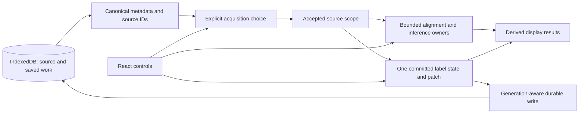

# MiraViewer: fresh full-codebase audit

> Historical plan/evidence. This preserves its original task and may include unfinished proposals. Current status belongs to the [implementation ledger](../active/2026-09-02-full-codebase-audit-implementation.md).

**Date:** September 2, 2026\
**Scope:** architecture, performance, duplication/obsoletion, and UX; correctness where it materially affects those areas or preservation of saved work.\
**Status:** review complete; recommendations below are not implemented by this audit.

## Executive assessment

The next substantial gains are in the connections between existing subsystems, not in replacing React, IndexedDB, Cornerstone, or the reconstruction algorithms. The application has acquired useful safeguards and optimizations, but several benefits stop at a component or worker boundary:

- A brush edit carries a sparse patch to the GPU, while CPU measurements, slice overlays, and persistence still process much larger data.
- The tracking transport can retain a model runtime, but the ordinary UI request wrapper disposes it after every proposal.
- IndexedDB is authoritative in principle, while mounted settings retain independent write authority across failed hydration, restore, and clear.
- Comparison uses normalized progress, but global controls do not consistently agree on which acquisition defines a numbered slice.
- Storage discovery and backup selection sometimes load binary values before deciding whether they are needed.

**My recommendation is to finish these ownership boundaries before adding another inference mode or a wider reconstruction surface.** The highest-value implementation work is A01–A03; A04 is a smaller, unusually clear UX improvement. A05–A08 address costs and surprises that grow with the number of examinations, saved grids, and imported acquisitions. A09 should follow actual GPU profiling. A11 is a concrete reduction pass, not a request for cosmetic file splitting.

This pass also found good evidence that earlier work landed: immutable alignment replay, worker-owned final scoring, key-only derived-frame retention, bounded sparse history, native-detail admission, hard cancellation, and acquired-image retry are present. They are not reported again as missing features.

### Prioritized work

Priority reflects expected product and architectural value, not a measured speedup. **P1** means address before expanding the affected workflow; **P2** means the next improvement cycle. Relative sizes are planning estimates, not delivery commitments.

| ID  | Priority | Improvement                                                                    | Main benefit                                            | Evidence                                               | Size |
| --- | -------- | ------------------------------------------------------------------------------ | ------------------------------------------------------- | ------------------------------------------------------ | ---- |
| A01 | P1       | Keep sparse edits sparse through publication, display, and saving              | Interaction latency, memory, simpler data flow          | Complete call-path review; exact array-size arithmetic | L    |
| A02 | P1       | Own reusable inference at the accepted-source scope, including retained memory | Repeated-correction latency and reliable admission      | Live caller/worker review; failing lifecycle tests     | M–L  |
| A03 | P1       | Give saved work one hydration and generation boundary                          | Predictable restore/clear and preservation of work      | Four small current-source reproductions                | M    |
| A04 | P1       | Give all global slice controls one named reference                             | Understandable navigation                               | Unequal-count numerical reproduction                   | S    |
| A05 | P1/P2    | Align visible dates first; separate physical pose from display output          | Time to useful comparison; fewer refits                 | Scheduling and cache-identity evidence                 | M    |
| A06 | P2       | Discover metadata before reading masks and derived pixels                      | Avoid unrelated payload reads during opening and export | IndexedDB call-path review                             | M    |
| A07 | P1       | Anchor durable work to stable source IDs and explicit acquisition choice       | Stable settings, backups, and comparisons               | Three identity/selection reproductions                 | L    |
| A08 | P1/P2    | Make export and restore share a bounded, cancellable plan                      | Trustworthy backup UX and bounded memory                | Capacity rejection plus producer review                | M–L  |
| A09 | P2       | Add conservative label-aware rendering acceleration                            | 3D overlay responsiveness                               | Shader review; GPU benefit unmeasured                  | M–L  |
| A10 | P2       | Make recovery, action readiness, and responsive warnings explicit              | Fewer dead ends and invisible explanations              | UI call paths; actual-app screenshots                  | M    |
| A11 | P2       | Retire unreachable branches and unnecessary startup dependencies               | Less code, smaller initial work, easier maintenance     | Production caller inventory; built entry measurement   | S–M  |
| A12 | P1/P2    | Qualify complete user workflows, not only component contracts                  | Reliable shipping decisions                             | Current checks and normal-production browser runs      | M    |

Two narrower follow-ups are described after these findings: **C01**, bounded metadata admission and legacy enrichment; **C02**, a bounded lifecycle for optional custom models. They should share existing owners rather than become parallel systems.

## 1. What was actually reviewed

### Snapshot and method

The audit reviewed the **current dirty working tree**, not just its base commit. It started with repository state and a file inventory, then divided production source into non-overlapping review areas. Every production file was read in full during this pass. The final consolidated ledger checks each reviewed file against the frozen source hash; no earlier hash-only review was substituted. Prior audit documents were consulted afterward to distinguish completed work from remaining work.

| Item                               | Audited value                                                                           |
| ---------------------------------- | --------------------------------------------------------------------------------------- |
| Branch                             | `blader/siqi-chen/segmentation-sampled-plane-pruning`                                   |
| HEAD                               | `5f0efa433b6c8b6672add9a30184ec1140b2b5a3`                                              |
| Local `origin/main` and merge base | Same commit as HEAD; no local `origin/latest` ref                                       |
| Working-source fingerprint         | `c18937dd03909c510e9efb75c60cef2be94499e4a92ad037ebbc0504afb45efe`                      |
| Model-manifest fingerprint         | `5662be7768cef65140ce885dde9099fb16c0e64f0b90927d79ef8a9461aa725c`                      |
| Production review                  | **180 files, 54,149 lines; all fully read**                                             |
| Additional complete reads          | 24 delivery/build/configuration files, 1,652 lines, outside the production-source count |
| PR lookup                          | No PR returned for this branch at the time of the live lookup                           |

The production count includes the application, CSS, declarations, hooks, services, storage, rendering, alignment, reconstruction, segmentation, and worker source under `frontend/src`. The additional count combines seven delivery/launcher files with seventeen build/configuration files. Large component files were read, not treated as black boxes: `Svr3DView` has 2,259 lines, `SvrVolume3DViewer` 3,283, `SvrSegmentationEditor` 1,042, and `useAutoAlign` 2,389. **Their size alone is not a finding**; the recommendations identify specific competing responsibilities and repeated work.

See the [full production coverage ledger](../../../artifacts/performance/full-fresh-audit-2026-09-02/coverage.json), [frozen file manifest](../../../artifacts/performance/full-fresh-audit-2026-09-02/source-manifest.json), and [additional build/configuration ledger](../../../artifacts/performance/full-fresh-audit-2026-09-02/root-tooling-coverage.json). Source links below refer to this working-tree snapshot; line numbers will drift after implementation.

### Evidence boundaries

- **Source-confirmed** means the current code establishes a call path, ownership relationship, allocation, condition, or ordering. It does not establish user-visible timing.
- **Reproduced** means a small probe actually invoked current production code. Storage probes use fake-indexeddb/JSDOM and synthetic inputs; they do not establish native-browser transaction timing or large-volume heap behavior.
- **Browser-verified** means the normal built application was exercised in a fresh Chromium context with synthetic DICOM. Screenshot verdicts are separate from functional test results.
- Memory quantities derived from array dimensions or planner output are explicitly labeled. No static operation count is presented as an observed speedup, measured peak RAM, or clinical-quality result.

**Excluded from line-by-line coverage:** third-party dependencies, generated output, the mechanical dependency lockfile, model binary internals, and every individual test/fixture. Relevant tests were inspected and the complete normal unit suite was run. Pinned model assets were verified by their existing verifier. Private MRI source directories were not opened, uploaded, modified, or deleted. This is a software audit, not an anatomical or clinical validation.

No application or tracked test source was changed for this audit. Existing dirty, deleted, and untracked work was preserved. New work consists of this report, audit evidence, and isolated diagnostic harnesses. No commit, push, PR grooming, or merge was performed.

## 2. Architecture: preserve the local-first design, clarify the owners

The current architecture is viable. Raw DICOM and saved work belong in IndexedDB; React owns interaction and presentation; bounded workers own expensive computation; rendering consumes immutable source and derived results. A backend or a new global state framework is not needed to address the findings.

The problematic boundaries are more specific:

| Fact or resource               | Current ambiguity                                   | Recommended authority                                          |
| ------------------------------ | --------------------------------------------------- | -------------------------------------------------------------- |
| Acquisition being compared     | Recomputed largest-series winner                    | Persisted explicit choice anchored to source UIDs              |
| Numbered global slice          | Grid wheel and bottom controls use different counts | One named navigation-reference descriptor                      |
| Accepted alignment pose        | Mixed with display output mode and calibration      | Pair-pose identity plus separate display projection            |
| Model runtime lifetime         | Transport retention versus per-request disposal     | Existing accepted-source operation owner                       |
| Saved settings readiness       | Failed read can become writable defaults            | Successfully hydrated state for the current durable generation |
| Committed label change         | Sparse patch exists, but downstream work ignores it | One label publication with patch/dirty-region metadata         |
| Candidate and backup discovery | Binary values read before scope selection           | Indexed metadata/key plan before payload reads                 |

The target flow is deliberately small:

These are ownership boundaries, not a proposed new directory tree or service framework. Extract a responsibility when doing so removes duplicate policy, repeated work, or competing lifecycle control. Splitting a 3,000-line component into ten equally coupled hooks would not accomplish that.

## 3. Findings and recommendations

### A01 — Keep sparse selection edits sparse beyond the GPU upload

**Priority: P1. Categories: performance, architecture, duplication. Confidence: high for the work performed; end-to-end latency has not been measured.**

The code already creates sparse edit patches and uses them for subregion GPU uploads. That optimization does not extend through the rest of the edit pipeline:

1. A brush edit clones the complete label array even when it already knows the affected indices. See [useSvrSelection.ts:312](../../../frontend/src/hooks/useSvrSelection.ts#L312).
2. Proposal publication validates and copies the complete result, reapplies hard marks, filters connectivity, and then constructs a patch without candidate indices. The patch builder scans the grid twice. See [useSvrSelection.ts:243](../../../frontend/src/hooks/useSvrSelection.ts#L243), [seedConnectedSelection.ts:46](../../../frontend/src/utils/segmentation/seedConnectedSelection.ts#L46), and [selectionEditing.ts:122](../../../frontend/src/utils/segmentation/selectionEditing.ts#L122).
3. The viewer computes a dirty box from that patch, but measurements still scan the full label volume for a new label buffer. See [SvrVolume3DViewer.tsx:642](../../../frontend/src/components/SvrVolume3DViewer.tsx#L642) and [the measurement pass at line 930](../../../frontend/src/components/SvrVolume3DViewer.tsx#L930).
4. The selection editor recreates its plane canvas and RGBA data and loops through the entire displayed plane when relevant labels, cursor, or window state changes. Base-image conversion and overlay work are coupled; the pixel loop also creates coordinate objects. This is not a claim that every hover event triggers the effect. See [SvrSegmentationEditor.tsx:119](../../../frontend/src/components/SvrSegmentationEditor.tsx#L119).
5. The persistence effect submits the full label record after completed edits and can also write after hydration. IndexedDB then clones the typed-array value. Immediate transaction ordering currently protects navigation away and immediate return, so a component-local debounce is not a safe drop-in replacement. See [SvrVolume3DViewer.tsx:578](../../../frontend/src/components/SvrVolume3DViewer.tsx#L578) and [localApi.ts:666](../../../frontend/src/utils/localApi.ts#L666).

For scale, one `Uint8Array` label volume is **16 MiB at 256³** and **54 MiB at 384³**. The current publication scratch formula reserves 18 bytes per cell, or **288 MiB at 256³**. These are exact arithmetic consequences of the data representation, not measured browser peaks. A fast brush rasterizer or faster model does not remove these downstream passes.

**Recommendation.** Carry the existing patch through the entire publication contract. Keep one authoritative label result; update counts and affected display planes from patch metadata where possible, and cache the base grayscale plane by slice and tone independently of labels. For dense model proposals, perform validation, support masking, hard-mark reconciliation, connectivity, and diff construction as one cancellable data-plane operation before publishing once. Avoid making several React effects independently rediscover what changed.

For durability, first eliminate redundant writes of unchanged hydrated state. Then evaluate a source-owned writer or transactional patch/checkpoint design against the actual remount contract. It must preserve ordered durable readback across mounts; do not trade that away for a debounce. Do not introduce a second full label store in React.

**Preserve:** immutable publication semantics, supported hard Add/Remove marks, connectivity rules, exact-grid ownership, existing dirty GPU uploads, and the 32 MiB/20-entry history bound.

**Acceptance:** extend the existing selection tests for patch-derived counts, undo/redo, disconnected proposals, Remove severance, and cancellation. In the normal app, measure native input → visible stroke → committed labels → same-key durable readback at representative grids. Record bytes copied, main-thread long tasks, and persistence work separately from inference. The failed 3D interaction attempt in section 4 means this audit does not yet provide that complete measurement.

### A02 — Complete runtime reuse at the accepted-source owner, with retained-memory accounting

**Priority: P1. Categories: architecture, performance. Confidence: high; incomplete integration is visible in current source.**

The in-progress transport work is real: a successful tracking job can leave its worker alive for 30 seconds; jobs use separate message channels; cancellation and errors destroy the worker. The worker retains one tracking controller while resetting job-specific state. See [interactiveTrackingWorker.ts:158](../../../frontend/src/utils/segmentation/interactiveTrackingWorker.ts#L158), [its completion path at line 352](../../../frontend/src/utils/segmentation/interactiveTrackingWorker.ts#L352), and [interactiveTracking.worker.ts:95](../../../frontend/src/utils/segmentation/interactiveTracking.worker.ts#L95).

However, the ordinary proposal wrapper still creates a transport for each call and disposes it in `finally`. The live 3D UI calls that wrapper. Retention inside the transport therefore does not yet deliver warm reuse between ordinary UI corrections. See [interactiveSelection.ts:101](../../../frontend/src/utils/segmentation/interactiveSelection.ts#L101), [its disposal at line 225](../../../frontend/src/utils/segmentation/interactiveSelection.ts#L225), and [Svr3DView.tsx:1479](../../../frontend/src/components/Svr3DView.tsx#L1479).

**Recommendation.** Let the existing accepted-source scope own one tracking transport and lend it to successive proposals. Preserve fresh temporal/prompt state per job, one active request, isolated reply channels, cancellation, and source-change/unmount disposal. The accepted source and its normalization are already cached at [Svr3DView.tsx:1370](../../../frontend/src/components/Svr3DView.tsx#L1370); use that ownership rather than adding a global model pool.

**Memory admission is part of this change, not a later optimization.** The planner currently takes the maximum of non-overlapping phase peaks. Its source and publication phases exclude a live model runtime, and attention allowance reflects the current request. A retained runtime may overlap a subsequent source/crop/publication phase and retain a previous larger job's arena. See [interactiveAdmission.ts:137](../../../frontend/src/utils/segmentation/interactiveAdmission.ts#L137) and [line 148](../../../frontend/src/utils/segmentation/interactiveAdmission.ts#L148). Either charge a conservative retained high-water allocation at the same owner or dispose it before a conflicting phase. Apply the same rule when reconstruction, refinement, enhancement, or a custom model competes for memory. Release the charge only after actual disposal.

The correction orientation is also a workload input. Existing marks are grouped on the latest stroke's plane; many conditioning planes can enlarge attention work even when the cropped context is smaller. Instrument planned conditioning frames and actual preparation/final-pass times before deciding whether additional caching is worthwhile. Do not drop marks, silently change orientation, or truncate native context to make a benchmark faster. See [interactivePrompts.ts:19](../../../frontend/src/utils/segmentation/interactivePrompts.ts#L19) and [interactiveTracking.ts:747](../../../frontend/src/utils/segmentation/interactiveTracking.ts#L747).

A synthetic invocation of the current public planner held 33 marks constant on a 96³ grid and changed only last-stroke plane metadata: axial produced 1 conditioning frame and a 59,244,544-byte attention allowance; sagittal produced 33 frames and a 328,728,576-byte allowance despite a smaller 96×80×80 context. These are **calculated allowances, not measured memory or inference latency**. External owners were set to zero to isolate the effect; no complete pointer history or model run was simulated. [Reproducible planner receipt](../../../artifacts/performance/full-fresh-audit-2026-09-02/conditioning-plane-probe-receipt.json).

**Current test status:** all 11 failures in the fresh full unit run are in the tracking-worker suite and expect successful/replacement worker termination under the older lifecycle contract. This is unfinished integration, not a green implementation. Do not mechanically replace those assertions without proving the intended ownership and cancellation behavior.

**Acceptance:** two ordinary UI corrections on one accepted source must avoid a second session initialization while preserving mask, support, and hard-mark results. Test large → small requests, idle expiry, source replacement, unmount, competing operations, and cancellation during a graph. A late reply must never publish to a replacement source. Directly invoking the worker twice is not sufficient product proof.

### A03 — Saved work needs one readiness and generation boundary

**Priority: P1. Categories: architecture and recovery UX, with important correctness consequences. Confidence: high; four current-source reproductions.**

There are several manifestations of the same ownership problem: a mounted settings owner can keep writing after its durable state was never loaded successfully, was restored underneath it, or was cleared.

| Reproduction                                                                | Observed result                                                                                                                               |
| --------------------------------------------------------------------------- | --------------------------------------------------------------------------------------------------------------------------------------------- |
| One transient settings-read failure; durable zoom initially 4               | Hook reports the failure, marks settings ready with default zoom 1, and its normal delayed save changes durable zoom to 1 without a user edit |
| Restore same-patient settings at zoom 2 over a live hook at zoom 4          | DB reads 2; mounted hook still reads 4; an unrelated brightness edit writes zoom 4 back                                                       |
| Clear while a 200 ms settings write is already pending                      | Settings count is 0 immediately after deletion and 1 after 230 ms, containing the old zoom                                                    |
| Restore a 1,100-byte archive with a missing late panel-settings primary key | Restore rejects with `DataError`, but one study, series, and instance remain committed; dataset revision is still 0                           |

The clear result is conditional on an already pending writer; it is not a claim that every leisurely Clear confirmation reproduces it. These probes use current modules, fake-indexeddb, and JSDOM. They prove the state/transaction paths, not native unload timing. They do not demonstrate loss of raw MRI pixels.

The failed-read branch creates defaults and marks ownership ready at [usePanelSettings.ts:325](../../../frontend/src/hooks/usePanelSettings.ts#L325); routine progress saves run at [line 469](../../../frontend/src/hooks/usePanelSettings.ts#L469). Hydration only adds missing dates for an unchanged owner, while edit and unload writers retain the live map. [ComparisonMatrix.tsx:234](../../../frontend/src/components/ComparisonMatrix.tsx#L234) refreshes comparison data after restore, not this separate settings owner. [ClearDataModal.tsx:45](../../../frontend/src/components/ClearDataModal.tsx#L45) leaves the mounted application alive until a delayed reload.

Restore validates the envelope but can encounter a synchronous key error while enqueuing rows, without an explicit abort of the medical transaction. See [exportBackup.ts:332](../../../frontend/src/services/exportBackup.ts#L332) and [line 547](../../../frontend/src/services/exportBackup.ts#L547). The importer and model-cache writer already contain explicit abort patterns to reuse: [dicomIngestion.ts:797](../../../frontend/src/services/dicomIngestion.ts#L797), [modelCache.ts:98](../../../frontend/src/utils/segmentation/onnx/modelCache.ts#L98).

**Recommendation.** Treat `failed to read` and `successfully loaded empty` as different states. A fallback display may remain usable, but it must not autosave over unconfirmed data. Provide Retry and retain the last confirmed state where available.

At restore/clear, retire or drain old writers, validate the plan, commit with explicit abort on any enqueue/commit failure, publish the new durable generation, adopt or clear mounted settings/history/preferences, then enable writes. Reuse the existing dataset/source ownership boundary; do not add unrelated generation counters in every component. Ordinary imports should not indiscriminately reset live settings.

Medical IndexedDB stores, the separate model-cache database, and localStorage cannot be claimed to form one atomic transaction. Define the medical commit point and explicit recovery for auxiliary writes rather than promising cross-database atomicity.

A related static warning is [GroundTruthPolygonOverlay.tsx:76](../../../frontend/src/components/GroundTruthPolygonOverlay.tsx#L76): annotation-read errors are only logged, and Save is not tied to successful hydration. No annotation overwrite was reproduced here; it should receive the same failed-read-versus-empty review, not a separate workaround.

**Acceptance:** extend existing hook/restore tests for each counterexample, then exercise real-browser restore into an already mounted patient and clear with queued writes. Failed reads must never overwrite existing work; failed restore must leave all medical stores and revision unchanged; a successful restore must survive a subsequent unrelated edit and reopen. Evidence: [lifecycle probes](../../../artifacts/performance/full-fresh-audit-2026-09-02/storage-lifecycle-probe.json), [read/clear probes](../../../artifacts/performance/full-fresh-audit-2026-09-02/storage-admission-clear-probe.json).

### A04 — Global slice controls need one named navigation reference

**Priority: P1, small scope. Categories: UX, architecture. Confidence: high; numerical reproduction using current functions.**

In Grid mode, global wheel navigation uses the primary Grid acquisition. The bottom navigator's slice count nevertheless prefers the persisted Overlay selection. Physical alignment follows the primary Grid acquisition as well. See [useComparisonWorkspaceNavigation.ts:137](../../../frontend/src/hooks/useComparisonWorkspaceNavigation.ts#L137), [ComparisonMatrix.tsx:381](../../../frontend/src/components/ComparisonMatrix.tsx#L381), [SliceLoopNavigator.tsx:264](../../../frontend/src/components/comparison/SliceLoopNavigator.tsx#L264), and [useVisibleAlignment.ts:48](../../../frontend/src/hooks/useVisibleAlignment.ts#L48).

With a 100-slice primary acquisition and a 20-slice Overlay selection:

| Action                                 | Normalized progress | Primary acquisition result     |
| -------------------------------------- | ------------------- | ------------------------------ |
| Wheel from primary slice 1 to 2        | `1 / 99`            | Slice 2                        |
| Bottom Go-to slice 2                   | `1 / 19`            | Slice 6                        |
| Bottom numbered sequence 1 → 2 → 3 → 4 | Based on 20 slices  | Primary slices 1 → 6 → 11 → 17 |

Different per-date slice numbers are expected when normalized progress maps different acquisitions. **The problem is that unlabeled global controls disagree about their reference while shown together**, not that all acquisitions should have equal slice numbers.

**Recommendation.** Derive one descriptor containing reference date/acquisition, count, offset, and reversal for global wheel, playback, slider, and Go-to. Name that reference in the UI when necessary. Keep deliberate panel-local navigation and normalized multi-date mapping. Do not replace physical alignment selection with whichever hidden Overlay state happens to be stored.

**Acceptance:** unequal counts, offsets, reverse order, disabled dates, single-slice cases, and Grid → Overlay → Grid transitions should retain consistent global units. An integration test should compare actual wheel and Go-to results, not only independently test mapping helpers. [Current reproduction](../../../artifacts/performance/full-fresh-audit-2026-09-02/alignment-navigation-units-probe.json).

### A05 — Schedule visible alignment first and separate pose from presentation

**Priority: P1/P2. Categories: performance, architecture, UX. Confidence: high for ordering and cache identity; latency benefit unmeasured.**

**Visible work is not first.** Enabled dates are ordered newest-first, while Overlay's default selected/compare pair is the oldest two dates. Only that pair mounts, but alignment serially traverses pending dates from the larger list. For dates 2022–2026 with 2026 as reference, the visible pair is 2022/2023 and pending order is 2025 → 2024 → 2023 → 2022. Two unmounted targets precede both visible targets. See [useComparisonWorkspaceNavigation.ts:35](../../../frontend/src/hooks/useComparisonWorkspaceNavigation.ts#L35), [useOverlayNavigation.ts:55](../../../frontend/src/hooks/useOverlayNavigation.ts#L55), [OverlayView.tsx:440](../../../frontend/src/components/comparison/OverlayView.tsx#L440), and [useAutoAlign.ts:1344](../../../frontend/src/hooks/useAutoAlign.ts#L1344). [Scheduling reproduction](../../../artifacts/performance/full-fresh-audit-2026-09-02/alignment-pending-order-probe.json).

Prioritize the selected/compare pair independently of alignment identity and then finish background dates with bounded concurrency. Preserve immediate resident replay. This observation proves dispatch order, not a measured delay or starvation. Date autoplay disables alignment; slice playback is a distinct controller and should not be conflated with it.

**Output resolution is part of physical-pair cache identity.** `outputMode` enters the pair key; changing it can miss accepted pose state, rerun coarse fitting, and request native refinement. The six output modes preserve acquired physical footprint. Three pairs across six modes produce 18 logical keys against a 16-entry cache. See [useAutoAlign.ts:159](../../../frontend/src/hooks/useAutoAlign.ts#L159), [cache lookup at line 738](../../../frontend/src/hooks/useAutoAlign.ts#L738), [coarse fitting at line 852](../../../frontend/src/hooks/useAutoAlign.ts#L852), [cache limit at line 1259](../../../frontend/src/hooks/useAutoAlign.ts#L1259), and [outputPlaneGrid.ts:69](../../../frontend/src/utils/outputPlaneGrid.ts#L69).

Separate accepted pair pose from output-grid reslicing and mode-specific calibration. **Do not simply remove a key field**: the cached model also holds display affine/tone values. Make those dependencies explicit so a display-resolution change reprojects a pose rather than redefining the fitting request. Explicit Realign must still recompute.

**New planes still prepare overlapping native context.** Exact replay is fixed, but a genuinely new accepted-pose plane rebuilds an intersecting native slab, converts cached raw frames, transfers data to a fresh worker, and later terminates it. Sharp display has related preparation. See [alignmentBrowsing.ts:193](../../../frontend/src/utils/alignmentBrowsing.ts#L193), [longitudinalFrames.ts:810](../../../frontend/src/utils/svr/longitudinalFrames.ts#L810), [decodedFrame.ts:68](../../../frontend/src/utils/decodedFrame.ts#L68), and [runLongitudinalRegistration.ts:49](../../../frontend/src/utils/svr/runLongitudinalRegistration.ts#L49). This is not repeated DICOM file decoding; Cornerstone already caches source images.

Only after profiling, consider bounded prepared-slab reuse at the current computation owner, with source/pose identity, cancellation, and a real byte budget. Do not introduce a worker pool merely because workers are created.

**Acceptance:** visible targets dispatch first and background targets still finish; native → 256 → 1024 → native causes no extra pose fitting; physical coverage, tone, final-pose diagnostics, and explicit Realign stay correct. Measure complete multi-date scrubbing through settled visible pixels before adding prepared-context caching.

### A06 — Discover metadata before reading binary payloads

**Priority: P2. Categories: performance, architecture, duplication. Confidence: high for data access; no large-library timing measured.**

Two separate user actions have the same avoidable storage shape:

- Opening a new grid without saved labels discovers transferable selections through a by-study **value cursor**. Each complete mask row is materialized before current-key and scope filtering. The UI ultimately keeps only candidate key and timestamp. See [SvrVolume3DViewer.tsx:544](../../../frontend/src/components/SvrVolume3DViewer.tsx#L544), [selectionMigration.ts:299](../../../frontend/src/utils/svr/selectionMigration.ts#L299), and [its filtering at line 322](../../../frontend/src/utils/svr/selectionMigration.ts#L322).
- Backup export calls `getAll` for volume segmentations and derived alignment frames before filtering to the selected patient/studies. These rows include typed-array masks or pixels, not merely lazy Blob handles. See [exportBackup.ts:240](../../../frontend/src/services/exportBackup.ts#L240).

Thirty 256³ one-byte masks imply **480 MiB of mask materialization over candidate discovery**. The cursor is sequential; this is not a claim that all 480 MiB are simultaneously resident. Eight unrelated masks of that size imply 128 MiB of values returned before backup exclusion. Both are arithmetic examples, not heap measurements.

**Recommendation.** Expose an indexed metadata/key projection for study, source geometry/provenance, revision, review state, timestamp, and byte length. Discover candidates and backup scope there; load labels/pixels only after explicit selection. If metadata and payload need separate stores, update them through one canonical writer and one transaction so this does not create independent truths.

Keep payload validation and final source/pose/revision revalidation when a selection is actually copied; a matching geometry key is not sufficient evidence of valid transferable labels. See [selectionMigration.ts:394](../../../frontend/src/utils/svr/selectionMigration.ts#L394).

This should extend the successful metadata-first pattern already used by per-series instance ordering and derived-frame retention. The previous all-pixel derived eviction/hydration issue is fixed at [localApi.ts:901](../../../frontend/src/utils/localApi.ts#L901) and [line 988](../../../frontend/src/utils/localApi.ts#L988).

**Acceptance:** a library with many saved grids should open an empty grid without reading candidate mask payloads; copying a candidate should read only the selected payload and reject stale provenance. A selected backup should not read unrelated volume/frame values. Track read counts and bytes, then measure the normal browser. A06 supplies the query plan used by A08; do not count the same avoided reads twice as independent savings.

### A07 — Durable identity must not depend on the surrounding dataset

**Priority: P1. Categories: architecture, UX, backup continuity. Confidence: high; multiple reproductions.**

Raw Study/Series/SOP UIDs are already retained, but some saved-work keys and source choices depend on the current presentation grouping:

- Patient grouping conservatively adds a study-derived suffix when conflicting nonempty names share an issuer/PatientID. Removing the conflicting study from a subset changes the grouping key. See [patientIdentity.ts:19](../../../frontend/src/db/patientIdentity.ts#L19).
- Examination keys start as date/time and add StudyUID only when another current examination shares the timestamp. See [localApi.ts:51](../../../frontend/src/utils/localApi.ts#L51) and [line 206](../../../frontend/src/utils/localApi.ts#L206).
- Matching series are reduced to the largest acquisition per combo/examination. Other candidates disappear from `ComparisonData`, and further imports can change the winner. See [localApi.ts:251](../../../frontend/src/utils/localApi.ts#L251).
- Panel state persists using those grouped patient/examination values; comparison reads can also change selected patient as a side effect. See [localApi.ts:170](../../../frontend/src/utils/localApi.ts#L170) and [line 305](../../../frontend/src/utils/localApi.ts#L305).

The fresh probes demonstrated three consequences:

1. A selected-patient backup containing a valid tiny derived frame rejects its own restore because the subset's recomputed patient owner differs. Without that frame, the backup restores but saved settings remain under the now-invisible suffixed owner.
2. Adding a same-timestamp study changes an existing examination's key without moving its saved date-keyed settings.
3. A three-frame alternative initially wins over a two-frame original; completing the original to four frames silently changes the displayed acquisition. There is still only one candidate in the returned comparison slot.

See [lifecycle/subset evidence](../../../artifacts/performance/full-fresh-audit-2026-09-02/storage-lifecycle-probe.json) and [identity/selection evidence](../../../artifacts/performance/full-fresh-audit-2026-09-02/storage-identity-capacity-probe.json). The subset archive is only 1,862 bytes; this failure does not require a large library.

**Recommendation.** Use canonical source ownership for durable settings and artifacts; derive patient/date labels for display. Persist explicit acquisition choice and expose alternatives with distinguishing metadata. The largest-series heuristic is a reasonable initial suggestion, not an ongoing authority that silently replaces user context.

Migrate old records only where ownership can be proved. Keep conservative patient separation; stripping suffixes or merging conflicting patient identities to make the backup pass would remove a safety boundary. Ambiguous legacy work needs an explicit recovery path rather than a guessed reassignment.

**Acceptance:** same-time imports, reused/missing patient IDs, subset export/restore, and completion of a second series must preserve existing source-bound work and explicit selection. Exercise labels, settings, and derived frames, not only raw instances. This is a larger change because keys cross persistence boundaries; stage it before broad cleanup of those APIs.

### A08 — Export and restore need the same capacity and cancellation contract

**Priority: P1/P2. Categories: backup UX, performance, architecture. Confidence: high for the mismatch; large-payload memory remains unmeasured.**

The export dialog promises a restorable backup, starts without a size plan, and disables Cancel during export. The producer accumulates ArrayBuffers in JSZip and generates a complete final Blob. Restore, however, rejects more than **512 MiB of declared binary payload**. See [ExportModal.tsx:65](../../../frontend/src/components/ExportModal.tsx#L65), [the promise at line 124](../../../frontend/src/components/ExportModal.tsx#L124), [cancel state at line 188](../../../frontend/src/components/ExportModal.tsx#L188), [exportBackup.ts:197](../../../frontend/src/services/exportBackup.ts#L197), [final generation at line 305](../../../frontend/src/services/exportBackup.ts#L305), and [restore admission at line 388](../../../frontend/src/services/exportBackup.ts#L388).

A tiny manifest declaring **536,870,913 bytes** is rejected before any archive-member read. No oversized ZIP was generated for this test. Source inspection shows no matching export preflight. The offline README already discloses the asymmetry; that documentation is useful but does not make the producer's UI promise true for every possible export.

Export also includes every model-cache row, while content-addressed loading can leave prior versions in the cache. This is a possible retention cost, not a claim that this user's browser currently contains obsolete versions. See [exportBackup.ts:276](../../../frontend/src/services/exportBackup.ts#L276), [loadAsset.ts:14](../../../frontend/src/utils/segmentation/efficientTam/loadAsset.ts#L14), and [modelCache.ts:131](../../../frontend/src/utils/segmentation/onnx/modelCache.ts#L131).

**Recommendation.** Build one plan from selected source IDs, metadata, and byte totals; use it for both export and restore admission. Tell the user whether the complete artifact is supported before expensive reads begin. Make selected reads and serialization cancellable, with a truthful completion boundary.

Distinguish reproducible app-pinned assets from indispensable user-imported models and annotations without losing offline functionality. Do not silently omit custom assets or saved work to fit a limit. Streaming export or staged restore may be appropriate if larger supported datasets are a product requirement; removing the existing limit alone is not a solution.

Coordinate this with A06's selected-payload query and A03's commit boundary. These are three facets of the same backup workflow: discovery, capacity/serialization, and publication—not three unrelated storage rewrites.

**Acceptance:** producer and consumer agree at boundary sizes including instances, labels, derived frames, and models; unrelated payloads are not read; cancellation releases work and does not announce success; a large _supported_ archive round-trips in a real browser. A failed restore must preserve the preexisting library. [Current capacity reproduction](../../../artifacts/performance/full-fresh-audit-2026-09-02/storage-identity-capacity-probe.json).

### A09 — Ordinary label overlays disable the renderer's main shortcuts

**Priority: P2. Category: performance. Confidence: high for shader behavior; hardware impact unmeasured.**

The ray marcher can use up to 1,536 steps and adapts settled traversal to physical voxel pitch. Its empty-space jump is available only when labels are disabled; opacity early exit is also disabled for ordinary labels-on context rendering. Even a small selected region can therefore remove those shortcuts across every intersecting ray. Enhancement layers impose additional limits on intensity-only occupancy. See [glRaymarch.ts:869](../../../frontend/src/utils/svr/glRaymarch.ts#L869), [line 918](../../../frontend/src/utils/svr/glRaymarch.ts#L918), and [line 1051](../../../frontend/src/utils/svr/glRaymarch.ts#L1051).

This is not an accidental condition to flip. Separate lesion accumulation allows selected tissue to remain visible behind opaque foreground anatomy; dark selected voxels must not be classified as empty by intensity alone. See [glRaymarch.ts:1033](../../../frontend/src/utils/svr/glRaymarch.ts#L1033) and [line 1075](../../../frontend/src/utils/svr/glRaymarch.ts#L1075).

**Recommendation.** Extend existing conservative occupancy/bounds with label occupancy, updated from the existing dirty region. Track whether anatomy and any remaining label contribution can still matter before skipping or exiting. Compare a separate-pass design only if profiling shows it is simpler or cheaper for the supported hardware; do not add another rendering layer by default.

**Acceptance:** deterministic image comparisons for small, deep, and dark selections; missing support; clipping; reversed/native planes; tumor-only and enhancement modes. Then measure interaction and settled frame time on the same actual hardware, viewport, dataset, and quality. Software-rendered browser screenshots can validate pixels, not establish a GPU speedup. Do not infer a numerical gain from the maximum loop count.

### A10 — Recovery and action readiness should be visible and local

**Priority: P2. Categories: UX, architecture. Confidence: mixed source and directly inspected normal-app images.**

There is already worthwhile UX infrastructure: accessible dialogs, coarse-pointer targets, reduced-motion styles, retained images during loading, and local acquired-image Retry. The remaining problems are at operational boundaries rather than a need for a visual redesign.

**Responsive warnings do not fully fit.** The normal browser workflow's context assertions pass, but direct inspection found a separate usability failure. At 1024×800 the open Scans drawer covers the first examination/date and the warning sentence clips. At 390×844 the main plane, sequence, first date, and first image remain readable, but date-specific warning details extend outside the visible rail. The second image is below the fold; that is not evidence that it is unreachable.

The drawer becomes an overlay at 1024 px, while initial automatic closing only applies at 760 px. See [index.css:1526](../../../frontend/src/index.css#L1526) and [useComparisonInstrumentUi.ts:78](../../../frontend/src/hooks/useComparisonInstrumentUi.ts#L78). Align the first-open policy with the overlay breakpoint and use an accessible warning-details disclosure or wrapping region that does not displace essential scan context. Preserve explicit user drawer choices when there is room.

**Actions can be gated by the wrong pending operation.** `canRun` describes the pending reconstruction form. `refineRegion` returns immediately when it is false, even though refinement operates on an already accepted result and computes its own regional parameters. The editor can still expose refinement. See [Svr3DView.tsx:1217](../../../frontend/src/components/Svr3DView.tsx#L1217), [line 1245](../../../frontend/src/components/Svr3DView.tsx#L1245), and [SvrSegmentationEditor.tsx:438](../../../frontend/src/components/SvrSegmentationEditor.tsx#L438). Derive action-specific readiness from the accepted source/region and current resource owners. Show why an action cannot run; do not silently return because unrelated next-generation controls are invalid. This is source-confirmed, not a completed UI reproduction.

**Saved child work and a new transfer are different operations.** Hydration intentionally prefers saved child-grid edits over a newly transferred initial selection. That protects reviewed work. A fresh-refine affordance should distinguish “resume this saved grid” from an explicit new/copy/replace operation and show lineage, rather than quietly overwriting the saved child. See [SvrVolume3DViewer.tsx:519](../../../frontend/src/components/SvrVolume3DViewer.tsx#L519) and [types/svr.ts:234](../../../frontend/src/types/svr.ts#L234). This is an operation-policy recommendation, not demonstrated data loss.

**Some recovery routes remain dead ends.** Fatal comparison-load failure is bare text without Retry or storage tools at [ComparisonMatrix.tsx:218](../../../frontend/src/components/ComparisonMatrix.tsx#L218). Keep a usable shell around a feature-level failure so the user can retry or export where safe. The additional 3D test remained at “Loading saved selection…” for 15 seconds; investigate that separately before expanding editor features. Its trace does not establish why hydration stalled.

**The legacy saved-mask affordance is not data-aware.** [ImageControls.tsx:65](../../../frontend/src/components/ImageControls.tsx#L65) offers Saved tumor based on native-image availability, not whether a saved 2D mask exists. After removal of the legacy writer, the production tree has no caller of `saveTumorSegmentation`; imported or historical rows can still be meaningful. Show a saved-data-aware state and direct new segmentation work to the current workflow. Preserve legacy rows and their reader rather than deleting user data because the producer is obsolete.

Finally, use consistent “this browser profile and origin” wording for local storage. “All MRI data on this device” in [ClearDataModal.tsx:91](../../../frontend/src/components/ClearDataModal.tsx#L91) is broader than what the operation can delete; other origins, profiles, downloaded backups, and original files remain separate.

**Acceptance:** normal-app keyboard and pointer use at 1440, 1024, and 390 px; warning details fully accessible; source context remains visible; each disabled action names its own reason; load failures retain safe recovery. Extend the current browser assertions to cover full warning readability and the actual refinement interaction, not only context labels.

### A11 — Remove unreachable experiments and unnecessary startup work

**Priority: P2. Categories: duplication/obsoletion, performance, maintainability. Confidence: high for the production caller inventory; exact savings require a candidate build.**

The normal production JavaScript entry measured **2,721,599 raw bytes / 830,690 gzip bytes**. That is a bundle measurement using Node's default gzip, not network transfer size under a particular server, first paint, or a reason to rewrite the application. [Build measurement](../../../artifacts/performance/full-fresh-audit-2026-09-02/bundle.json).

There are concrete deletion/lazy-loading candidates:

| Candidate                                                         | Current evidence                                                                                                    | Safe boundary                                                                                                        |
| ----------------------------------------------------------------- | ------------------------------------------------------------------------------------------------------------------- | -------------------------------------------------------------------------------------------------------------------- |
| Cornerstone Tools, Hammer, and Cornerstone Math startup           | Imported/wired/initialized; no production tool activation found                                                     | Remove only the unused tools layer; retain Cornerstone and the working DICOM loader/custom interactions              |
| Focus/exclusion-specific landmark and tumor-alignment experiments | Sole production alignment caller supplies neither focus nor exclusion; specialized branches require them            | Retire unreachable feature branches and their exclusive helpers, preserving live unmasked anatomical slab refinement |
| Standalone `synthesizeSharpSlice`                                 | No production caller; current sharp display uses the physical reslicer                                              | Remove the obsolete entrypoint, not shared cubic interpolation primitives                                            |
| `DicomViewer.imageUrlOverride`                                    | Consumer plumbing with no production provider                                                                       | Remove the unused mode and conditional state once tests confirm ordinary/derived paths                               |
| Optional dialogs on the initial import graph                      | Root eagerly imports upload/export/help-related UI                                                                  | Lazy-load substantial optional paths; verify empty-state/import behavior and offline chunks                          |
| Unused custom-model hook API and stale tooling exclusions         | `allowUnsafeFullRes`/`initSession` are unconsumed public surfaces; doctor config still mentions retired seeded code | Delete unsupported API surface and stale exclusions after caller/test inventory; do not bypass admission             |

Sources: [cornerstoneInit.ts:3](../../../frontend/src/utils/cornerstoneInit.ts#L3), [initialization at line 124](../../../frontend/src/utils/cornerstoneInit.ts#L124), [useVisibleAlignment.ts:69](../../../frontend/src/hooks/useVisibleAlignment.ts#L69), [longitudinalRegistration.ts:1304](../../../frontend/src/utils/svr/longitudinalRegistration.ts#L1304), [sharpSliceSynthesis.ts:95](../../../frontend/src/utils/sharpSliceSynthesis.ts#L95), [DicomViewer.tsx:182](../../../frontend/src/components/DicomViewer.tsx#L182), [ComparisonMatrix.tsx:4](../../../frontend/src/components/ComparisonMatrix.tsx#L4), and [doctor.config.ts](../../../frontend/doctor.config.ts).

The two specialized landmark/tumor helper modules contain 601 and 558 lines respectively. Their production imports are in the guarded registration branch; use that reachability evidence, not their names or size, to decide removal. Keep the live anatomical slab path and all shared math. Test-only consumers do not make a feature product-reachable, but deliberately retained research code should be moved out of the shipping path with an explicit owner rather than silently discarded.

Several seeded-segmentation files are already deleted in the working tree. **Do not propose deleting them again.** Similarly, a historical saved-mask reader is not obsolete merely because its writer is retired.

Two small delivery improvements belong in the same maintenance pass. [make-downloadable-zip.mjs:50](../../../frontend/scripts/make-downloadable-zip.mjs#L50) deletes the previous release before the new build succeeds; stage and publish only after success. [dev.mjs:33](../../../frontend/scripts/dev.mjs#L33) recognizes a running app by generic MiraViewer/Vite HTML, not checkout identity; report a source/build fingerprint so a neighboring worktree cannot silently supply QA evidence. Preserve the fixed origin and existing services.

The repository's Vite/offline paths set relevant isolation headers, but [vercel.json](../../../vercel.json) does not declare them. Live hosting headers were not inspected, so this is **a deployment verification item, not a claim that production lacks isolation**. Check actual headers and model-asset delivery before attributing runtime differences to hosting.

**Acceptance:** production caller search, focused behavior tests, ordinary build, offline chunk/asset loading, and a before/after entry measurement. Startup performance needs an actual cold app measurement. Preserve comments and meaningful scientific contracts; do not optimize for an arbitrary deleted-line target or remove compatibility data without a migration.

### A12 — Qualification must reach the complete user workflow

**Priority: P1 for current failures and basic 3D acceptance; P2 for broader performance gates. Categories: architecture of validation, UX, correctness.**

The repository has substantial focused coverage. The unit suite reported 3,160 cases: **3,095 passed, 11 failed, 54 skipped**. This pass also ran the existing normal-production workflow suite successfully. The remaining issue is what each form of evidence actually establishes.

The inference browser harness exercises real graph assets, ordering/parity, cancellation, and offline asset bytes through a direct worker route. Its small three-frame input and session initialization checks do not prove two ordinary UI corrections reuse a runtime or that the learned model contributes useful selected tissue. See [inference.spec.ts](../../../frontend/tests/browser/inference.spec.ts) and [inferenceProbe.ts](../../../frontend/tests/browser/inferenceProbe.ts). Hard Add marks are reinserted before publication; therefore a nonempty final mask alone cannot establish useful model contribution.

The normal workflow suite verifies import, acquired pixels, decode recovery, settings, annotation persistence, backup round-trip, and alignment replay. That is meaningful product evidence. It does not cover a completed 3D selection edit or model-assisted review/save/reopen. The additional synthetic 3D probe imported 24 slices and opened the workspace, but selection hydration did not visibly finish within its 15-second interaction timeout. No brush, reviewed mask, or durable 3D reload was proved. A GPU `ReadPixels` warning in the trace is not a diagnosed cause.

The existing GPU suite is a pixel qualification, not hardware frame-time evidence. Performance tests cover narrower boundaries such as scoring/storage, not the entire native input → visible result → durable edit sequence. See [gpu.spec.ts](../../../frontend/tests/browser/gpu.spec.ts), [performance.spec.ts](../../../frontend/tests/browser/performance.spec.ts), and [workflow.spec.ts](../../../frontend/tests/browser/workflow.spec.ts).

There is no checked-in `.github` workflow in this snapshot; Vercel's declared command builds the app. That does not prove external CI is absent. The local TypeScript projects cover application source and Vite config, not all tests, Playwright harnesses, and scripts. The validation entrypoints should make the intended shipping gates explicit rather than relying on an agent to remember them.

**Recommendation.** Maintain a small reproducible acceptance path against the shipped normal/offline build, tagged with source hash, model hash, provider, fixture, and browser/hardware. First close the current lifecycle test failures and the unresolved 3D hydration/edit gap. Then cover two model-assisted corrections, raw model predictions beyond the forced marks, hard-mark authority, review, same-key save/reopen, cancellation, and source replacement. Keep numerical/runtime parity distinct from usefulness and anatomical quality.

Performance gates should capture cold/warm corrections, complete multi-date scrubbing, sparse edits on representative native grids, and selected backup from a large unrelated library. Record enough repetitions and provenance to support a claim; do not report a percentile from a tiny sample or use software rendering as evidence of hardware speed.

Use existing suites and fixtures where possible. Add new test infrastructure only for a missing boundary. Private anatomical validation remains opt-in and local; it was not performed here. Do not weaken hard marks, source geometry, or review requirements to force an acceptance test to pass.

## 4. Current verification results

All results below refer to the working-source fingerprint in section 1. Heavy checks were serialized, and the normal build was emitted to a separate temporary directory rather than overwriting the existing `dist` or using an unrelated running checkout.

| Check                                          | Result                                                     | What it establishes / limitation                                                                    |
| ---------------------------------------------- | ---------------------------------------------------------- | --------------------------------------------------------------------------------------------------- |
| `npm run lint`                                 | Pass, 29.9 s                                               | Current configured lint surface                                                                     |
| `tsc -b`                                       | Pass, 6.55 s                                               | Current application/Vite TypeScript projects, not every test/script                                 |
| Full normal unit suite, two workers            | **Fail:** 3,095 passed; 11 failed; 54 skipped, about 120 s | All failures in `interactiveTrackingWorker.test.ts`; private opt-in fixtures disabled               |
| Source model-asset verifier                    | Pass                                                       | Pinned bytes and manifest contract, not model quality                                               |
| Normal Vite production build                   | Pass, 11.98 s                                              | Shippable normal bundle builds in isolation                                                         |
| Built model-asset verifier                     | Pass                                                       | Built asset bytes match pins                                                                        |
| Ten synthetic storage/import cases             | All counterexamples reproduced                             | Current module behavior under fake-indexeddb/JSDOM, not browser timing or large payloads            |
| Navigation and pending-alignment probes        | Counterexamples reproduced                                 | Actual mapping and ordering, not elapsed latency                                                    |
| Existing normal-production browser workflow    | **3/3 pass, 14.4 s**                                       | Actual synthetic import/view/annotation/backup/alignment workflows                                  |
| Additional normal-production 3D brush workflow | **Incomplete / failed before brush**                       | 24 synthetic slices imported; workspace opened; remained at saved-selection loading through timeout |

Receipts: [lint/typecheck/unit commands](../../../artifacts/performance/full-fresh-audit-2026-09-02/checks.json), [build and asset checks](../../../artifacts/performance/full-fresh-audit-2026-09-02/production-build.json), [storage reproduction provenance and rerun commands](../../../artifacts/performance/full-fresh-audit-2026-09-02/storage-probes-provenance.json), [normal workflow receipt](../../../artifacts/performance/full-fresh-audit-2026-09-02/normal-production-workflow-receipt.json), [3D attempt receipt](../../../artifacts/performance/full-fresh-audit-2026-09-02/normal-production-brush-receipt.json), and [3D trace analysis and limitations](../../../artifacts/performance/full-fresh-audit-2026-09-02/normal-production-brush-analysis.json).

### What the passing normal workflow did

The unmodified existing browser tests ran against the normal production app, not Storybook or an illustrative reconstruction. They imported synthetic binary DICOM, verified acquired pixels/navigation, introduced an unvisited corrupt synthetic image and verified retained prior pixels plus Retry, persisted pan and an outline, downloaded a backup, and restored it into a fresh browser context with durable readback. A separate two-examination scenario exercised alignment/sharp replay and verified that reference pan did not change the raster or restart sharp work. Context assertions ran at desktop, tablet, and mobile widths.

That success does not contradict A03: fresh-context restore is a different boundary from restore underneath a mounted settings owner. It also does not imply all warning text fits: the automated context test and manual visual inspection check different things.

### Visual inspection

Each image below was inspected individually at original resolution, followed immediately by a recorded verdict. All pixels are synthetic. The images are linked rather than replaced by diagrammatic mockups.

| Actual-app artifact                                                                                                     | Verdict                                     | Observation                                                                                                                              |
| ----------------------------------------------------------------------------------------------------------------------- | ------------------------------------------- | ---------------------------------------------------------------------------------------------------------------------------------------- |
| [Desktop comparison, 1440×1000](../../../artifacts/visual-validation/full-fresh-audit-2026-09-02/alignment-desktop.png) | **Pass for static composition/labels**      | Scans dominate; dates, slice counts, acquired/derived and sharp labels are legible; no central occlusion                                 |
| [Tablet warning state, 1024×800](../../../artifacts/visual-validation/full-fresh-audit-2026-09-02/warning-tablet.png)   | **Fail for comparison/warning readability** | Open Scans drawer covers the first examination/date; warning clips; plane and sequence remain readable                                   |
| [Mobile warning state, 390×844](../../../artifacts/visual-validation/full-fresh-audit-2026-09-02/warning-mobile.png)    | **Fail for complete warning readability**   | Primary context and first stacked image are readable; date-specific warning details run outside the rail; second image is below the fold |

These stills do not validate motion, scrolling behavior, clinical anatomy, or learned segmentation. The 3D trace image was not visually qualified and is not offered as a successful editor screenshot. [Inspection receipt](../../../artifacts/visual-validation/full-fresh-audit-2026-09-02/inspection-receipt.json).

The workflow and additional 3D batch both closed their owned browser processes, preview servers, and temporary profiles. Existing user browsers and services on the usual development/offline ports were preserved. Cleanup receipts identify the exact batch PIDs/profiles; a reused launch marker was not used to terminate a different batch.

## 5. Narrower follow-ups

### C01 — Consolidate bounded metadata admission and legacy enrichment

**Priority: P2. Categories: performance, duplication, upgrade UX.**

New-file admission reads the whole file before rejecting unsupported/non-displayable objects. Duplicate detection already uses bounded headers, while legacy acquisition hydration uses a different bounded reader that does not repair physical ordering fields. See [dicomIngestion.ts:285](../../../frontend/src/services/dicomIngestion.ts#L285), [duplicate probe at line 507](../../../frontend/src/services/dicomIngestion.ts#L507), and [dicomAcquisitionMetadata.ts:73](../../../frontend/src/services/dicomAcquisitionMetadata.ts#L73).

A valid-header synthetic two-frame file containing 1,048,576 pixel bytes was rejected only after one full **1,049,050-byte** `arrayBuffer` read, with zero slice reads. This establishes avoidable read volume for that admission case, not a parsing-time benchmark. The original raw Blob is retained unchanged for accepted files, so bounded admission need not rewrite DICOM pixels.

Legacy-shaped rows with valid stored position/orientation/spacing but no `physicalSlicePosition` are treated as unreliable and sorted by instance number. Adding only the derived scalar changes them to reliable physical order. The schema adds the physical index without enriching existing rows; acquisition-only hydration and duplicate early return do not repair this. See [db.ts:94](../../../frontend/src/db/db.ts#L94), [localApi.ts:461](../../../frontend/src/utils/localApi.ts#L461), and [acquisitionProvenance.ts:431](../../../frontend/src/utils/svr/acquisitionProvenance.ts#L431). Reconstruction/alignment correctly reject uncertain geometry before those later paths.

**Recommendation:** one canonical, bounded identity/geometry/acquisition reader for new admission and resumable enrichment. Derive missing values from valid retained tags when possible; otherwise read a bounded header and verify UIDs before writing. Keep explicit fallbacks for transfer-syntax/vendor cases requiring more data. Do not remove conservative geometry gates or claim that the existing acquisition hydrator repairs them.

**Acceptance:** original bytes preserved; unsupported large multiframe files rejected without reading pixels where header structure permits; duplicate imports remain fast; a real old-schema fixture upgrades into reliable physical ordering only when provable. The current legacy probe changes row shape in the current schema—it is not a completed historic browser-upgrade test. [Read-volume evidence](../../../artifacts/performance/full-fresh-audit-2026-09-02/storage-admission-clear-probe.json), [legacy row evidence](../../../artifacts/performance/full-fresh-audit-2026-09-02/storage-identity-capacity-probe.json).

### C02 — Optional custom models need a bounded execution owner

**Priority: P2, secondary workflow. Categories: architecture, resource management, cancellation UX.**

The custom ONNX path verifies content hash, tensor/layout/normalization, class semantics, and output metadata. Those are useful contracts, but they do not bound initializer peak, model weights, arbitrary graph workspace, or runtime duration. Its preflight mainly reserves input/preprocessing and output tensors before loading model bytes and creating a session. See [useOnnxTumorSession.ts:220](../../../frontend/src/hooks/useOnnxTumorSession.ts#L220), [loading at line 367](../../../frontend/src/hooks/useOnnxTumorSession.ts#L367), and [ortLoader.ts:63](../../../frontend/src/utils/segmentation/onnx/ortLoader.ts#L63).

Cancellation invalidates publication but waits for direct `session.run` to settle; it cannot terminate a dedicated custom-model worker. `releaseIdleSession` correctly refuses to release/admit around a still-live operation, so a hung custom graph can also block subsequent ordinary suggestions. See [useOnnxTumorSession.ts:128](../../../frontend/src/hooks/useOnnxTumorSession.ts#L128), [run/cancel at line 486](../../../frontend/src/hooks/useOnnxTumorSession.ts#L486), and [SvrVolume3DViewer.tsx:705](../../../frontend/src/components/SvrVolume3DViewer.tsx#L705).

**Recommendation:** decide whether arbitrary user graphs are a supported product contract. If they are, require a versioned resource profile and a disposable worker with bounded initialization/run/release, using the existing single-task/generation authority. Otherwise narrow supported models explicitly. Preserve atomic verified model-cache replacement and offline loading. The built-in interactive path already has hard worker cancellation; do not inaccurately generalize this custom-path weakness to it.

**Acceptance:** same-shaped models with different workspaces, non-settling init/run, cancellation followed by ordinary correction, source/model replacement, and offline reload. No specific supplied custom model was shown to fail during this audit.

## 6. Recommended implementation order

Do not implement every finding as one large PR. Separate independent owners, and keep each change falsifiable with its own evidence.

| Sequence | Work package                                                                       | Completion criterion                                                                                                                                                         |
| -------- | ---------------------------------------------------------------------------------- | ---------------------------------------------------------------------------------------------------------------------------------------------------------------------------- |
| 1        | Close current acceptance gaps; make A03 hydration/restore/clear ownership explicit | Current lifecycle suite agrees with intended semantics; failed reads cannot save defaults; restore/clear preserve their contracts; 3D loading issue reproduced and explained |
| 2        | A04 global navigation reference and A05 visible-target priority                    | Wheel/Go-to agree on unequal counts; visible alignment dispatches first without invalidating cached identity                                                                 |
| 3        | A02 accepted-source runtime lifetime plus retained-memory admission                | Two real UI corrections reuse sessions; cancellation/source changes and large→small memory ownership are proven                                                              |
| 4        | A01 patch-driven downstream work                                                   | Sparse edits avoid avoidable full scans/redundant saves; exact masks and remount durability remain intact; complete edit timing recorded                                     |
| 5        | A06 metadata-first queries plus A08 shared backup plan                             | No unrelated payload reads; producer/consumer capacity agreement; cancellation and real-browser round-trip                                                                   |
| 6        | A07 durable identity and explicit acquisition choice                               | Collision/subset migrations preserve owned work; incoming slices do not silently switch chosen acquisitions                                                                  |
| 7        | A05 pose/display separation and, if measured worthwhile, prepared context reuse    | Resolution changes reproject without refitting; full scrubbing performance improves without new unbounded caches                                                             |
| 8        | A09 renderer work, A10 remaining recovery/responsive UX, A11 reduction, C01/C02    | Pixel/behavior contracts preserved; targeted hardware or lifecycle proof for each change                                                                                     |

A11's small, independently proved deletions and lazy-loading changes can run earlier when they do not conflict with active work. A07 and backup work must agree on identity before final schema migration. A09 needs a baseline before implementation. A12 is the evidence requirement for every package, not a final testing phase postponed until all changes are merged.

### Avoid these tempting shortcuts

- Do not globally retain all workers or all prepared frames; ownership and retained bytes must remain bounded.
- Do not remove safety limits, support masks, hard marks, geometry checks, or patient separation to improve throughput or tests.
- Do not debounce durable writes inside a disappearing component without preserving read-after-remount ordering.
- Do not change output-mode cache keys without separating pose from tone/display dependencies.
- Do not turn every long file into more hooks without reducing duplicate authority or data passes.
- Do not delete saved legacy data with an obsolete producer, or silently overwrite reviewed child-grid work with a fresh transfer.
- Do not treat passing graph parity, a nonempty prompted mask, or one software-rendered screenshot as proof of useful MRI segmentation.

## 7. Strengths and completed work to preserve

The following were confirmed in the current source and should constrain future simplification:

- **Local-first ownership:** raw DICOM remains in browser storage; canonical source identifiers and patient/geometry checks exist across import, alignment, reconstruction, and saved-work transfer.
- **Acquired versus derived is explicit:** output planes, enhancement, proposed masks, and committed labels are not treated as independent acquired evidence.
- **Source support is separate from intensity:** unsupported voxels are not silently filled into authoritative tissue; native reconstruction uses exact index/stride/crop mappings when required.
- **Bounded expensive work:** native waits have deadlines, dense computation has disposable cancellation owners, model assets are pinned, and admitted buffers have explicit budgets.
- **Manual authority and history:** hard Add/Remove marks remain authoritative; sparse edit history is bounded; pruning requires complete sampled-plane evidence and exact lattice mapping.
- **Rendering work is already selective in useful places:** on-demand rendering, dirty label uploads, stable native-plane bindings, and retained acquired images avoid unnecessary flashes/rebuilds.
- **Alignment replay is materially improved:** immutable-content replay preserves raster/pending sharp work; final affine scoring runs in the worker; reverse coverage and final-pose diagnostics are present.
- **Storage improvements landed:** key-only instance ordering and derived-frame eviction, indexed hydration, bounded duplicate probing, import abort handling, and verified atomic model-cache writes.
- **Delivery is more predictable:** fixed offline loopback origin, packaged local assets, actionable port conflicts, and explicit restore-limit documentation.
- **Existing UX/testing investment is useful:** shared controls/dialogs, responsive and reduced-motion styling, local Retry, extensive mathematical tests, and actual normal-app import/backup/alignment browser coverage.

These are reasons to make focused reductions and finish integration—not to restart the architecture.

## 8. Audit closeout and remaining uncertainty

The strongest next changes are supported by current call paths and small concrete counterexamples. The weakest evidence remains **large native-grid interaction timing, retained model memory under repeated work, hardware 3D rendering, complete 3D saved-selection interaction, and useful model-assisted anatomical output**. Those are explicit measurement/acceptance tasks, not implied successes or speculative diagnoses.

This report is intentionally a new snapshot rather than an edit to the earlier implementation ledger. It neither declares that older implementation objective complete nor absorbs the existing worktree into a PR.

The earlier TurboVac invocation is **not complete**. Its stages were not started for this review-only deliverable:

- first `$clean-pr`: **not done**
- diff reduction: **not done**
- second `$clean-pr`: **not done**
- `$hall-monitor`: **not done**

There is no current PR clearance, current-head CI/mergeability claim, or permission inferred to groom unrelated dirty work. The completed deliverable is this full-source audit and its local evidence.

[Final local verification](../../../artifacts/performance/full-fresh-audit-2026-09-02/final-verification.json) records source-hash stability, coverage totals, report-link checks, and owned-runtime cleanup.
